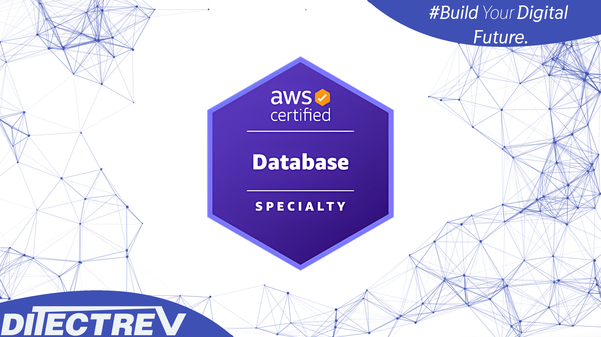

# ⬆️ Amazon Web Services Certified (AWS Certified) Database Specialty (DBS-C01) Practice Tests Exams Questions & Answers

## Udemy & Etsy

❣️ Please support us by purchasing this course on Udemy in an interactive version with the [discounted link](https://www.udemy.com/user/social-ditectrev/). If you're working for a company, you could most probably easily claim this expense during preparation for your exam. For us, it's to be, or not to be, in the game.

🛍️ Alternatively, you can buy the PDF with those questions on [Etsy](https://ditectrev.etsy.com).

## ✨ This course is unlike any Amazon Web Services Certified (AWS Certified) Database Specialty (DBS-C01) course you will find online.

✋ Join a live online community and a course taught by industry experts and pass the Amazon Web Services Certified (AWS Certified) Database Specialty (DBS-C01) confidently. We aim to build an ecosystem of Information Technology (IT) certifications and online courses in cooperation with the technology industry. We believe it will give our students 100% confidence in the pacing market in an open-source environment. We are just at the beginning of our way, so it's even better for you to join now!

## ⌛️ Short and to the point; why should you take the course

1. Always happy to answer your questions on Udemy's Q&A's and outside :)
2. Failed? Please submit a screenshot of your exam result and request a refund (via our upcoming platform, not possible on Udemy); we'll always accept it.
3. Learn about topics, such as:
   - Amazon Aurora;
   - Amazon DynamoDB;
   - Amazon Elastic Compute Cloud (Amazon EC2);
   - Amazon ElastiCache;
   - Amazon Neptune;
   - Amazon Redshift;
   - Amazon Relational Database Service (Amazon RDS);
   - Amazon Simple Storage Service (Amazon S3);
   - AWS CloudFormation;
   - AWS Command Line Interface (AWS CLI);
   - AWS Database Migration Service (AWS DMS);
   - AWS Identity and Access Management (AWS IAM);
   - AWS Key Management Service (AWS KMS);
   - Microsoft SQL Server;
   - MySQL;
   - PostgreSQL;
   - Redis;
   - **Much More!**
4. Questions are similar to the actual exam, without duplications (like in other courses ;-)).
5. The Practice Tests Exams simulate the actual exam's content, timing, and percentage required to pass the exam.
6. This course is **not** an Amazon Web Services Certified (AWS Certified) Database Specialty (DBS-C01) Exam Dump. Some people use brain dumps or exam dumps, but that's absurd, which we don't practice.
7. 139 **unique** questions.

## ☝️ Course Updates

**[v1.0.0](../../releases/tag/v1.0.0): April X, 2024.**

- Launch of the course.

## 🙋‍♀️ & 🙋‍♂️ Contribution

We are so thankful for every contribution, which makes sure we can deliver top-notch content. Whenever you find a missing resource, broken link in a [Table of Contents](#table-of-contents), the wrong answer, please submit an [issue](../../issues). Even better would be a [Pull Request (PR)](../../pulls).

## Who this course is for:

- 👨‍🎓 Students preparing for the Amazon Web Services Certified (AWS Certified) Database Specialty (DBS-C01) Exam;
- 👨‍🎓 ...

## Requirements

- 🤩 Excitement to learn!
- 0️⃣ Prior knowledge is required;
- ✅ You can pass the Amazon Web Services Certified (AWS Certified) Database Specialty (DBS-C01) Exam solely based on our Practice Tests Exams.

## Table of Contents

| No. | Questions |
| --- | --------- |
| 1   | [A company has deployed an e-commerce web application in a new AWS account. An Amazon RDS for MySQL Multi-AZ DB instance is part of this deployment with a database-1.xxxxxxxxxxxx.us-east-1.rds.amazonaws.com endpoint listening on port 3306. The company's Database Specialist is able to log in to MySQL and run queries from the bastion host using these details. When users try to utilize the application hosted in the AWS account, they are presented with a generic error message. The application servers are logging a 'could not connect to server: Connection times out' error message to Amazon CloudWatch Logs. What is the cause of this error?](#a-company-has-deployed-an-e-commerce-web-application-in-a-new-aws-account-an-amazon-rds-for-mysql-multi-az-db-instance-is-part-of-this-deployment-with-a-database-1xxxxxxxxxxxxus-east-1rdsamazonawscom-endpoint-listening-on-port-3306-the-companys-database-specialist-is-able-to-log-in-to-mysql-and-run-queries-from-the-bastion-host-using-these-details-when-users-try-to-utilize-the-application-hosted-in-the-aws-account-they-are-presented-with-a-generic-error-message-the-application-servers-are-logging-a-could-not-connect-to-server-connection-times-out-error-message-to-amazon-cloudwatch-logs-what-is-the-cause-of-this-error)
| 2   | [An AWS CloudFormation stack that included an Amazon RDS DB instance was accidentally deleted and recent data was lost. A Database Specialist needs to add RDS settings to the CloudFormation template to reduce the chance of accidental instance data loss in the future. Which settings will meet this requirement? (Choose three.)](#an-aws-cloudformation-stack-that-included-an-amazon-rds-db-instance-was-accidentally-deleted-and-recent-data-was-lost-a-database-specialist-needs-to-add-rds-settings-to-the-cloudformation-template-to-reduce-the-chance-of-accidental-instance-data-loss-in-the-future-which-settings-will-meet-this-requirement-choose-three)
| 3   | [A Database Specialist is troubleshooting an application connection failure on an Amazon Aurora DB cluster with multiple Aurora Replicas that had been running with no issues for the past 2 months. The connection failure lasted for 5 minutes and corrected itself after that. The Database Specialist reviewed the Amazon RDS events and determined a failover event occurred at that time. The failover process took around 15 seconds to complete. What is the MOST likely cause of the 5-minute connection outage?](#a-database-specialist-is-troubleshooting-an-application-connection-failure-on-an-amazon-aurora-db-cluster-with-multiple-aurora-replicas-that-had-been-running-with-no-issues-for-the-past-2-months-the-connection-failure-lasted-for-5-minutes-and-corrected-itself-after-that-the-database-specialist-reviewed-the-amazon-rds-events-and-determined-a-failover-event-occurred-at-that-time-the-failover-process-took-around-15-seconds-to-complete-what-is-the-most-likely-cause-of-the-5-minute-connection-outage)
| 4   | [A company is deploying a solution in Amazon Aurora by migrating from an on-premises system. The IT department has established an AWS Direct Connect link from the company's data center. The company's Database Specialist has selected the option to require SSL/TLS for connectivity to prevent plaintext data from being set over the network. The migration appears to be working successfully, and the data can be queried from a desktop machine. Two Data Analysts have been asked to query and validate the data in the new Aurora DB cluster. Both Analysts are unable to connect to Aurora. Their user names and passwords have been verified as valid and the Database Specialist can connect to the DB cluster using their accounts. The Database Specialist also verified that the security group configuration allows network from all corporate IP addresses. What should the Database Specialist do to correct the Data Analysts' inability to connect?](#a-company-is-deploying-a-solution-in-amazon-aurora-by-migrating-from-an-on-premises-system-the-it-department-has-established-an-aws-direct-connect-link-from-the-companys-data-center-the-companys-database-specialist-has-selected-the-option-to-require-ssltls-for-connectivity-to-prevent-plaintext-data-from-being-set-over-the-network-the-migration-appears-to-be-working-successfully-and-the-data-can-be-queried-from-a-desktop-machine-two-data-analysts-have-been-asked-to-query-and-validate-the-data-in-the-new-aurora-db-cluster-both-analysts-are-unable-to-connect-to-aurora-their-user-names-and-passwords-have-been-verified-as-valid-and-the-database-specialist-can-connect-to-the-db-cluster-using-their-accounts-the-database-specialist-also-verified-that-the-security-group-configuration-allows-network-from-all-corporate-ip-addresses-what-should-the-database-specialist-do-to-correct-the-data-analysts-inability-to-connect)
| 5   | [A company is concerned about the cost of a large-scale, transactional application using Amazon DynamoDB that only needs to store data for 2 days before it is deleted. In looking at the tables, a Database Specialist notices that much of the data is months old, and goes back to when the application was first deployed. What can the Database Specialist do to reduce the overall cost?](#a-company-is-concerned-about-the-cost-of-a-large-scale-transactional-application-using-amazon-dynamodb-that-only-needs-to-store-data-for-2-days-before-it-is-deleted-in-looking-at-the-tables-a-database-specialist-notices-that-much-of-the-data-is-months-old-and-goes-back-to-when-the-application-was-first-deployed-what-can-the-database-specialist-do-to-reduce-the-overall-cost)
| 6   | [A company has an on-premises system that tracks various database operations that occur over the lifetime of a database, including database shutdown, deletion, creation, and backup. The company recently moved two databases to Amazon RDS and is looking at a solution that would satisfy these requirements. The data could be used by other systems within the company. Which solution will meet these requirements with minimal effort?](#a-company-has-an-on-premises-system-that-tracks-various-database-operations-that-occur-over-the-lifetime-of-a-database-including-database-shutdown-deletion-creation-and-backup-the-company-recently-moved-two-databases-to-amazon-rds-and-is-looking-at-a-solution-that-would-satisfy-these-requirements-the-data-could-be-used-by-other-systems-within-the-company-which-solution-will-meet-these-requirements-with-minimal-effort)
| 7   | [A clothing company uses a custom ecommerce application and a PostgreSQL database to sell clothes to thousands of users from multiple countries. The company is migrating its application and database from its on- premises data center to the AWS Cloud. The company has selected Amazon EC2 for the application and Amazon RDS for PostgreSQL for the database. The company requires database passwords to be changed every 60 days. A Database Specialist needs to ensure that the credentials used by the web application to connect to the database are managed securely. Which approach should the Database Specialist take to securely manage the database credentials?](#a-clothing-company-uses-a-custom-ecommerce-application-and-a-postgresql-database-to-sell-clothes-to-thousands-of-users-from-multiple-countries-the-company-is-migrating-its-application-and-database-from-its-on--premises-data-center-to-the-aws-cloud-the-company-has-selected-amazon-ec2-for-the-application-and-amazon-rds-for-postgresql-for-the-database-the-company-requires-database-passwords-to-be-changed-every-60-days-a-database-specialist-needs-to-ensure-that-the-credentials-used-by-the-web-application-to-connect-to-the-database-are-managed-securely-which-approach-should-the-database-specialist-take-to-securely-manage-the-database-credentials)
| 8   | [A financial services company is developing a shared data service that supports different applications from throughout the company. A Database Specialist designed a solution to leverage Amazon ElastiCache for Redis with cluster mode enabled to enhance performance and scalability. The cluster is configured to listen on port 6379. Which combination of steps should the Database Specialist take to secure the cache data and protect it from unauthorized access? (Choose three.)](#a-financial-services-company-is-developing-a-shared-data-service-that-supports-different-applications-from-throughout-the-company-a-database-specialist-designed-a-solution-to-leverage-amazon-elasticache-for-redis-with-cluster-mode-enabled-to-enhance-performance-and-scalability-the-cluster-is-configured-to-listen-on-port-6379-which-combination-of-steps-should-the-database-specialist-take-to-secure-the-cache-data-and-protect-it-from-unauthorized-access-choose-three)
| 9   | [A company is running an Amazon RDS for PostgeSQL DB instance and wants to migrate it to an Amazon Aurora PostgreSQL DB cluster. The current database is 1 TB in size. The migration needs to have minimal downtime. What is the FASTEST way to accomplish this?](#a-company-is-running-an-amazon-rds-for-postgesql-db-instance-and-wants-to-migrate-it-to-an-amazon-aurora-postgresql-db-cluster-the-current-database-is-1-tb-in-size-the-migration-needs-to-have-minimal-downtime-what-is-the-fastest-way-to-accomplish-this)
| 10  | [A Database Specialist is migrating a 2 TB Amazon RDS for Oracle DB instance to an RDS for PostgreSQL DB instance using AWS DMS. The source RDS Oracle DB instance is in a VPC in the us-east-1 Region. The target RDS for PostgreSQL DB instance is in a VPC in the use-west-2 Region. Where should the AWS DMS replication instance be placed for the MOST optimal performance?](#a-database-specialist-is-migrating-a-2-tb-amazon-rds-for-oracle-db-instance-to-an-rds-for-postgresql-db-instance-using-aws-dms-the-source-rds-oracle-db-instance-is-in-a-vpc-in-the-us-east-1-region-the-target-rds-for-postgresql-db-instance-is-in-a-vpc-in-the-use-west-2-region-where-should-the-aws-dms-replication-instance-be-placed-for-the-most-optimal-performance)
| 11  | [The Development team recently executed a database script containing several data definition language (DDL) and data manipulation language (DML) statements on an Amazon Aurora MySQL DB cluster. The release accidentally deleted thousands of rows from an important table and broke some application functionality. This was discovered 4 hours after the release. Upon investigation, a Database Specialist tracked the issue to a DELETE command in the script with an incorrect WHERE clause filtering the wrong set of rows. The Aurora DB cluster has Backtrack enabled with an 8-hour backtrack window. The Database Administrator also took a manual snapshot of the DB cluster before the release started. The database needs to be returned to the correct state as quickly as possible to resume full application functionality. Data loss must be minimal. How can the Database Specialist accomplish this?](#the-development-team-recently-executed-a-database-script-containing-several-data-definition-language-ddl-and-data-manipulation-language-dml-statements-on-an-amazon-aurora-mysql-db-cluster-the-release-accidentally-deleted-thousands-of-rows-from-an-important-table-and-broke-some-application-functionality-this-was-discovered-4-hours-after-the-release-upon-investigation-a-database-specialist-tracked-the-issue-to-a-delete-command-in-the-script-with-an-incorrect-where-clause-filtering-the-wrong-set-of-rows-the-aurora-db-cluster-has-backtrack-enabled-with-an-8-hour-backtrack-window-the-database-administrator-also-took-a-manual-snapshot-of-the-db-cluster-before-the-release-started-the-database-needs-to-be-returned-to-the-correct-state-as-quickly-as-possible-to-resume-full-application-functionality-data-loss-must-be-minimal-how-can-the-database-specialist-accomplish-this)
| 12  | [A company is load testing its three-tier production web application deployed with an AWS CloudFormation template on AWS. The Application team is making changes to deploy additional Amazon EC2 and AWS Lambda resources to expand the load testing capacity. A Database Specialist wants to ensure that the changes made by the Application team will not change the Amazon RDS database resources already deployed. Which combination of steps would allow the Database Specialist to accomplish this? (Choose two.)](#a-company-is-load-testing-its-three-tier-production-web-application-deployed-with-an-aws-cloudformation-template-on-aws-the-application-team-is-making-changes-to-deploy-additional-amazon-ec2-and-aws-lambda-resources-to-expand-the-load-testing-capacity-a-database-specialist-wants-to-ensure-that-the-changes-made-by-the-application-team-will-not-change-the-amazon-rds-database-resources-already-deployed-which-combination-of-steps-would-allow-the-database-specialist-to-accomplish-this-choose-two)
| 13  | [A manufacturing company's website uses an Amazon Aurora PostgreSQL DB cluster. Which configurations will result in the LEAST application downtime during a failover? (Choose three.)](#a-manufacturing-companys-website-uses-an-amazon-aurora-postgresql-db-cluster-which-configurations-will-result-in-the-least-application-downtime-during-a-failover-choose-three)
| 14  | [A company is hosting critical business data in an Amazon Redshift cluster. Due to the sensitive nature of the data, the cluster is encrypted at rest using AWS KMS. As a part of disaster recovery requirements, the company needs to copy the Amazon Redshift snapshots to another Region. Which steps should be taken in the AWS Management Console to meet the disaster recovery requirements?](#a-company-is-hosting-critical-business-data-in-an-amazon-redshift-cluster-due-to-the-sensitive-nature-of-the-data-the-cluster-is-encrypted-at-rest-using-aws-kms-as-a-part-of-disaster-recovery-requirements-the-company-needs-to-copy-the-amazon-redshift-snapshots-to-another-region-which-steps-should-be-taken-in-the-aws-management-console-to-meet-the-disaster-recovery-requirements)
| 15  | [A company has a production Amazon Aurora Db cluster that serves both online transaction processing (OLTP) transactions and compute-intensive reports. The reports run for 10% of the total cluster uptime while the OLTP transactions run all the time. The company has benchmarked its workload and determined that a six-node Aurora DB cluster is appropriate for the peak workload. The company is now looking at cutting costs for this DB cluster, but needs to have a sufficient number of nodes in the cluster to support the workload at different times. The workload has not changed since the previous benchmarking exercise. How can a Database Specialist address these requirements with minimal user involvement?](#a-company-has-a-production-amazon-aurora-db-cluster-that-serves-both-online-transaction-processing-oltp-transactions-and-compute-intensive-reports-the-reports-run-for-10%25-of-the-total-cluster-uptime-while-the-oltp-transactions-run-all-the-time-the-company-has-benchmarked-its-workload-and-determined-that-a-six-node-aurora-db-cluster-is-appropriate-for-the-peak-workload-the-company-is-now-looking-at-cutting-costs-for-this-db-cluster-but-needs-to-have-a-sufficient-number-of-nodes-in-the-cluster-to-support-the-workload-at-different-times-the-workload-has-not-changed-since-the-previous-benchmarking-exercise-how-can-a-database-specialist-address-these-requirements-with-minimal-user-involvement)
| 16  | [A company is running a finance application on an Amazon RDS for MySQL DB instance. The application is governed by multiple financial regulatory agencies. The RDS DB instance is set up with security groups to allow access to certain Amazon EC2 servers only. AWS KMS is used for encryption at rest. Which step will provide additional security?](#a-company-is-running-a-finance-application-on-an-amazon-rds-for-mysql-db-instance-the-application-is-governed-by-multiple-financial-regulatory-agencies-the-rds-db-instance-is-set-up-with-security-groups-to-allow-access-to-certain-amazon-ec2-servers-only-aws-kms-is-used-for-encryption-at-rest-which-step-will-provide-additional-security)
| 17  | [A company needs a data warehouse solution that keeps data in a consistent, highly structured format. The company requires fast responses for end-user queries when looking at data from the current year, and users must have access to the full 15-year dataset, when needed. This solution also needs to handle a fluctuating number incoming queries. Storage costs for the 100 TB of data must be kept low. Which solution meets these requirements?](#a-company-needs-a-data-warehouse-solution-that-keeps-data-in-a-consistent-highly-structured-format-the-company-requires-fast-responses-for-end-user-queries-when-looking-at-data-from-the-current-year-and-users-must-have-access-to-the-full-15-year-dataset-when-needed-this-solution-also-needs-to-handle-a-fluctuating-number-incoming-queries-storage-costs-for-the-100-tb-of-data-must-be-kept-low-which-solution-meets-these-requirements)
| 18  | [A gaming company wants to deploy a game in multiple Regions. The company plans to save local high scores in Amazon DynamoDB tables in each Region. A Database Specialist needs to design a solution to automate the deployment of the database with identical configurations in additional Regions, as needed. The solution should also automate configuration changes across all Regions. Which solution would meet these requirements and deploy the DynamoDB tables?](#a-gaming-company-wants-to-deploy-a-game-in-multiple-regions-the-company-plans-to-save-local-high-scores-in-amazon-dynamodb-tables-in-each-region-a-database-specialist-needs-to-design-a-solution-to-automate-the-deployment-of-the-database-with-identical-configurations-in-additional-regions-as-needed-the-solution-should-also-automate-configuration-changes-across-all-regions-which-solution-would-meet-these-requirements-and-deploy-the-dynamodb-tables)
| 19  | [A team of Database Specialists is currently investigating performance issues on an Amazon RDS for MySQL DB instance and is reviewing related metrics. The team wants to narrow the possibilities down to specific database wait events to better understand the situation. How can the Database Specialists accomplish this?](#a-team-of-database-specialists-is-currently-investigating-performance-issues-on-an-amazon-rds-for-mysql-db-instance-and-is-reviewing-related-metrics-the-team-wants-to-narrow-the-possibilities-down-to-specific-database-wait-events-to-better-understand-the-situation-how-can-the-database-specialists-accomplish-this)
| 20  | [A large company is using an Amazon RDS for Oracle Multi-AZ DB instance with a Java application. As a part of its disaster recovery annual testing, the company would like to simulate an Availability Zone failure and record how the application reacts during the DB instance failover activity. The company does not want to make any code changes for this activity. What should the company do to achieve this in the shortest amount of time?](#a-large-company-is-using-an-amazon-rds-for-oracle-multi-az-db-instance-with-a-java-application-as-a-part-of-its-disaster-recovery-annual-testing-the-company-would-like-to-simulate-an-availability-zone-failure-and-record-how-the-application-reacts-during-the-db-instance-failover-activity-the-company-does-not-want-to-make-any-code-changes-for-this-activity-what-should-the-company-do-to-achieve-this-in-the-shortest-amount-of-time)
| 21  | [A company maintains several databases using Amazon RDS for MySQL and PostgreSQL. Each RDS database generates log files with retention periods set to their default values. The company has now mandated that database logs be maintained for up to 90 days in a centralized repository to facilitate real-time and after- the-fact analyses. What should a Database Specialist do to meet these requirements with minimal effort?](#a-company-maintains-several-databases-using-amazon-rds-for-mysql-and-postgresql-each-rds-database-generates-log-files-with-retention-periods-set-to-their-default-values-the-company-has-now-mandated-that-database-logs-be-maintained-for-up-to-90-days-in-a-centralized-repository-to-facilitate-real-time-and-after--the-fact-analyses-what-should-a-database-specialist-do-to-meet-these-requirements-with-minimal-effort)
| 22  | [A Database Specialist is setting up a new Amazon Aurora DB cluster with one primary instance and three Aurora Replicas for a highly intensive, business-critical application. The Aurora DB cluster has one medium- sized primary instance, one large-sized replica, and two medium sized replicas. The Database Specialist did not assign a promotion tier to the replicas. In the event of a primary failure, what will occur?](#a-database-specialist-is-setting-up-a-new-amazon-aurora-db-cluster-with-one-primary-instance-and-three-aurora-replicas-for-a-highly-intensive-business-critical-application-the-aurora-db-cluster-has-one-medium--sized-primary-instance-one-large-sized-replica-and-two-medium-sized-replicas-the-database-specialist-did-not-assign-a-promotion-tier-to-the-replicas-in-the-event-of-a-primary-failure-what-will-occur)
| 23  | [A company is running its line of business application on AWS, which uses Amazon RDS for MySQL at the persistent data store. The company wants to minimize downtime when it migrates the database to Amazon Aurora. Which migration method should a Database Specialist use?](#a-company-is-running-its-line-of-business-application-on-aws-which-uses-amazon-rds-for-mysql-at-the-persistent-data-store-the-company-wants-to-minimize-downtime-when-it-migrates-the-database-to-amazon-aurora-which-migration-method-should-a-database-specialist-use)
| 24  | [The Security team for a finance company was notified of an internal security breach that happened 3 weeks ago. A Database Specialist must start producing audit logs out of the production Amazon Aurora PostgreSQL cluster for the Security team to use for monitoring and alerting. The Security team is required to perform real- time alerting and monitoring outside the Aurora DB cluster and wants to have the cluster push encrypted files to the chosen solution. Which approach will meet these requirements?](#the-security-team-for-a-finance-company-was-notified-of-an-internal-security-breach-that-happened-3-weeks-ago-a-database-specialist-must-start-producing-audit-logs-out-of-the-production-amazon-aurora-postgresql-cluster-for-the-security-team-to-use-for-monitoring-and-alerting-the-security-team-is-required-to-perform-real--time-alerting-and-monitoring-outside-the-aurora-db-cluster-and-wants-to-have-the-cluster-push-encrypted-files-to-the-chosen-solution-which-approach-will-meet-these-requirements)
| 25  | [A company is using Amazon RDS for MySQL to redesign its business application. A Database Specialist has noticed that the Development team is restoring their MySQL database multiple times a day when Developers make mistakes in their schema updates. The Developers sometimes need to wait hours to the restores to complete. Multiple team members are working on the project, making it difficult to find the correct restore point for each mistake. Which approach should the Database Specialist take to reduce downtime?](#a-company-is-using-amazon-rds-for-mysql-to-redesign-its-business-application-a-database-specialist-has-noticed-that-the-development-team-is-restoring-their-mysql-database-multiple-times-a-day-when-developers-make-mistakes-in-their-schema-updates-the-developers-sometimes-need-to-wait-hours-to-the-restores-to-complete-multiple-team-members-are-working-on-the-project-making-it-difficult-to-find-the-correct-restore-point-for-each-mistake-which-approach-should-the-database-specialist-take-to-reduce-downtime)
| 26  | [A media company is using Amazon RDS for PostgreSQL to store user data. The RDS DB instance currently has a publicly accessible setting enabled and is hosted in a public subnet. Following a recent AWS Well-Architected Framework review, a Database Specialist was given new security requirements. Only certain on-premises corporate network IPs should connect to the DB instance. Connectivity is allowed from the corporate network only. Which combination of steps does the Database Specialist need to take to meet these new requirements? (Choose three.)](#a-media-company-is-using-amazon-rds-for-postgresql-to-store-user-data-the-rds-db-instance-currently-has-a-publicly-accessible-setting-enabled-and-is-hosted-in-a-public-subnet-following-a-recent-aws-well-architected-framework-review-a-database-specialist-was-given-new-security-requirements-only-certain-on-premises-corporate-network-ips-should-connect-to-the-db-instance-connectivity-is-allowed-from-the-corporate-network-only-which-combination-of-steps-does-the-database-specialist-need-to-take-to-meet-these-new-requirements-choose-three)
| 27  | [A company is about to launch a new product, and test databases must be re-created from production data. The company runs its production databases on an Amazon Aurora MySQL DB cluster. A Database Specialist needs to deploy a solution to create these test databases as quickly as possible with the least amount of administrative effort. What should the Database Specialist do to meet these requirements?](#a-company-is-about-to-launch-a-new-product-and-test-databases-must-be-re-created-from-production-data-the-company-runs-its-production-databases-on-an-amazon-aurora-mysql-db-cluster-a-database-specialist-needs-to-deploy-a-solution-to-create-these-test-databases-as-quickly-as-possible-with-the-least-amount-of-administrative-effort-what-should-the-database-specialist-do-to-meet-these-requirements)
| 28  | [A company with branch offices in Portland, New York, and Singapore has a three-tier web application that leverages a shared database. The database runs on Amazon RDS for MySQL and is hosted in the us-west-2 Region. The application has a distributed front end deployed in the us-west-2, ap-southheast-1, and us-east-2 Regions. This front end is used as a dashboard for Sales Managers in each branch office to see current sales statistics. There are complaints that the dashboard performs more slowly in the Singapore location than it does in Portland or New York. A solution is needed to provide consistent performance for all users in each location. Which set of actions will meet these requirements?](#a-company-with-branch-offices-in-portland-new-york-and-singapore-has-a-three-tier-web-application-that-leverages-a-shared-database-the-database-runs-on-amazon-rds-for-mysql-and-is-hosted-in-the-us-west-2-region-the-application-has-a-distributed-front-end-deployed-in-the-us-west-2-ap-southheast-1-and-us-east-2-regions-this-front-end-is-used-as-a-dashboard-for-sales-managers-in-each-branch-office-to-see-current-sales-statistics-there-are-complaints-that-the-dashboard-performs-more-slowly-in-the-singapore-location-than-it-does-in-portland-or-new-york-a-solution-is-needed-to-provide-consistent-performance-for-all-users-in-each-location-which-set-of-actions-will-meet-these-requirements)
| 29  | [A company wants to migrate its existing on-premises Oracle database to Amazon Aurora PostgreSQL. The migration must be completed with minimal downtime using AWS DMS. A Database Specialist must validate that the data was migrated accurately from the source to the target before the cutover. The migration must have minimal impact on the performance of the source database. Which approach will MOST effectively meet these requirements?](#a-company-wants-to-migrate-its-existing-on-premises-oracle-database-to-amazon-aurora-postgresql-the-migration-must-be-completed-with-minimal-downtime-using-aws-dms-a-database-specialist-must-validate-that-the-data-was-migrated-accurately-from-the-source-to-the-target-before-the-cutover-the-migration-must-have-minimal-impact-on-the-performance-of-the-source-database-which-approach-will-most-effectively-meet-these-requirements)
| 30  | [A company is planning to close for several days. A Database Specialist needs to stop all applications along with the DB instances to ensure employees do not have access to the systems during this time. All databases are running on Amazon RDS for MySQL. The Database Specialist wrote and executed a script to stop all the DB instances. When reviewing the logs, the Database Specialist found that Amazon RDS DB instances with read replicas did not stop. How should the Database Specialist edit the script to fix this issue?](#a-company-is-planning-to-close-for-several-days-a-database-specialist-needs-to-stop-all-applications-along-with-the-db-instances-to-ensure-employees-do-not-have-access-to-the-systems-during-this-time-all-databases-are-running-on-amazon-rds-for-mysql-the-database-specialist-wrote-and-executed-a-script-to-stop-all-the-db-instances-when-reviewing-the-logs-the-database-specialist-found-that-amazon-rds-db-instances-with-read-replicas-did-not-stop-how-should-the-database-specialist-edit-the-script-to-fix-this-issue)
| 31  | [A global digital advertising company captures browsing metadata to contextually display relevant images, pages, and links to targeted users. A single page load can generate multiple events that need to be stored individually. The maximum size of an event is 200 KB and the average size is 10 KB. Each page load must query the user's browsing history to provide targeting recommendations. The advertising company expects over 1 billion page visits per day from users in the United States, Europe, Hong Kong, and India. The structure of the metadata varies depending on the event. Additionally, the browsing metadata must be written and read with very low latency to ensure a good viewing experience for the users. Which database solution meets these requirements?](#a-global-digital-advertising-company-captures-browsing-metadata-to-contextually-display-relevant-images-pages-and-links-to-targeted-users-a-single-page-load-can-generate-multiple-events-that-need-to-be-stored-individually-the-maximum-size-of-an-event-is-200-kb-and-the-average-size-is-10-kb-each-page-load-must-query-the-users-browsing-history-to-provide-targeting-recommendations-the-advertising-company-expects-over-1-billion-page-visits-per-day-from-users-in-the-united-states-europe-hong-kong-and-india-the-structure-of-the-metadata-varies-depending-on-the-event-additionally-the-browsing-metadata-must-be-written-and-read-with-very-low-latency-to-ensure-a-good-viewing-experience-for-the-users-which-database-solution-meets-these-requirements)
| 32  | [A Database Specialist modified an existing parameter group currently associated with a production Amazon RDS for SQL Server Multi-AZ DB instance. The change is associated with a static parameter type, which controls the number of user connections allowed on the most critical RDS SQL Server DB instance for the company. This change has been approved for a specific maintenance window to help minimize the impact on users. How should the Database Specialist apply the parameter group change for the DB instance?](#a-database-specialist-modified-an-existing-parameter-group-currently-associated-with-a-production-amazon-rds-for-sql-server-multi-az-db-instance-the-change-is-associated-with-a-static-parameter-type-which-controls-the-number-of-user-connections-allowed-on-the-most-critical-rds-sql-server-db-instance-for-the-company-this-change-has-been-approved-for-a-specific-maintenance-window-to-help-minimize-the-impact-on-users-how-should-the-database-specialist-apply-the-parameter-group-change-for-the-db-instance)
| 33  | [A Database Specialist is designing a new database infrastructure for a ride hailing application. The application data includes a ride tracking system that stores GPS coordinates for all rides. Real-time statistics and metadata lookups must be performed with high throughput and microsecond latency. The database should be fault tolerant with minimal operational overhead and development effort. Which solution meets these requirements in the MOST efficient way?](#a-database-specialist-is-designing-a-new-database-infrastructure-for-a-ride-hailing-application-the-application-data-includes-a-ride-tracking-system-that-stores-gps-coordinates-for-all-rides-real-time-statistics-and-metadata-lookups-must-be-performed-with-high-throughput-and-microsecond-latency-the-database-should-be-fault-tolerant-with-minimal-operational-overhead-and-development-effort-which-solution-meets-these-requirements-in-the-most-efficient-way)
| 34  | [A company is using an Amazon Aurora PostgreSQL DB cluster with an xlarge primary instance master and two large Aurora Replicas for high availability and read-only workload scaling. A failover event occurs and application performance is poor for several minutes. During this time, application servers in all Availability Zones are healthy and responding normally. What should the company do to eliminate this application performance issue?](#a-company-is-using-an-amazon-aurora-postgresql-db-cluster-with-an-xlarge-primary-instance-master-and-two-large-aurora-replicas-for-high-availability-and-read-only-workload-scaling-a-failover-event-occurs-and-application-performance-is-poor-for-several-minutes-during-this-time-application-servers-in-all-availability-zones-are-healthy-and-responding-normally-what-should-the-company-do-to-eliminate-this-application-performance-issue)
| 35  | [A company has a database monitoring solution that uses Amazon CloudWatch for its Amazon RDS for SQL Server environment. The cause of a recent spike in CPU utilization was not determined using the standard metrics that were collected. The CPU spike caused the application to perform poorly, impacting users. A Database Specialist needs to determine what caused the CPU spike. Which combination of steps should be taken to provide more visibility into the processes and queries running during an increase in CPU load? (Choose two.)](#a-company-has-a-database-monitoring-solution-that-uses-amazon-cloudwatch-for-its-amazon-rds-for-sql-server-environment-the-cause-of-a-recent-spike-in-cpu-utilization-was-not-determined-using-the-standard-metrics-that-were-collected-the-cpu-spike-caused-the-application-to-perform-poorly-impacting-users-a-database-specialist-needs-to-determine-what-caused-the-cpu-spike-which-combination-of-steps-should-be-taken-to-provide-more-visibility-into-the-processes-and-queries-running-during-an-increase-in-cpu-load-choose-two)
| 36  | [A company is using Amazon with Aurora Replicas for read-only workload scaling. A Database Specialist needs to split up two read-only applications so each application always connects to a dedicated replica. The Database Specialist wants to implement load balancing and high availability for the read-only applications. Which solution meets these requirements?](#a-company-is-using-amazon-with-aurora-replicas-for-read-only-workload-scaling-a-database-specialist-needs-to-split-up-two-read-only-applications-so-each-application-always-connects-to-a-dedicated-replica-the-database-specialist-wants-to-implement-load-balancing-and-high-availability-for-the-read-only-applications-which-solution-meets-these-requirements)
| 37  | [An online gaming company is planning to launch a new game with Amazon DynamoDB as its data store. The database should be designated to support the following use cases: Update scores in real time whenever a player is playing the game. Retrieve a player's score details for a specific game session. A Database Specialist decides to implement a DynamoDB table. Each player has a unique user_id and each game has a unique game_id. Which choice of keys is recommended for the DynamoDB table?](#an-online-gaming-company-is-planning-to-launch-a-new-game-with-amazon-dynamodb-as-its-data-store-the-database-should-be-designated-to-support-the-following-use-cases-update-scores-in-real-time-whenever-a-player-is-playing-the-game-retrieve-a-players-score-details-for-a-specific-game-session-a-database-specialist-decides-to-implement-a-dynamodb-table-each-player-has-a-unique-user_id-and-each-game-has-a-unique-game_id-which-choice-of-keys-is-recommended-for-the-dynamodb-table)
| 38  | [A Database Specialist migrated an existing production MySQL database from on-premises to an Amazon RDS for MySQL DB instance. However, after the migration, the database needed to be encrypted at rest using AWS KMS. Due to the size of the database, reloading, the data into an encrypted database would be too time- consuming, so it is not an option. How should the Database Specialist satisfy this new requirement?](#a-database-specialist-migrated-an-existing-production-mysql-database-from-on-premises-to-an-amazon-rds-for-mysql-db-instance-however-after-the-migration-the-database-needed-to-be-encrypted-at-rest-using-aws-kms-due-to-the-size-of-the-database-reloading-the-data-into-an-encrypted-database-would-be-too-time--consuming-so-it-is-not-an-option-how-should-the-database-specialist-satisfy-this-new-requirement)
| 39  | [A Database Specialist is planning to create a read replica of an existing Amazon RDS for MySQL Multi-AZ DB instance. When using the AWS Management Console to conduct this task, the Database Specialist discovers that the source RDS DB instance does not appear in the read replica source selection box, so the read replica cannot be created. What is the most likely reason for this?](#a-database-specialist-is-planning-to-create-a-read-replica-of-an-existing-amazon-rds-for-mysql-multi-az-db-instance-when-using-the-aws-management-console-to-conduct-this-task-the-database-specialist-discovers-that-the-source-rds-db-instance-does-not-appear-in-the-read-replica-source-selection-box-so-the-read-replica-cannot-be-created-what-is-the-most-likely-reason-for-this)
| 40  | [A Database Specialist has migrated an on-premises Oracle database to Amazon Aurora PostgreSQL. The schema and the data have been migrated successfully. The on-premises database server was also being used to run database maintenance cron jobs written in Python to perform tasks including data purging and generating data exports. The logs for these jobs show that, most of the time, the jobs completed within 5 minutes, but a few jobs took up to 10 minutes to complete. These maintenance jobs need to be set up for Aurora PostgreSQL. How can the Database Specialist schedule these jobs so the setup requires minimal maintenance and provides high availability?](#a-database-specialist-has-migrated-an-on-premises-oracle-database-to-amazon-aurora-postgresql-the-schema-and-the-data-have-been-migrated-successfully-the-on-premises-database-server-was-also-being-used-to-run-database-maintenance-cron-jobs-written-in-python-to-perform-tasks-including-data-purging-and-generating-data-exports-the-logs-for-these-jobs-show-that-most-of-the-time-the-jobs-completed-within-5-minutes-but-a-few-jobs-took-up-to-10-minutes-to-complete-these-maintenance-jobs-need-to-be-set-up-for-aurora-postgresql-how-can-the-database-specialist-schedule-these-jobs-so-the-setup-requires-minimal-maintenance-and-provides-high-availability)
| 41  | [A company has an Amazon RDS Multi-AZ DB instances that is 200 GB in size with an RPO of 6 hours. To meet the company's disaster recovery policies, the database backup needs to be copied into another Region. The company requires the solution to be cost-effective and operationally efficient. What should a Database Specialist do to copy the database backup into a different Region?](#a-company-has-an-amazon-rds-multi-az-db-instances-that-is-200-gb-in-size-with-an-rpo-of-6-hours-to-meet-the-companys-disaster-recovery-policies-the-database-backup-needs-to-be-copied-into-another-region-the-company-requires-the-solution-to-be-cost-effective-and-operationally-efficient-what-should-a-database-specialist-do-to-copy-the-database-backup-into-a-different-region)
| 42  | [An Amazon RDS EBS-optimized instance with Provisioned IOPS (PIOPS) storage is using less than half of its allocated IOPS over the course of several hours under constant load. The RDS instance exhibits multi-second read and write latency, and uses all of its maximum bandwidth for read throughput, yet the instance uses less than half of its CPU and RAM resources. What should a Database Specialist do in this situation to increase performance and return latency to sub- second levels?](#an-amazon-rds-ebs-optimized-instance-with-provisioned-iops-piops-storage-is-using-less-than-half-of-its-allocated-iops-over-the-course-of-several-hours-under-constant-load-the-rds-instance-exhibits-multi-second-read-and-write-latency-and-uses-all-of-its-maximum-bandwidth-for-read-throughput-yet-the-instance-uses-less-than-half-of-its-cpu-and-ram-resources-what-should-a-database-specialist-do-in-this-situation-to-increase-performance-and-return-latency-to-sub--second-levels)
| 43  | [After restoring an Amazon RDS snapshot from 3 days ago, a company's Development team cannot connect to the restored RDS DB instance. What is the likely cause of this problem?](#after-restoring-an-amazon-rds-snapshot-from-3-days-ago-a-companys-development-team-cannot-connect-to-the-restored-rds-db-instance-what-is-the-likely-cause-of-this-problem)
| 44  | [A gaming company has implemented a leaderboard in AWS using a Sorted Set data structure within Amazon ElastiCache for Redis. The ElastiCache cluster has been deployed with cluster mode disabled and has a replication group deployed with two additional replicas. The company is planning for a worldwide gaming event and is anticipating a higher write load than what the current cluster can handle. Which method should a Database Specialist use to scale the ElastiCache cluster ahead of the upcoming event?](#a-gaming-company-has-implemented-a-leaderboard-in-aws-using-a-sorted-set-data-structure-within-amazon-elasticache-for-redis-the-elasticache-cluster-has-been-deployed-with-cluster-mode-disabled-and-has-a-replication-group-deployed-with-two-additional-replicas-the-company-is-planning-for-a-worldwide-gaming-event-and-is-anticipating-a-higher-write-load-than-what-the-current-cluster-can-handle-which-method-should-a-database-specialist-use-to-scale-the-elasticache-cluster-ahead-of-the-upcoming-event)
| 45  | [An ecommerce company has tasked a Database Specialist with creating a reporting dashboard that visualizes critical business metrics that will be pulled from the core production database running on Amazon Aurora. Data that is read by the dashboard should be available within 100 milliseconds of an update. The Database Specialist needs to review the current configuration of the Aurora DB cluster and develop a cost-effective solution. The solution needs to accommodate the unpredictable read workload from the reporting dashboard without any impact on the write availability and performance of the DB cluster. Which solution meets these requirements?](#an-ecommerce-company-has-tasked-a-database-specialist-with-creating-a-reporting-dashboard-that-visualizes-critical-business-metrics-that-will-be-pulled-from-the-core-production-database-running-on-amazon-aurora-data-that-is-read-by-the-dashboard-should-be-available-within-100-milliseconds-of-an-update-the-database-specialist-needs-to-review-the-current-configuration-of-the-aurora-db-cluster-and-develop-a-cost-effective-solution-the-solution-needs-to-accommodate-the-unpredictable-read-workload-from-the-reporting-dashboard-without-any-impact-on-the-write-availability-and-performance-of-the-db-cluster-which-solution-meets-these-requirements)
| 46  | [A retail company is about to migrate its online and mobile store to AWS. The company's CEO has strategic plans to grow the brand globally. A Database Specialist has been challenged to provide predictable read and write database performance with minimal operational overhead. What should the Database Specialist do to meet these requirements?](#a-retail-company-is-about-to-migrate-its-online-and-mobile-store-to-aws-the-companys-ceo-has-strategic-plans-to-grow-the-brand-globally-a-database-specialist-has-been-challenged-to-provide-predictable-read-and-write-database-performance-with-minimal-operational-overhead-what-should-the-database-specialist-do-to-meet-these-requirements)
| 47  | [A company is closing one of its remote data centers. This site runs a 100 TB on-premises data warehouse solution. The company plans to use the AWS Schema Conversion Tool (AWS SCT) and AWS DMS for the migration to AWS. The site network bandwidth is 500 Mbps. A Database Specialist wants to migrate the on- premises data using Amazon S3 as the data lake and Amazon Redshift as the data warehouse. This move must take place during a 2-week period when source systems are shut down for maintenance. The data should stay encrypted at rest and in transit. Which approach has the least risk and the highest likelihood of a successful data transfer?](#a-company-is-closing-one-of-its-remote-data-centers-this-site-runs-a-100-tb-on-premises-data-warehouse-solution-the-company-plans-to-use-the-aws-schema-conversion-tool-aws-sct-and-aws-dms-for-the-migration-to-aws-the-site-network-bandwidth-is-500-mbps-a-database-specialist-wants-to-migrate-the-on--premises-data-using-amazon-s3-as-the-data-lake-and-amazon-redshift-as-the-data-warehouse-this-move-must-take-place-during-a-2-week-period-when-source-systems-are-shut-down-for-maintenance-the-data-should-stay-encrypted-at-rest-and-in-transit-which-approach-has-the-least-risk-and-the-highest-likelihood-of-a-successful-data-transfer)
| 48  | [A company is looking to migrate a 1 TB Oracle database from on-premises to an Amazon Aurora PostgreSQL DB cluster. The company's Database Specialist discovered that the Oracle database is storing 100 GB of large binary objects (LOBs) across multiple tables. The Oracle database has a maximum LOB size of 500 MB with an average LOB size of 350 MB. The Database Specialist has chosen AWS DMS to migrate the data with the largest replication instances. How should the Database Specialist optimize the database migration using AWS DMS?](#a-company-is-looking-to-migrate-a-1-tb-oracle-database-from-on-premises-to-an-amazon-aurora-postgresql-db-cluster-the-companys-database-specialist-discovered-that-the-oracle-database-is-storing-100-gb-of-large-binary-objects-lobs-across-multiple-tables-the-oracle-database-has-a-maximum-lob-size-of-500-mb-with-an-average-lob-size-of-350-mb-the-database-specialist-has-chosen-aws-dms-to-migrate-the-data-with-the-largest-replication-instances-how-should-the-database-specialist-optimize-the-database-migration-using-aws-dms)
| 49  | [A Database Specialist is designing a disaster recovery strategy for a production Amazon DynamoDB table. The table uses provisioned read/write capacity mode, global secondary indexes, and time to live (TTL). The Database Specialist has restored the latest backup to a new table. To prepare the new table with identical settings, which steps should be performed? (Choose two.)](#a-database-specialist-is-designing-a-disaster-recovery-strategy-for-a-production-amazon-dynamodb-table-the-table-uses-provisioned-readwrite-capacity-mode-global-secondary-indexes-and-time-to-live-ttl-the-database-specialist-has-restored-the-latest-backup-to-a-new-table-to-prepare-the-new-table-with-identical-settings-which-steps-should-be-performed-choose-two)
| 50  | [A Database Specialist is creating Amazon DynamoDB tables, Amazon CloudWatch alarms, and associated infrastructure for an Application team using a development AWS account. The team wants a deployment method that will standardize the core solution components while managing environment-specific settings separately, and wants to minimize rework due to configuration errors. Which process should the Database Specialist recommend to meet these requirements?](#a-database-specialist-is-creating-amazon-dynamodb-tables-amazon-cloudwatch-alarms-and-associated-infrastructure-for-an-application-team-using-a-development-aws-account-the-team-wants-a-deployment-method-that-will-standardize-the-core-solution-components-while-managing-environment-specific-settings-separately-and-wants-to-minimize-rework-due-to-configuration-errors-which-process-should-the-database-specialist-recommend-to-meet-these-requirements)
| 51  | [A company runs online transaction processing (OLTP) workloads on an Amazon RDS for PostgreSQL Multi- AZ DB instance. Tests were run on the database after work hours, which generated additional database logs. The free storage of the RDS DB instance is low due to these additional logs. What should the company do to address this space constraint issue?](#a-company-runs-online-transaction-processing-oltp-workloads-on-an-amazon-rds-for-postgresql-multi--az-db-instance-tests-were-run-on-the-database-after-work-hours-which-generated-additional-database-logs-the-free-storage-of-the-rds-db-instance-is-low-due-to-these-additional-logs-what-should-the-company-do-to-address-this-space-constraint-issue)
| 52  | [A user has a non-relational key-value database. The user is looking for a fully managed AWS service that will offload the administrative burdens of operating and scaling distributed databases. The solution must be cost- effective and able to handle unpredictable application traffic. What should a Database Specialist recommend for this user?](#a-user-has-a-non-relational-key-value-database-the-user-is-looking-for-a-fully-managed-aws-service-that-will-offload-the-administrative-burdens-of-operating-and-scaling-distributed-databases-the-solution-must-be-cost--effective-and-able-to-handle-unpredictable-application-traffic-what-should-a-database-specialist-recommend-for-this-user)
| 53  | [A gaming company is designing a mobile gaming app that will be accessed by many users across the globe. The company wants to have replication and full support for multi-master writes. The company also wants to ensure low latency and consistent performance for app users. Which solution meets these requirements?](#a-gaming-company-is-designing-a-mobile-gaming-app-that-will-be-accessed-by-many-users-across-the-globe-the-company-wants-to-have-replication-and-full-support-for-multi-master-writes-the-company-also-wants-to-ensure-low-latency-and-consistent-performance-for-app-users-which-solution-meets-these-requirements)
| 54  | [A Database Specialist needs to speed up any failover that might occur on an Amazon Aurora PostgreSQL DB cluster. The Aurora DB cluster currently includes the primary instance and three Aurora Replicas. How can the Database Specialist ensure that failovers occur with the least amount of downtime for the application?](#a-database-specialist-needs-to-speed-up-any-failover-that-might-occur-on-an-amazon-aurora-postgresql-db-cluster-the-aurora-db-cluster-currently-includes-the-primary-instance-and-three-aurora-replicas-how-can-the-database-specialist-ensure-that-failovers-occur-with-the-least-amount-of-downtime-for-the-application)
| 55  | [A Database Specialist needs to define a database migration strategy to migrate an on-premises Oracle database to an Amazon Aurora MySQL DB cluster. The company requires near-zero downtime for the data migration. The solution must also be cost-effective. Which approach should the Database Specialist take?](#a-database-specialist-needs-to-define-a-database-migration-strategy-to-migrate-an-on-premises-oracle-database-to-an-amazon-aurora-mysql-db-cluster-the-company-requires-near-zero-downtime-for-the-data-migration-the-solution-must-also-be-cost-effective-which-approach-should-the-database-specialist-take)
| 56  | [A marketing company is using Amazon DocumentDB and requires that database audit logs be enabled. A Database Specialist needs to configure monitoring so that all data definition language (DDL) statements performed are visible to the Administrator. The Database Specialist has set the audit_logs parameter to enabled in the cluster parameter group. What should the Database Specialist do to automatically collect the database logs for the Administrator?](#a-marketing-company-is-using-amazon-documentdb-and-requires-that-database-audit-logs-be-enabled-a-database-specialist-needs-to-configure-monitoring-so-that-all-data-definition-language-ddl-statements-performed-are-visible-to-the-administrator-the-database-specialist-has-set-the-audit_logs-parameter-to-enabled-in-the-cluster-parameter-group-what-should-the-database-specialist-do-to-automatically-collect-the-database-logs-for-the-administrator)
| 57  | [A company is looking to move an on-premises IBM Db2 database running AIX on an IBM POWER7 server. Due to escalating support and maintenance costs, the company is exploring the option of moving the workload to an Amazon Aurora PostgreSQL DB cluster. What is the quickest way for the company to gather data on the migration compatibility?](#a-company-is-looking-to-move-an-on-premises-ibm-db2-database-running-aix-on-an-ibm-power7-server-due-to-escalating-support-and-maintenance-costs-the-company-is-exploring-the-option-of-moving-the-workload-to-an-amazon-aurora-postgresql-db-cluster-what-is-the-quickest-way-for-the-company-to-gather-data-on-the-migration-compatibility)
| 58  | [An ecommerce company is using Amazon DynamoDB as the backend for its order-processing application. The steady increase in the number of orders is resulting in increased DynamoDB costs. Order verification and reporting perform many repeated GetItem functions that pull similar datasets, and this read activity is contributing to the increased costs. The company wants to control these costs without significant development efforts. How should a Database Specialist address these requirements?](#an-ecommerce-company-is-using-amazon-dynamodb-as-the-backend-for-its-order-processing-application-the-steady-increase-in-the-number-of-orders-is-resulting-in-increased-dynamodb-costs-order-verification-and-reporting-perform-many-repeated-getitem-functions-that-pull-similar-datasets-and-this-read-activity-is-contributing-to-the-increased-costs-the-company-wants-to-control-these-costs-without-significant-development-efforts-how-should-a-database-specialist-address-these-requirements)
| 59  | [An IT consulting company wants to reduce costs when operating its development environment databases. The company's workflow creates multiple Amazon Aurora MySQL DB clusters for each development group. The Aurora DB clusters are only used for 8 hours a day. The DB clusters can then be deleted at the end of the development cycle, which lasts 2 weeks. Which of the following provides the MOST cost-effective solution?](#an-it-consulting-company-wants-to-reduce-costs-when-operating-its-development-environment-databases-the-companys-workflow-creates-multiple-amazon-aurora-mysql-db-clusters-for-each-development-group-the-aurora-db-clusters-are-only-used-for-8-hours-a-day-the-db-clusters-can-then-be-deleted-at-the-end-of-the-development-cycle-which-lasts-2-weeks-which-of-the-following-provides-the-most-cost-effective-solution)
| 60  | [A company has multiple applications serving data from a secure on-premises database. The company is migrating all applications and databases to the AWS Cloud. The IT Risk and Compliance department requires that auditing be enabled on all secure databases to capture all log ins, log outs, failed logins, permission changes, and database schema changes. A Database Specialist has recommended Amazon Aurora MySQL as the migration target, and leveraging the Advanced Auditing feature in Aurora. Which events need to be specified in the Advanced Auditing configuration to satisfy the minimum auditing requirements? (Choose three.)](#a-company-has-multiple-applications-serving-data-from-a-secure-on-premises-database-the-company-is-migrating-all-applications-and-databases-to-the-aws-cloud-the-it-risk-and-compliance-department-requires-that-auditing-be-enabled-on-all-secure-databases-to-capture-all-log-ins-log-outs-failed-logins-permission-changes-and-database-schema-changes-a-database-specialist-has-recommended-amazon-aurora-mysql-as-the-migration-target-and-leveraging-the-advanced-auditing-feature-in-aurora-which-events-need-to-be-specified-in-the-advanced-auditing-configuration-to-satisfy-the-minimum-auditing-requirements-choose-three)
| 61  | [A gaming company has recently acquired a successful iOS game, which is particularly popular during the holiday season. The company has decided to add a leaderboard to the game that uses Amazon DynamoDB. The application load is expected to ramp up over the holiday season. Which solution will meet these requirements at the lowest cost?](#a-gaming-company-has-recently-acquired-a-successful-ios-game-which-is-particularly-popular-during-the-holiday-season-the-company-has-decided-to-add-a-leaderboard-to-the-game-that-uses-amazon-dynamodb-the-application-load-is-expected-to-ramp-up-over-the-holiday-season-which-solution-will-meet-these-requirements-at-the-lowest-cost)
| 62  | [A company's Security department established new requirements that state internal users must connect to an existing Amazon RDS for SQL Server DB instance using their corporate Active Directory (AD) credentials. A Database Specialist must make the modifications needed to fulfill this requirement. Which combination of actions should the Database Specialist take? (Choose three.)](#a-companys-security-department-established-new-requirements-that-state-internal-users-must-connect-to-an-existing-amazon-rds-for-sql-server-db-instance-using-their-corporate-active-directory-ad-credentials-a-database-specialist-must-make-the-modifications-needed-to-fulfill-this-requirement-which-combination-of-actions-should-the-database-specialist-take-choose-three)
| 63  | [A Database Specialist is performing a proof of concept with Amazon Aurora using a small instance to confirm a simple database behavior. When loading a large dataset and creating the index, the Database Specialist encounters the following error message from Aurora: ERROR: cloud not write block 7507718 of temporary file: No space left on device What is the cause of this error and what should the Database Specialist do to resolve this issue?](#a-database-specialist-is-performing-a-proof-of-concept-with-amazon-aurora-using-a-small-instance-to-confirm-a-simple-database-behavior-when-loading-a-large-dataset-and-creating-the-index-the-database-specialist-encounters-the-following-error-message-from-aurora-error-cloud-not-write-block-7507718-of-temporary-file-no-space-left-on-device-what-is-the-cause-of-this-error-and-what-should-the-database-specialist-do-to-resolve-this-issue)
| 64  | [A financial company wants to store sensitive user data in an Amazon Aurora PostgreSQL DB cluster. The database will be accessed by multiple applications across the company. The company has mandated that all communications to the database be encrypted and the server identity must be validated. Any non-SSL-based connections should be disallowed access to the database. Which solution addresses these requirements?](#a-financial-company-wants-to-store-sensitive-user-data-in-an-amazon-aurora-postgresql-db-cluster-the-database-will-be-accessed-by-multiple-applications-across-the-company-the-company-has-mandated-that-all-communications-to-the-database-be-encrypted-and-the-server-identity-must-be-validated-any-non-ssl-based-connections-should-be-disallowed-access-to-the-database-which-solution-addresses-these-requirements)
| 65  | [A company is using 5 TB Amazon RDS DB instances and needs to maintain 5 years of monthly database backups for compliance purposes. A Database Administrator must provide Auditors with data within 24 hours. Which solution will meet these requirements and is the MOST operationally efficient?](#a-company-is-using-5-tb-amazon-rds-db-instances-and-needs-to-maintain-5-years-of-monthly-database-backups-for-compliance-purposes-a-database-administrator-must-provide-auditors-with-data-within-24-hours-which-solution-will-meet-these-requirements-and-is-the-most-operationally-efficient)
| 66  | [A company wants to automate the creation of secure test databases with random credentials to be stored safely for later use. The credentials should have sufficient information about each test database to initiate a connection and perform automated credential rotations. The credentials should not be logged or stored anywhere in an unencrypted form. Which steps should a Database Specialist take to meet these requirements using an AWS CloudFormation template?](#a-company-wants-to-automate-the-creation-of-secure-test-databases-with-random-credentials-to-be-stored-safely-for-later-use-the-credentials-should-have-sufficient-information-about-each-test-database-to-initiate-a-connection-and-perform-automated-credential-rotations-the-credentials-should-not-be-logged-or-stored-anywhere-in-an-unencrypted-form-which-steps-should-a-database-specialist-take-to-meet-these-requirements-using-an-aws-cloudformation-template)
| 67  | [A company is going to use an Amazon Aurora PostgreSQL DB cluster for an application backend. The DB cluster contains some tables with sensitive data. A Database Specialist needs to control the access privileges at the table level. How can the Database Specialist meet these requirements?](#a-company-is-going-to-use-an-amazon-aurora-postgresql-db-cluster-for-an-application-backend-the-db-cluster-contains-some-tables-with-sensitive-data-a-database-specialist-needs-to-control-the-access-privileges-at-the-table-level-how-can-the-database-specialist-meet-these-requirements)
| 68  | [A Database Specialist is working with a company to launch a new website built on Amazon Aurora with several Aurora Replicas. This new website will replace an on-premises website connected to a legacy relational database. Due to stability issues in the legacy database, the company would like to test the resiliency of Aurora. Which action can the Database Specialist take to test the resiliency of the Aurora DB cluster?](#a-database-specialist-is-working-with-a-company-to-launch-a-new-website-built-on-amazon-aurora-with-several-aurora-replicas-this-new-website-will-replace-an-on-premises-website-connected-to-a-legacy-relational-database-due-to-stability-issues-in-the-legacy-database-the-company-would-like-to-test-the-resiliency-of-aurora-which-action-can-the-database-specialist-take-to-test-the-resiliency-of-the-aurora-db-cluster)
| 69  | [A company just migrated to Amazon Aurora PostgreSQL from an on-premises Oracle database. After the migration, the company discovered there is a period of time every day around 3:00 PM where the response time of the application is noticeably slower. The company has narrowed down the cause of this issue to the database and not the application. Which set of steps should the Database Specialist take to most efficiently find the problematic PostgreSQL query?](#a-company-just-migrated-to-amazon-aurora-postgresql-from-an-on-premises-oracle-database-after-the-migration-the-company-discovered-there-is-a-period-of-time-every-day-around-300-pm-where-the-response-time-of-the-application-is-noticeably-slower-the-company-has-narrowed-down-the-cause-of-this-issue-to-the-database-and-not-the-application-which-set-of-steps-should-the-database-specialist-take-to-most-efficiently-find-the-problematic-postgresql-query)
| 70  | [A company has a web-based survey application that uses Amazon DynamoDB. During peak usage, when survey responses are being collected, a Database Specialist sees the ProvisionedThroughputExceededException error. What can the Database Specialist do to resolve this error? (Choose two.)](#a-company-has-a-web-based-survey-application-that-uses-amazon-dynamodb-during-peak-usage-when-survey-responses-are-being-collected-a-database-specialist-sees-the-provisionedthroughputexceededexception-error-what-can-the-database-specialist-do-to-resolve-this-error-choose-two)
| 71  | [A company is running a two-tier ecommerce application in one AWS account. The web server is deployed using an Amazon RDS for MySQL Multi-AZ DB instance. A Developer mistakenly deleted the database in the production environment. The database has been restored, but this resulted in hours of downtime and lost revenue. Which combination of changes in existing IAM policies should a Database Specialist make to prevent an error like this from happening in the future? (Choose three.)](#a-company-is-running-a-two-tier-ecommerce-application-in-one-aws-account-the-web-server-is-deployed-using-an-amazon-rds-for-mysql-multi-az-db-instance-a-developer-mistakenly-deleted-the-database-in-the-production-environment-the-database-has-been-restored-but-this-resulted-in-hours-of-downtime-and-lost-revenue-which-combination-of-changes-in-existing-iam-policies-should-a-database-specialist-make-to-prevent-an-error-like-this-from-happening-in-the-future-choose-three)
| 72  | [A company is building a new web platform where user requests trigger an AWS Lambda function that performs an insert into an Amazon Aurora MySQL DB cluster. Initial tests with less than 10 users on the new platform yielded successful execution and fast response times. However, upon more extensive tests with the actual target of 3,000 concurrent users, Lambda functions are unable to connect to the DB cluster and receive too many connections errors. Which of the following will resolve this issue?](#a-company-is-building-a-new-web-platform-where-user-requests-trigger-an-aws-lambda-function-that-performs-an-insert-into-an-amazon-aurora-mysql-db-cluster-initial-tests-with-less-than-10-users-on-the-new-platform-yielded-successful-execution-and-fast-response-times-however-upon-more-extensive-tests-with-the-actual-target-of-3000-concurrent-users-lambda-functions-are-unable-to-connect-to-the-db-cluster-and-receive-too-many-connections-errors-which-of-the-following-will-resolve-this-issue)
| 73  | [A company is developing a multi-tier web application hosted on AWS using Amazon Aurora as the database. The application needs to be deployed to production and other non-production environments. A Database Specialist needs to specify different MasterUsername and MasterUserPassword properties in the AWS CloudFormation templates used for automated deployment. The CloudFormation templates are version controlled in the company's code repository. The company also needs to meet compliance requirement by routinely rotating its database master password for production. What is most secure solution to store the master password?](#a-company-is-developing-a-multi-tier-web-application-hosted-on-aws-using-amazon-aurora-as-the-database-the-application-needs-to-be-deployed-to-production-and-other-non-production-environments-a-database-specialist-needs-to-specify-different-masterusername-and-masteruserpassword-properties-in-the-aws-cloudformation-templates-used-for-automated-deployment-the-cloudformation-templates-are-version-controlled-in-the-companys-code-repository-the-company-also-needs-to-meet-compliance-requirement-by-routinely-rotating-its-database-master-password-for-production-what-is-most-secure-solution-to-store-the-master-password)
| 74  | [A company is writing a new survey application to be used with a weekly televised game show. The application will be available for 2 hours each week. The company expects to receive over 500,000 entries every week, with each survey asking 2-3 multiple choice questions of each user. A Database Specialist needs to select a platform that is highly scalable for a large number of concurrent writes to handle he anticipated volume. Which AWS services should the Database Specialist consider? (Choose two.)](#a-company-is-writing-a-new-survey-application-to-be-used-with-a-weekly-televised-game-show-the-application-will-be-available-for-2-hours-each-week-the-company-expects-to-receive-over-500000-entries-every-week-with-each-survey-asking-2-3-multiple-choice-questions-of-each-user-a-database-specialist-needs-to-select-a-platform-that-is-highly-scalable-for-a-large-number-of-concurrent-writes-to-handle-he-anticipated-volume-which-aws-services-should-the-database-specialist-consider-choose-two)
| 75  | [A company has migrated a single MySQL database to Amazon Aurora. The production data is hosted in a DB cluster in VPC_PROD, and 12 testing environments are hosted in VPC_TEST using the same AWS account. Testing results in minimal changes to the test data. The Development team wants each environment refreshed nightly so each test database contains fresh production data every day. Which migration approach will be the fastest and most cost-effective to implement?](#a-company-has-migrated-a-single-mysql-database-to-amazon-aurora-the-production-data-is-hosted-in-a-db-cluster-in-vpc_prod-and-12-testing-environments-are-hosted-in-vpc_test-using-the-same-aws-account-testing-results-in-minimal-changes-to-the-test-data-the-development-team-wants-each-environment-refreshed-nightly-so-each-test-database-contains-fresh-production-data-every-day-which-migration-approach-will-be-the-fastest-and-most-cost-effective-to-implement)
| 76  | [A large ecommerce company uses Amazon DynamoDB to handle the transactions on its web portal. Traffic patterns throughout the year are usually stable; however, a large event is planned. The company knows that traffic will increase by up to 10 times the normal load over the 3-day event. When sale prices are published during the event, traffic will spike rapidly. How should a Database Specialist ensure DynamoDB can handle the increased traffic?](#a-large-ecommerce-company-uses-amazon-dynamodb-to-handle-the-transactions-on-its-web-portal-traffic-patterns-throughout-the-year-are-usually-stable-however-a-large-event-is-planned-the-company-knows-that-traffic-will-increase-by-up-to-10-times-the-normal-load-over-the-3-day-event-when-sale-prices-are-published-during-the-event-traffic-will-spike-rapidly-how-should-a-database-specialist-ensure-dynamodb-can-handle-the-increased-traffic)
| 77  | [A Database Specialist is migrating an on-premises Microsoft SQL Server application database to Amazon RDS for PostgreSQL using AWS DMS. The application requires minimal downtime when the RDS DB instance goes live. What change should the Database Specialist make to enable the migration?](#a-database-specialist-is-migrating-an-on-premises-microsoft-sql-server-application-database-to-amazon-rds-for-postgresql-using-aws-dms-the-application-requires-minimal-downtime-when-the-rds-db-instance-goes-live-what-change-should-the-database-specialist-make-to-enable-the-migration)
| 78  | [A financial company has allocated an Amazon RDS MariaDB DB instance with large storage capacity to accommodate migration efforts. Post-migration, the company purged unwanted data from the instance. The company now want to downsize storage to save money. The solution must have the least impact on production and near-zero downtime. Which solution would meet these requirements?](#a-financial-company-has-allocated-an-amazon-rds-mariadb-db-instance-with-large-storage-capacity-to-accommodate-migration-efforts-post-migration-the-company-purged-unwanted-data-from-the-instance-the-company-now-want-to-downsize-storage-to-save-money-the-solution-must-have-the-least-impact-on-production-and-near-zero-downtime-which-solution-would-meet-these-requirements)
| 79  | [A large financial services company requires that all data be encrypted in transit. A Developer is attempting to connect to an Amazon RDS DB instance using the company VPC for the first time with credentials provided by a Database Specialist. Other members of the Development team can connect, but this user is consistently receiving an error indicating a communications link failure. The Developer asked the Database Specialist to reset the password a number of times, but the error persists. Which step should be taken to troubleshoot this issue?](#a-large-financial-services-company-requires-that-all-data-be-encrypted-in-transit-a-developer-is-attempting-to-connect-to-an-amazon-rds-db-instance-using-the-company-vpc-for-the-first-time-with-credentials-provided-by-a-database-specialist-other-members-of-the-development-team-can-connect-but-this-user-is-consistently-receiving-an-error-indicating-a-communications-link-failure-the-developer-asked-the-database-specialist-to-reset-the-password-a-number-of-times-but-the-error-persists-which-step-should-be-taken-to-troubleshoot-this-issue)
| 80  | [A company is running Amazon RDS for MySQL for its workloads. There is downtime when AWS operating system patches are applied during the Amazon RDS-specified maintenance window. What is the MOST cost-effective action that should be taken to avoid downtime?](#a-company-is-running-amazon-rds-for-mysql-for-its-workloads-there-is-downtime-when-aws-operating-system-patches-are-applied-during-the-amazon-rds-specified-maintenance-window-what-is-the-most-cost-effective-action-that-should-be-taken-to-avoid-downtime)
| 81  | [A Database Specialist must create a read replica to isolate read-only queries for an Amazon RDS for MySQL DB instance. Immediately after creating the read replica, users that query it report slow response times. What could be causing these slow response times?](#a-database-specialist-must-create-a-read-replica-to-isolate-read-only-queries-for-an-amazon-rds-for-mysql-db-instance-immediately-after-creating-the-read-replica-users-that-query-it-report-slow-response-times-what-could-be-causing-these-slow-response-times)
| 82  | [A company developed an AWS CloudFormation template used to create all new Amazon DynamoDB tables in its AWS account. The template configures provisioned throughput capacity using hard-coded values. The company wants to change the template so that the tables it creates in the future have independently configurable read and write capacity units assigned. Which solution will enable this change?](#a-company-developed-an-aws-cloudformation-template-used-to-create-all-new-amazon-dynamodb-tables-in-its-aws-account-the-template-configures-provisioned-throughput-capacity-using-hard-coded-values-the-company-wants-to-change-the-template-so-that-the-tables-it-creates-in-the-future-have-independently-configurable-read-and-write-capacity-units-assigned-which-solution-will-enable-this-change)
| 83  | [A retail company with its main office in New York and another office in Tokyo plans to build a database solution on AWS. The company's main workload consists of a mission-critical application that updates its application data in a data store. The team at the Tokyo office is building dashboards with complex analytical queries using the application data. The dashboards will be used to make buying decisions, so they need to have access to the application data in less than 1 second. Which solution meets these requirements?](#a-retail-company-with-its-main-office-in-new-york-and-another-office-in-tokyo-plans-to-build-a-database-solution-on-aws-the-companys-main-workload-consists-of-a-mission-critical-application-that-updates-its-application-data-in-a-data-store-the-team-at-the-tokyo-office-is-building-dashboards-with-complex-analytical-queries-using-the-application-data-the-dashboards-will-be-used-to-make-buying-decisions-so-they-need-to-have-access-to-the-application-data-in-less-than-1-second-which-solution-meets-these-requirements)
| 84  | [A company is using Amazon RDS for PostgreSQL. The Security team wants all database connection requests to be logged and retained for 180 days. The RDS for PostgreSQL DB instance is currently using the default parameter group. A Database Specialist has identified that setting the log_connections parameter to 1 will enable connections logging. Which combination of steps should the Database Specialist take to meet the logging and retention requirements? (Choose two.)](#a-company-is-using-amazon-rds-for-postgresql-the-security-team-wants-all-database-connection-requests-to-be-logged-and-retained-for-180-days-the-rds-for-postgresql-db-instance-is-currently-using-the-default-parameter-group-a-database-specialist-has-identified-that-setting-the-log_connections-parameter-to-1-will-enable-connections-logging-which-combination-of-steps-should-the-database-specialist-take-to-meet-the-logging-and-retention-requirements-choose-two)
| 85  | [A Database Specialist is creating a new Amazon Neptune DB cluster, and is attempting to load fata from Amazon S3 into the Neptune DB cluster using the Neptune bulk loader API. The Database Specialist receives the following error: 'Unable to connect to s3 endpoint. Provided source = s3://mybucket/graphdata/ and region = us-east-1. Please verify your S3 configuration.' Which combination of actions should the Database Specialist take to troubleshoot the problem? (Choose two.)](#a-database-specialist-is-creating-a-new-amazon-neptune-db-cluster-and-is-attempting-to-load-fata-from-amazon-s3-into-the-neptune-db-cluster-using-the-neptune-bulk-loader-api-the-database-specialist-receives-the-following-error-unable-to-connect-to-s3-endpoint-provided-source--s3mybucketgraphdata-and-region--us-east-1-please-verify-your-s3-configuration-which-combination-of-actions-should-the-database-specialist-take-to-troubleshoot-the-problem-choose-two)
| 86  | [A database specialist manages a critical Amazon RDS for MySQL DB instance for a company. The data stored daily could vary from .01% to 10% of the current database size. The database specialist needs to ensure that the DB instance storage grows as needed. What is the MOST operationally efficient and cost-effective solution?](#a-database-specialist-manages-a-critical-amazon-rds-for-mysql-db-instance-for-a-company-the-data-stored-daily-could-vary-from-01%25-to-10%25-of-the-current-database-size-the-database-specialist-needs-to-ensure-that-the-db-instance-storage-grows-as-needed-what-is-the-most-operationally-efficient-and-cost-effective-solution)
| 87  | [A company is due for renewing its database license. The company wants to migrate its 80 TB transactional database system from on-premises to the AWS Cloud. The migration should incur the least possible downtime on the downstream database applications. The company's network infrastructure has limited network bandwidth that is shared with other applications. Which solution should a database specialist use for a timely migration?](#a-company-is-due-for-renewing-its-database-license-the-company-wants-to-migrate-its-80-tb-transactional-database-system-from-on-premises-to-the-aws-cloud-the-migration-should-incur-the-least-possible-downtime-on-the-downstream-database-applications-the-companys-network-infrastructure-has-limited-network-bandwidth-that-is-shared-with-other-applications-which-solution-should-a-database-specialist-use-for-a-timely-migration)
| 88  | [A database specialist is responsible for an Amazon RDS for MySQL DB instance with one read replica. The DB instance and the read replica are assigned to the default parameter group. The database team currently runs test queries against a read replica. The database team wants to create additional tables in the read replica that will only be accessible from the read replica to benefit the tests. Which should the database specialist do to allow the database team to create the test tables?](#a-database-specialist-is-responsible-for-an-amazon-rds-for-mysql-db-instance-with-one-read-replica-the-db-instance-and-the-read-replica-are-assigned-to-the-default-parameter-group-the-database-team-currently-runs-test-queries-against-a-read-replica-the-database-team-wants-to-create-additional-tables-in-the-read-replica-that-will-only-be-accessible-from-the-read-replica-to-benefit-the-tests-which-should-the-database-specialist-do-to-allow-the-database-team-to-create-the-test-tables)
| 89  | [A company has a heterogeneous six-node production Amazon Aurora DB cluster that handles online transaction processing (OLTP) for the core business and OLAP reports for the human resources department. To match compute resources to the use case, the company has decided to have the reporting workload for the human resources department be directed to two small nodes in the Aurora DB cluster, while every other workload goes to four large nodes in the same DB cluster. Which option would ensure that the correct nodes are always available for the appropriate workload while meeting these requirements?](#a-company-has-a-heterogeneous-six-node-production-amazon-aurora-db-cluster-that-handles-online-transaction-processing-oltp-for-the-core-business-and-olap-reports-for-the-human-resources-department-to-match-compute-resources-to-the-use-case-the-company-has-decided-to-have-the-reporting-workload-for-the-human-resources-department-be-directed-to-two-small-nodes-in-the-aurora-db-cluster-while-every-other-workload-goes-to-four-large-nodes-in-the-same-db-cluster-which-option-would-ensure-that-the-correct-nodes-are-always-available-for-the-appropriate-workload-while-meeting-these-requirements)
| 90  | [Developers have requested a new Amazon Redshift cluster so they can load new third-party marketing data. The new cluster is ready and the user credentials are given to the developers. The developers indicate that their copy jobs fail with the following error message: 'Amazon Invalid operation: S3ServiceException:Access Denied,Status 403,Error AccessDenied.' The developers need to load this data soon, so a database specialist must act quickly to solve this issue. What is the MOST secure solution?](#developers-have-requested-a-new-amazon-redshift-cluster-so-they-can-load-new-third-party-marketing-data-the-new-cluster-is-ready-and-the-user-credentials-are-given-to-the-developers-the-developers-indicate-that-their-copy-jobs-fail-with-the-following-error-message-amazon-invalid-operation-s3serviceexceptionaccess-deniedstatus-403error-accessdenied-the-developers-need-to-load-this-data-soon-so-a-database-specialist-must-act-quickly-to-solve-this-issue-what-is-the-most-secure-solution)
| 91  | [A database specialist at a large multi-national financial company is in charge of designing the disaster recovery strategy for a highly available application that is in development. The application uses an Amazon DynamoDB table as its data store. The application requires a recovery time objective (RTO) of 1 minute and a recovery point objective (RPO) of 2 minutes. Which operationally efficient disaster recovery strategy should the database specialist recommend for the DynamoDB table?](#a-database-specialist-at-a-large-multi-national-financial-company-is-in-charge-of-designing-the-disaster-recovery-strategy-for-a-highly-available-application-that-is-in-development-the-application-uses-an-amazon-dynamodb-table-as-its-data-store-the-application-requires-a-recovery-time-objective-rto-of-1-minute-and-a-recovery-point-objective-rpo-of-2-minutes-which-operationally-efficient-disaster-recovery-strategy-should-the-database-specialist-recommend-for-the-dynamodb-table)
| 92  | [A small startup company is looking to migrate a 4 TB on-premises MySQL database to AWS using an Amazon RDS for MySQL DB instance. Which strategy would allow for a successful migration with the LEAST amount of downtime?](#a-small-startup-company-is-looking-to-migrate-a-4-tb-on-premises-mysql-database-to-aws-using-an-amazon-rds-for-mysql-db-instance-which-strategy-would-allow-for-a-successful-migration-with-the-least-amount-of-downtime)
| 93  | [A software development company is using Amazon Aurora MySQL DB clusters for several use cases, including development and reporting. These use cases place unpredictable and varying demands on the Aurora DB clusters, and can cause momentary spikes in latency. System users run ad-hoc queries sporadically throughout the week. Cost is a primary concern for the company, and a solution that does not require significant rework is needed. Which solution meets these requirements?](#a-software-development-company-is-using-amazon-aurora-mysql-db-clusters-for-several-use-cases-including-development-and-reporting-these-use-cases-place-unpredictable-and-varying-demands-on-the-aurora-db-clusters-and-can-cause-momentary-spikes-in-latency-system-users-run-ad-hoc-queries-sporadically-throughout-the-week-cost-is-a-primary-concern-for-the-company-and-a-solution-that-does-not-require-significant-rework-is-needed-which-solution-meets-these-requirements)
| 94  | [A database specialist is building a system that uses a static vendor dataset of postal codes and related territory information that is less than 1 GB in size. The dataset is loaded into the application's cache at start up. The company needs to store this data in a way that provides the lowest cost with a low application startup time. Which approach will meet these requirements?](#a-database-specialist-is-building-a-system-that-uses-a-static-vendor-dataset-of-postal-codes-and-related-territory-information-that-is-less-than-1-gb-in-size-the-dataset-is-loaded-into-the-applications-cache-at-start-up-the-company-needs-to-store-this-data-in-a-way-that-provides-the-lowest-cost-with-a-low-application-startup-time-which-approach-will-meet-these-requirements)
| 95  | [A database specialist needs to review and optimize an Amazon DynamoDB table that is experiencing performance issues. A thorough investigation by the database specialist reveals that the partition key is causing hot partitions, so a new partition key is created. The database specialist must effectively apply this new partition key to all existing and new data. How can this solution be implemented?](#a-database-specialist-needs-to-review-and-optimize-an-amazon-dynamodb-table-that-is-experiencing-performance-issues-a-thorough-investigation-by-the-database-specialist-reveals-that-the-partition-key-is-causing-hot-partitions-so-a-new-partition-key-is-created-the-database-specialist-must-effectively-apply-this-new-partition-key-to-all-existing-and-new-data-how-can-this-solution-be-implemented)
| 96  | [A company is going through a security audit. The audit team has identified cleartext master user password in the AWS CloudFormation templates for Amazon RDS for MySQL DB instances. The audit team has flagged this as a security risk to the database team. What should a database specialist do to mitigate this risk?](#a-company-is-going-through-a-security-audit-the-audit-team-has-identified-cleartext-master-user-password-in-the-aws-cloudformation-templates-for-amazon-rds-for-mysql-db-instances-the-audit-team-has-flagged-this-as-a-security-risk-to-the-database-team-what-should-a-database-specialist-do-to-mitigate-this-risk)
| 97  | [A company's database specialist disabled TLS on an Amazon DocumentDB cluster to perform benchmarking tests. A few days after this change was implemented, a database specialist trainee accidentally deleted multiple tables. The database specialist restored the database from available snapshots. An hour after restoring the cluster, the database specialist is still unable to connect to the new cluster endpoint. What should the database specialist do to connect to the new, restored Amazon DocumentDB cluster?](#a-companys-database-specialist-disabled-tls-on-an-amazon-documentdb-cluster-to-perform-benchmarking-tests-a-few-days-after-this-change-was-implemented-a-database-specialist-trainee-accidentally-deleted-multiple-tables-the-database-specialist-restored-the-database-from-available-snapshots-an-hour-after-restoring-the-cluster-the-database-specialist-is-still-unable-to-connect-to-the-new-cluster-endpoint-what-should-the-database-specialist-do-to-connect-to-the-new-restored-amazon-documentdb-cluster)
| 98  | [A company runs a customer relationship management (CRM) system that is hosted on-premises with a MySQL database as the backend. A custom stored procedure is used to send email notifications to another system when data is inserted into a table. The company has noticed that the performance of the CRM system has decreased due to database reporting applications used by various teams. The company requires an AWS solution that would reduce maintenance, improve performance, and accommodate the email notification feature. Which AWS solution meets these requirements?](#a-company-runs-a-customer-relationship-management-crm-system-that-is-hosted-on-premises-with-a-mysql-database-as-the-backend-a-custom-stored-procedure-is-used-to-send-email-notifications-to-another-system-when-data-is-inserted-into-a-table-the-company-has-noticed-that-the-performance-of-the-crm-system-has-decreased-due-to-database-reporting-applications-used-by-various-teams-the-company-requires-an-aws-solution-that-would-reduce-maintenance-improve-performance-and-accommodate-the-email-notification-feature-which-aws-solution-meets-these-requirements)
| 99  | [A company needs to migrate Oracle Database Standard Edition running on an Amazon EC2 instance to an Amazon RDS for Oracle DB instance with Multi-AZ. The database supports an ecommerce website that runs continuously. The company can only provide a maintenance window of up to 5 minutes. Which solution will meet these requirements?](#a-company-needs-to-migrate-oracle-database-standard-edition-running-on-an-amazon-ec2-instance-to-an-amazon-rds-for-oracle-db-instance-with-multi-az-the-database-supports-an-ecommerce-website-that-runs-continuously-the-company-can-only-provide-a-maintenance-window-of-up-to-5-minutes-which-solution-will-meet-these-requirements)
| 100 | [A finance company needs to make sure that its MySQL database backups are available for the most recent 90 days. All of the MySQL databases are hosted on Amazon RDS for MySQL DB instances. A database specialist must implement a solution that meets the backup retention requirement with the least possible development effort. Which approach should the database specialist take?](#a-finance-company-needs-to-make-sure-that-its-mysql-database-backups-are-available-for-the-most-recent-90-days-all-of-the-mysql-databases-are-hosted-on-amazon-rds-for-mysql-db-instances-a-database-specialist-must-implement-a-solution-that-meets-the-backup-retention-requirement-with-the-least-possible-development-effort-which-approach-should-the-database-specialist-take)
| 101 | [A database specialist must load 25 GB of data files from a company’s on-premises storage to an Amazon Neptune database. Which approach to load the data is FASTEST?](#a-database-specialist-must-load-25-gb-of-data-files-from-a-companys-on-premises-storage-to-an-amazon-neptune-database-which-approach-to-load-the-data-is-fastest)
| 102 | [A company hosts an internal file-sharing application running on Amazon EC2 instances in VPC_A. This application is backed by an Amazon ElastiCache cluster, which is in VPC_B and peered with VPC_A. The company migrates its application instances from VPC_A to VPC_B. Logs indicate that the file-sharing application no longer can connect to the ElastiCache cluster. What should a database specialist do to resolve this issue?](#a-company-hosts-an-internal-file-sharing-application-running-on-amazon-ec2-instances-in-vpc_a-this-application-is-backed-by-an-amazon-elasticache-cluster-which-is-in-vpc_b-and-peered-with-vpc_a-the-company-migrates-its-application-instances-from-vpc_a-to-vpc_b-logs-indicate-that-the-file-sharing-application-no-longer-can-connect-to-the-elasticache-cluster-what-should-a-database-specialist-do-to-resolve-this-issue)
| 103 | [A financial company recently launched a portfolio management solution. The backend of the application is powered by Amazon Aurora with MySQL compatibility. The company requires an RTO of 5 minutes and an RPO of 5 minutes. A database specialist must configure an efficient disaster recovery solution with minimal replication lag. Which approach should the database specialist take to meet these requirements?](#a-financial-company-recently-launched-a-portfolio-management-solution-the-backend-of-the-application-is-powered-by-amazon-aurora-with-mysql-compatibility-the-company-requires-an-rto-of-5-minutes-and-an-rpo-of-5-minutes-a-database-specialist-must-configure-an-efficient-disaster-recovery-solution-with-minimal-replication-lag-which-approach-should-the-database-specialist-take-to-meet-these-requirements)
| 104 | [An online advertising website uses an Amazon DynamoDB table with on-demand capacity mode as its data store. The website also has a DynamoDB Accelerator (DAX) cluster in the same VPC as its web application server. The application needs to perform infrequent writes and many strongly consistent reads from the data store by querying the DAX cluster. During a performance audit, a systems administrator notices that the application can look up items by using the DAX cluster. However, the QueryCacheHits metric for the DAX cluster consistently shows 0 while the QueryCacheMisses metric continuously keeps growing in Amazon CloudWatch. What is the MOST likely reason for this occurrence?](#an-online-advertising-website-uses-an-amazon-dynamodb-table-with-on-demand-capacity-mode-as-its-data-store-the-website-also-has-a-dynamodb-accelerator-dax-cluster-in-the-same-vpc-as-its-web-application-server-the-application-needs-to-perform-infrequent-writes-and-many-strongly-consistent-reads-from-the-data-store-by-querying-the-dax-cluster-during-a-performance-audit-a-systems-administrator-notices-that-the-application-can-look-up-items-by-using-the-dax-cluster-however-the-querycachehits-metric-for-the-dax-cluster-consistently-shows-0-while-the-querycachemisses-metric-continuously-keeps-growing-in-amazon-cloudwatch-what-is-the-most-likely-reason-for-this-occurrence)
| 105 | [A ride-hailing application uses an Amazon RDS for MySQL DB instance as persistent storage for bookings. This application is very popular and the company expects a tenfold increase in the user base in next few months. The application experiences more traffic during the morning and evening hours. This application has two parts: An in-house booking component that accepts online bookings that directly correspond to simultaneous requests from users. A third-party customer relationship management (CRM) component used by customer care representatives. The CRM uses queries to access booking data. A database specialist needs to design a cost-effective database solution to handle this workload. Which solution meets these requirements?](#a-ride-hailing-application-uses-an-amazon-rds-for-mysql-db-instance-as-persistent-storage-for-bookings-this-application-is-very-popular-and-the-company-expects-a-tenfold-increase-in-the-user-base-in-next-few-months-the-application-experiences-more-traffic-during-the-morning-and-evening-hours-this-application-has-two-parts-an-in-house-booking-component-that-accepts-online-bookings-that-directly-correspond-to-simultaneous-requests-from-users-a-third-party-customer-relationship-management-crm-component-used-by-customer-care-representatives-the-crm-uses-queries-to-access-booking-data-a-database-specialist-needs-to-design-a-cost-effective-database-solution-to-handle-this-workload-which-solution-meets-these-requirements)
| 106 | [An online retail company is planning a multi-day flash sale that must support processing of up to 5,000 orders per second. The number of orders and exact schedule for the sale will vary each day. During the sale, approximately 10,000 concurrent users will look at the deals before buying items. Outside of the sale, the traffic volume is very low. The acceptable performance for read/write queries should be under 25 ms. Order items are about 2 KB in size and have a unique identifier. The company requires the most cost-effective solution that will automatically scale and is highly available. Which solution meets these requirements?](#an-online-retail-company-is-planning-a-multi-day-flash-sale-that-must-support-processing-of-up-to-5000-orders-per-second-the-number-of-orders-and-exact-schedule-for-the-sale-will-vary-each-day-during-the-sale-approximately-10000-concurrent-users-will-look-at-the-deals-before-buying-items-outside-of-the-sale-the-traffic-volume-is-very-low-the-acceptable-performance-for-readwrite-queries-should-be-under-25-ms-order-items-are-about-2-kb-in-size-and-have-a-unique-identifier-the-company-requires-the-most-cost-effective-solution-that-will-automatically-scale-and-is-highly-available-which-solution-meets-these-requirements)
| 107 | [A startup company is building a new application to allow users to visualize their on-premises and cloud networking components. The company expects billions of components to be stored and requires responses in milliseconds. The application should be able to identify: The networks and routes affected if a particular component fails. The networks that have redundant routes between them. The networks that do not have redundant routes between them. The fastest path between two networks. Which database engine meets these requirements?](#a-startup-company-is-building-a-new-application-to-allow-users-to-visualize-their-on-premises-and-cloud-networking-components-the-company-expects-billions-of-components-to-be-stored-and-requires-responses-in-milliseconds-the-application-should-be-able-to-identify-the-networks-and-routes-affected-if-a-particular-component-fails-the-networks-that-have-redundant-routes-between-them-the-networks-that-do-not-have-redundant-routes-between-them-the-fastest-path-between-two-networks-which-database-engine-meets-these-requirements)
| 108 | [A company has an AWS CloudFormation template written in JSON that is used to launch new Amazon RDS for MySQL DB instances. The security team has asked a database specialist to ensure that the master password is automatically rotated every 30 days for all new DB instances that are launched using the template. What is the MOST operationally efficient solution to meet these requirements?](#a-company-has-an-aws-cloudformation-template-written-in-json-that-is-used-to-launch-new-amazon-rds-for-mysql-db-instances-the-security-team-has-asked-a-database-specialist-to-ensure-that-the-master-password-is-automatically-rotated-every-30-days-for-all-new-db-instances-that-are-launched-using-the-template-what-is-the-most-operationally-efficient-solution-to-meet-these-requirements)
| 109 | [A company is using a Single-AZ Amazon RDS for MySQL DB instance for development. The DB instance is experiencing slow performance when queries are executed. Amazon CloudWatch metrics indicate that the instance requires more I/ O capacity. Which actions can a database specialist perform to resolve this issue? (Choose two.)](#a-company-is-using-a-single-az-amazon-rds-for-mysql-db-instance-for-development-the-db-instance-is-experiencing-slow-performance-when-queries-are-executed-amazon-cloudwatch-metrics-indicate-that-the-instance-requires-more-i-o-capacity-which-actions-can-a-database-specialist-perform-to-resolve-this-issue-choose-two)
| 110 | [A database specialist must create nightly backups of an Amazon DynamoDB table in a mission-critical workload as part of a disaster recovery strategy. Which backup methodology should the database specialist use to MINIMIZE management overhead?](#a-database-specialist-must-create-nightly-backups-of-an-amazon-dynamodb-table-in-a-mission-critical-workload-as-part-of-a-disaster-recovery-strategy-which-backup-methodology-should-the-database-specialist-use-to-minimize-management-overhead)
| 111 | [A company is using an Amazon RDS for MySQL DB instance for its internal applications. A security audit shows that the DB instance is not encrypted at rest. The company’s application team needs to encrypt the DB instance. What should the team do to meet this requirement?](#a-company-is-using-an-amazon-rds-for-mysql-db-instance-for-its-internal-applications-a-security-audit-shows-that-the-db-instance-is-not-encrypted-at-rest-the-companys-application-team-needs-to-encrypt-the-db-instance-what-should-the-team-do-to-meet-this-requirement)
| 112 | [A company migrated one of its business-critical database workloads to an Amazon Aurora Multi-AZ DB cluster. The company requires a very low RTO and needs to improve the application recovery time after database failovers. Which approach meets these requirements?](#a-company-migrated-one-of-its-business-critical-database-workloads-to-an-amazon-aurora-multi-az-db-cluster-the-company-requires-a-very-low-rto-and-needs-to-improve-the-application-recovery-time-after-database-failovers-which-approach-meets-these-requirements)
| 113 | [A company is moving its fraud detection application from on premises to the AWS Cloud and is using Amazon Neptune for data storage. The company has set up a 1 Gbps AWS Direct Connect connection to migrate 25 TB of fraud detection data from the on-premises data center to a Neptune DB instance. The company already has an Amazon S3 bucket and an S3 VPC endpoint, and 80% of the company’s network bandwidth is available. How should the company perform this data load?](#a-company-is-moving-its-fraud-detection-application-from-on-premises-to-the-aws-cloud-and-is-using-amazon-neptune-for-data-storage-the-company-has-set-up-a-1-gbps-aws-direct-connect-connection-to-migrate-25-tb-of-fraud-detection-data-from-the-on-premises-data-center-to-a-neptune-db-instance-the-company-already-has-an-amazon-s3-bucket-and-an-s3-vpc-endpoint-and-80%25-of-the-companys-network-bandwidth-is-available-how-should-the-company-perform-this-data-load)
| 114 | [A company developed a new application that is deployed on Amazon EC2 instances behind an Application Load Balancer. The EC2 instances use the security group named sg-application-servers. The company needs a database to store the data from the application and decides to use an Amazon RDS for MySQL DB instance. The DB instance is deployed in private DB subnet. What is the MOST restrictive configuration for the DB instance security group?](#a-company-developed-a-new-application-that-is-deployed-on-amazon-ec2-instances-behind-an-application-load-balancer-the-ec2-instances-use-the-security-group-named-sg-application-servers-the-company-needs-a-database-to-store-the-data-from-the-application-and-decides-to-use-an-amazon-rds-for-mysql-db-instance-the-db-instance-is-deployed-in-private-db-subnet-what-is-the-most-restrictive-configuration-for-the-db-instance-security-group)
| 115 | [To meet new data compliance requirements, a company needs to keep critical data durably stored and readily accessible for 7 years. Data that is more than 1 year old is considered archival data and must automatically be moved out of the Amazon Aurora MySQL DB cluster every week. On average, around 10 GB of new data is added to the database every month. A database specialist must choose the most operationally efficient solution to migrate the archival data to Amazon S3. Which solution meets these requirements?](#to-meet-new-data-compliance-requirements-a-company-needs-to-keep-critical-data-durably-stored-and-readily-accessible-for-7-years-data-that-is-more-than-1-year-old-is-considered-archival-data-and-must-automatically-be-moved-out-of-the-amazon-aurora-mysql-db-cluster-every-week-on-average-around-10-gb-of-new-data-is-added-to-the-database-every-month-a-database-specialist-must-choose-the-most-operationally-efficient-solution-to-migrate-the-archival-data-to-amazon-s3-which-solution-meets-these-requirements)
| 116 | [A company is building a software as a service application. As part of the new user sign-on workflow, a Python script invokes the CreateTable operation using the Amazon DynamoDB API. After the call returns, the script attempts to call PutItem.Occasionally, the PutItem request fails with a ResourceNotFoundException error, which causes the workflow to fail. The development team has confirmed that the same table name is used in the two API calls. How should a database specialist fix this issue?](#a-company-is-building-a-software-as-a-service-application-as-part-of-the-new-user-sign-on-workflow-a-python-script-invokes-the-createtable-operation-using-the-amazon-dynamodb-api-after-the-call-returns-the-script-attempts-to-call-putitemoccasionally-the-putitem-request-fails-with-a-resourcenotfoundexception-error-which-causes-the-workflow-to-fail-the-development-team-has-confirmed-that-the-same-table-name-is-used-in-the-two-api-calls-how-should-a-database-specialist-fix-this-issue)
| 117 | [A company has an application that uses an Amazon DynamoDB table to store user data. Every morning, a single-threaded process calls the DynamoDB API Scan operation to scan the entire table and generate a critical start-of-day report for management. A successful marketing campaign recently doubled the number of items in the table, and now the process takes too long to run and the report is not generated in time. A database specialist needs to improve the performance of the process. The database specialist notes that, when the process is running, 15% of the table’s provisioned read capacity units (RCUs) are being used. What should the database specialist do?](#a-company-has-an-application-that-uses-an-amazon-dynamodb-table-to-store-user-data-every-morning-a-single-threaded-process-calls-the-dynamodb-api-scan-operation-to-scan-the-entire-table-and-generate-a-critical-start-of-day-report-for-management-a-successful-marketing-campaign-recently-doubled-the-number-of-items-in-the-table-and-now-the-process-takes-too-long-to-run-and-the-report-is-not-generated-in-time-a-database-specialist-needs-to-improve-the-performance-of-the-process-the-database-specialist-notes-that-when-the-process-is-running-15%25-of-the-tables-provisioned-read-capacity-units-rcus-are-being-used-what-should-the-database-specialist-do)
| 118 | [A company uses the Amazon DynamoDB table contractDB in us-east-1 for its contract system with the following schema: orderID (primary key) timestamp (sort key) contract (map) createdBy (string) customerEmail (string) After a problem in production, the operations team has asked a database specialist to provide an IAM policy to read items from the database to debug the application. In addition, the developer is not allowed to access the value of the customerEmail field to stay compliant.Which IAM policy should the database specialist use to achieve these requirements?](#a-company-uses-the-amazon-dynamodb-table-contractdb-in-us-east-1-for-its-contract-system-with-the-following-schema-orderid-primary-key-timestamp-sort-key-contract-map-createdby-string-customeremail-string-after-a-problem-in-production-the-operations-team-has-asked-a-database-specialist-to-provide-an-iam-policy-to-read-items-from-the-database-to-debug-the-application-in-addition-the-developer-is-not-allowed-to-access-the-value-of-the-customeremail-field-to-stay-compliantwhich-iam-policy-should-the-database-specialist-use-to-achieve-these-requirements)
| 119 | [A retail company manages a web application that stores data in an Amazon DynamoDB table. The company is undergoing account consolidation efforts. A database engineer needs to migrate the DynamoDB table from the current AWS account to a new AWS account. Which strategy meets these requirements with the LEAST amount of administrative work?](#a-retail-company-manages-a-web-application-that-stores-data-in-an-amazon-dynamodb-table-the-company-is-undergoing-account-consolidation-efforts-a-database-engineer-needs-to-migrate-the-dynamodb-table-from-the-current-aws-account-to-a-new-aws-account-which-strategy-meets-these-requirements-with-the-least-amount-of-administrative-work)
| 120 | [A company wants to migrate its on-premises MySQL databases to Amazon RDS for MySQL. To comply with the company’s security policy, all databases must be encrypted at rest. RDS DB instance snapshots must also be shared across various accounts to provision testing and staging environments. Which solution meets these requirements?](#a-company-wants-to-migrate-its-on-premises-mysql-databases-to-amazon-rds-for-mysql-to-comply-with-the-companys-security-policy-all-databases-must-be-encrypted-at-rest-rds-db-instance-snapshots-must-also-be-shared-across-various-accounts-to-provision-testing-and-staging-environments-which-solution-meets-these-requirements)
| 121 | [A company’s ecommerce website uses Amazon DynamoDB for purchase orders. Each order is made up of a Customer ID and an Order ID. The DynamoDB table uses the Customer ID as the partition key and the Order ID as the sort key. To meet a new requirement, the company also wants the ability to query the table by using a third attribute named Invoice ID. Queries using the Invoice ID must be strongly consistent. A database specialist must provide this capability with optimal performance and minimal overhead. What should the database administrator do to meet these requirements?](#a-companys-ecommerce-website-uses-amazon-dynamodb-for-purchase-orders-each-order-is-made-up-of-a-customer-id-and-an-order-id-the-dynamodb-table-uses-the-customer-id-as-the-partition-key-and-the-order-id-as-the-sort-key-to-meet-a-new-requirement-the-company-also-wants-the-ability-to-query-the-table-by-using-a-third-attribute-named-invoice-id-queries-using-the-invoice-id-must-be-strongly-consistent-a-database-specialist-must-provide-this-capability-with-optimal-performance-and-minimal-overhead-what-should-the-database-administrator-do-to-meet-these-requirements)
| 122 | [A company wants to migrate its Microsoft SQL Server Enterprise Edition database instance from on-premises to AWS. A deep review is performed and the AWS Schema Conversion Tool (AWS SCT) provides options for running this workload on Amazon RDS for SQL Server Enterprise Edition, Amazon RDS for SQL Server Standard Edition, Amazon Aurora MySQL, and Amazon Aurora PostgreSQL. The company does not want to use its own SQL server license and does not want to change from Microsoft SQL Server What is the MOST cost-effective and operationally efficient solution?](#a-company-wants-to-migrate-its-microsoft-sql-server-enterprise-edition-database-instance-from-on-premises-to-aws-a-deep-review-is-performed-and-the-aws-schema-conversion-tool-aws-sct-provides-options-for-running-this-workload-on-amazon-rds-for-sql-server-enterprise-edition-amazon-rds-for-sql-server-standard-edition-amazon-aurora-mysql-and-amazon-aurora-postgresql-the-company-does-not-want-to-use-its-own-sql-server-license-and-does-not-want-to-change-from-microsoft-sql-server-what-is-the-most-cost-effective-and-operationally-efficient-solution)
| 123 | [A company is running an on-premises application comprised of a web tier, an application tier, and a MySQL database tier. The database is used primarily during business hours with random activity peaks throughout the day. A database specialist needs to improve the availability and reduce the cost of the MySQL database tier as part of the company’s migration to AWS.Which MySQL database option would meet these requirements?](#a-company-is-running-an-on-premises-application-comprised-of-a-web-tier-an-application-tier-and-a-mysql-database-tier-the-database-is-used-primarily-during-business-hours-with-random-activity-peaks-throughout-the-day-a-database-specialist-needs-to-improve-the-availability-and-reduce-the-cost-of-the-mysql-database-tier-as-part-of-the-companys-migration-to-awswhich-mysql-database-option-would-meet-these-requirements)
| 124 | [A large gaming company is creating a centralized solution to store player session state for multiple online games. The workload required key-value storage with low latency and will be an equal mix of reads and writes. Data should be written into the AWS Region closest to the user across the games’ geographically distributed user base. The architecture should minimize the amount of overhead required to manage the replication of data between Regions.Which solution meets these requirements?](#a-large-gaming-company-is-creating-a-centralized-solution-to-store-player-session-state-for-multiple-online-games-the-workload-required-key-value-storage-with-low-latency-and-will-be-an-equal-mix-of-reads-and-writes-data-should-be-written-into-the-aws-region-closest-to-the-user-across-the-games-geographically-distributed-user-base-the-architecture-should-minimize-the-amount-of-overhead-required-to-manage-the-replication-of-data-between-regionswhich-solution-meets-these-requirements)
| 125 | [A company has an ecommerce web application with an Amazon RDS for MySQL DB instance. The marketing team has noticed some unexpected updates to the product and pricing information on the website, which is impacting sales targets. The marketing team wants a database specialist to audit future database activity to help identify how and when the changes are being made. What should the database specialist do to meet these requirements? (Choose two.)](#a-company-has-an-ecommerce-web-application-with-an-amazon-rds-for-mysql-db-instance-the-marketing-team-has-noticed-some-unexpected-updates-to-the-product-and-pricing-information-on-the-website-which-is-impacting-sales-targets-the-marketing-team-wants-a-database-specialist-to-audit-future-database-activity-to-help-identify-how-and-when-the-changes-are-being-made-what-should-the-database-specialist-do-to-meet-these-requirements-choose-two)
| 126 | [The Amazon CloudWatch metric for FreeLocalStorage on an Amazon Aurora MySQL DB instance shows that the amount of local storage is below 10 MB. A database engineer must increase the local storage available in the Aurora DB instance.How should the database engineer meet this requirement?](#the-amazon-cloudwatch-metric-for-freelocalstorage-on-an-amazon-aurora-mysql-db-instance-shows-that-the-amount-of-local-storage-is-below-10-mb-a-database-engineer-must-increase-the-local-storage-available-in-the-aurora-db-instancehow-should-the-database-engineer-meet-this-requirement)
| 127 | [A company has applications running on Amazon EC2 instances in a private subnet with no internet connectivity. The company deployed a new application that uses Amazon DynamoDB, but the application cannot connect to the DynamoDB tables. A developer already checked that all permissions are set correctly. What should a database specialist do to resolve this issue while minimizing access to external resources?](#a-company-has-applications-running-on-amazon-ec2-instances-in-a-private-subnet-with-no-internet-connectivity-the-company-deployed-a-new-application-that-uses-amazon-dynamodb-but-the-application-cannot-connect-to-the-dynamodb-tables-a-developer-already-checked-that-all-permissions-are-set-correctly-what-should-a-database-specialist-do-to-resolve-this-issue-while-minimizing-access-to-external-resources)
| 128 | [A company recently acquired a new business. A database specialist must migrate an unencrypted 12 TB Amazon RDS for MySQL DB instance to a new AWS account. The database specialist needs to minimize the amount of time required to migrate the database. Which solution meets these requirements?](#a-company-recently-acquired-a-new-business-a-database-specialist-must-migrate-an-unencrypted-12-tb-amazon-rds-for-mysql-db-instance-to-a-new-aws-account-the-database-specialist-needs-to-minimize-the-amount-of-time-required-to-migrate-the-database-which-solution-meets-these-requirements)
| 129 | [A company is developing a new web application. An AWS CloudFormation template was created as a part of the build process. Recently, a change was made to an AWS::RDS::DBInstance resource in the template. The CharacterSetName property was changed to allow the application to process international text. A change set was generated using the new template, which indicated that the existing DB instance should be replaced during an upgrade. What should a database specialist do to prevent data loss during the stack upgrade?](#a-company-is-developing-a-new-web-application-an-aws-cloudformation-template-was-created-as-a-part-of-the-build-process-recently-a-change-was-made-to-an-awsrdsdbinstance-resource-in-the-template-the-charactersetname-property-was-changed-to-allow-the-application-to-process-international-text-a-change-set-was-generated-using-the-new-template-which-indicated-that-the-existing-db-instance-should-be-replaced-during-an-upgrade-what-should-a-database-specialist-do-to-prevent-data-loss-during-the-stack-upgrade)
| 130 | [A large company has a variety of Amazon DB clusters. Each of these clusters has various configurations that adhere to various requirements. Depending on the team and use case, these configurations can be organized into broader categories. A database administrator wants to make the process of storing and modifying these parameters more systematic. The database administrator also wants to ensure that changes to individual categories of configurations are automatically applied to all instances when required. Which AWS service or feature will help automate and achieve this objective?](#a-large-company-has-a-variety-of-amazon-db-clusters-each-of-these-clusters-has-various-configurations-that-adhere-to-various-requirements-depending-on-the-team-and-use-case-these-configurations-can-be-organized-into-broader-categories-a-database-administrator-wants-to-make-the-process-of-storing-and-modifying-these-parameters-more-systematic-the-database-administrator-also-wants-to-ensure-that-changes-to-individual-categories-of-configurations-are-automatically-applied-to-all-instances-when-required-which-aws-service-or-feature-will-help-automate-and-achieve-this-objective)
| 131 | [An online shopping company has a large inflow of shopping requests daily. As a result, there is a consistent load on the company’s Amazon RDS database. A database specialist needs to ensure the database is up and running at all times. The database specialist wants an automatic notification system for issues that may cause database downtime or for configuration changes made to the database. What should the database specialist do to achieve this? (Choose two.)](#an-online-shopping-company-has-a-large-inflow-of-shopping-requests-daily-as-a-result-there-is-a-consistent-load-on-the-companys-amazon-rds-database-a-database-specialist-needs-to-ensure-the-database-is-up-and-running-at-all-times-the-database-specialist-wants-an-automatic-notification-system-for-issues-that-may-cause-database-downtime-or-for-configuration-changes-made-to-the-database-what-should-the-database-specialist-do-to-achieve-this-choose-two)
| 132 | [A banking company recently launched an Amazon RDS for MySQL DB instance as part of a proof-of-concept project. A database specialist has configured automated database snapshots. As a part of routine testing, the database specialist noticed one day that the automated database snapshot was not created. Which of the following are possible reasons why the snapshot was not created? (Choose two.)](#a-banking-company-recently-launched-an-amazon-rds-for-mysql-db-instance-as-part-of-a-proof-of-concept-project-a-database-specialist-has-configured-automated-database-snapshots-as-a-part-of-routine-testing-the-database-specialist-noticed-one-day-that-the-automated-database-snapshot-was-not-created-which-of-the-following-are-possible-reasons-why-the-snapshot-was-not-created-choose-two)
| 133 | [A company is running a website on Amazon EC2 instances deployed in multiple Availability Zones (AZs). The site performs a high number of repetitive reads and writes each second on an Amazon RDS for MySQL Multi-AZ DB instance with General Purpose SSD (gp2) storage. After comprehensive testing and analysis, a database specialist discovers that there is high read latency and high CPU utilization on the DB instance. Which approach should the database specialist to take to resolve this issue without changing the application?](#a-company-is-running-a-website-on-amazon-ec2-instances-deployed-in-multiple-availability-zones-azs-the-site-performs-a-high-number-of-repetitive-reads-and-writes-each-second-on-an-amazon-rds-for-mysql-multi-az-db-instance-with-general-purpose-ssd-gp2-storage-after-comprehensive-testing-and-analysis-a-database-specialist-discovers-that-there-is-high-read-latency-and-high-cpu-utilization-on-the-db-instance-which-approach-should-the-database-specialist-to-take-to-resolve-this-issue-without-changing-the-application)
| 134 | [A company uses Amazon Aurora for secure financial transactions. The data must always be encrypted at rest and in transit to meet compliance requirements. Which combination of actions should a database specialist take to meet these requirements? (Choose two.)](#a-company-uses-amazon-aurora-for-secure-financial-transactions-the-data-must-always-be-encrypted-at-rest-and-in-transit-to-meet-compliance-requirements-which-combination-of-actions-should-a-database-specialist-take-to-meet-these-requirements-choose-two)
| 135 | [A database specialist was alerted that a production Amazon RDS MariaDB instance with 100 GB of storage was out of space. In response, the database specialist modified the DB instance and added 50 GB of storage capacity. Three hours later, a new alert is generated due to a lack of free space on the same DB instance. The database specialist decides to modify the instance immediately to increase its storage capacity by 20 GB. What will happen when the modification is submitted?](#a-database-specialist-was-alerted-that-a-production-amazon-rds-mariadb-instance-with-100-gb-of-storage-was-out-of-space-in-response-the-database-specialist-modified-the-db-instance-and-added-50-gb-of-storage-capacity-three-hours-later-a-new-alert-is-generated-due-to-a-lack-of-free-space-on-the-same-db-instance-the-database-specialist-decides-to-modify-the-instance-immediately-to-increase-its-storage-capacity-by-20-gb-what-will-happen-when-the-modification-is-submitted)
| 136 | [A company uses an Amazon RDS for PostgreSQL DB instance for its customer relationship management (CRM) system. New compliance requirements specify that the database must be encrypted at rest. Which action will meet these requirements?](#a-company-uses-an-amazon-rds-for-postgresql-db-instance-for-its-customer-relationship-management-crm-system-new-compliance-requirements-specify-that-the-database-must-be-encrypted-at-rest-which-action-will-meet-these-requirements)
| 137 | [A company uses Amazon DynamoDB as the data store for its ecommerce website. The website receives little to no traffic at night, and the majority of the traffic occurs during the day. The traffic growth during peak hours is gradual and predictable on a daily basis, but it can be orders of magnitude higher than during offpeak hours. The company initially provisioned capacity based on its average volume during the day without accounting for the variability in traffic patterns. However, the website is experiencing a significant amount of throttling during peak hours. The company wants to reduce the amount of throttling while minimizing costs. What should a database specialist do to meet these requirements?](#a-company-uses-amazon-dynamodb-as-the-data-store-for-its-ecommerce-website-the-website-receives-little-to-no-traffic-at-night-and-the-majority-of-the-traffic-occurs-during-the-day-the-traffic-growth-during-peak-hours-is-gradual-and-predictable-on-a-daily-basis-but-it-can-be-orders-of-magnitude-higher-than-during-offpeak-hours-the-company-initially-provisioned-capacity-based-on-its-average-volume-during-the-day-without-accounting-for-the-variability-in-traffic-patterns-however-the-website-is-experiencing-a-significant-amount-of-throttling-during-peak-hours-the-company-wants-to-reduce-the-amount-of-throttling-while-minimizing-costs-what-should-a-database-specialist-do-to-meet-these-requirements)
| 138 | [A large retail company recently migrated its three-tier ecommerce applications to AWS. The company’s backend database is hosted on Amazon Aurora PostgreSQL. During peak times, users complain about longer page load times. A database specialist reviewed Amazon RDS Performance Insights and found a spike in IO:XactSync wait events. The SQL attached to the wait events are all single INSERT statements. How should this issue be resolved?](#a-large-retail-company-recently-migrated-its-three-tier-ecommerce-applications-to-aws-the-companys-backend-database-is-hosted-on-amazon-aurora-postgresql-during-peak-times-users-complain-about-longer-page-load-times-a-database-specialist-reviewed-amazon-rds-performance-insights-and-found-a-spike-in-ioxactsync-wait-events-the-sql-attached-to-the-wait-events-are-all-single-insert-statements-how-should-this-issue-be-resolved)
| 139 | [A gaming company is developing a new mobile game and decides to store the data for each user in Amazon DynamoDB. To make the registration process as easy as possible, users can log in with their existing Facebook or Amazon accounts. The company expects more than 10,000 users. How should a database specialist implement access control with the LEAST operational effort?](#a-gaming-company-is-developing-a-new-mobile-game-and-decides-to-store-the-data-for-each-user-in-amazon-dynamodb-to-make-the-registration-process-as-easy-as-possible-users-can-log-in-with-their-existing-facebook-or-amazon-accounts-the-company-expects-more-than-10000-users-how-should-a-database-specialist-implement-access-control-with-the-least-operational-effort)
| 140 | [A database specialist is managing an application in the us-west-1 Region and wants to set up disaster recovery in the us-east-1 Region. The Amazon Aurora MySQL DB cluster needs an RPO of 1 minute and an RTO of 2 minutes. Which approach meets these requirements with no negative performance impact?](#a-database-specialist-is-managing-an-application-in-the-us-west-1-region-and-wants-to-set-up-disaster-recovery-in-the-us-east-1-region-the-amazon-aurora-mysql-db-cluster-needs-an-rpo-of-1-minute-and-an-rto-of-2-minutes-which-approach-meets-these-requirements-with-no-negative-performance-impact)
| 141 | [A company has two separate AWS accounts: one for the business unit and another for corporate analytics. The company wants to replicate the business unit data stored in Amazon RDS for MySQL in us-east-1 to its corporate analytics Amazon Redshift environment in us-west-1. The company wants to use AWS DMS with Amazon RDS as the source endpoint and Amazon Redshift as the target endpoint. Which action will allow AVS DMS to perform the replication?](#a-company-has-two-separate-aws-accounts-one-for-the-business-unit-and-another-for-corporate-analytics-the-company-wants-to-replicate-the-business-unit-data-stored-in-amazon-rds-for-mysql-in-us-east-1-to-its-corporate-analytics-amazon-redshift-environment-in-us-west-1-the-company-wants-to-use-aws-dms-with-amazon-rds-as-the-source-endpoint-and-amazon-redshift-as-the-target-endpoint-which-action-will-allow-avs-dms-to-perform-the-replication)
| 142 | [A company has a 20 TB production Amazon Aurora DB cluster. The company runs a large batch job overnight to load data into the Aurora DB cluster. To ensure the company’s development team has the most up-to-date data for testing, a copy of the DB cluster must be available in the shortest possible time after the batch job completes. How should this be accomplished?](#a-company-has-a-20-tb-production-amazon-aurora-db-cluster-the-company-runs-a-large-batch-job-overnight-to-load-data-into-the-aurora-db-cluster-to-ensure-the-companys-development-team-has-the-most-up-to-date-data-for-testing-a-copy-of-the-db-cluster-must-be-available-in-the-shortest-possible-time-after-the-batch-job-completes-how-should-this-be-accomplished)
| 143 | [A company is migrating a mission-critical 2-TB Oracle database from on premises to Amazon Aurora. The cost for the database migration must be kept to a minimum, and both the on-premises Oracle database and the Aurora DB cluster must remain open for write traffic until the company is ready to completely cut over to Aurora. Which combination of actions should a database specialist take to accomplish this migration as quickly as possible? (Choose two.)](#a-company-is-migrating-a-mission-critical-2-tb-oracle-database-from-on-premises-to-amazon-aurora-the-cost-for-the-database-migration-must-be-kept-to-a-minimum-and-both-the-on-premises-oracle-database-and-the-aurora-db-cluster-must-remain-open-for-write-traffic-until-the-company-is-ready-to-completely-cut-over-to-aurora-which-combination-of-actions-should-a-database-specialist-take-to-accomplish-this-migration-as-quickly-as-possible-choose-two)
| 144 | [A company is migrating its on-premises database workloads to the AWS Cloud. A database specialist performing the move has chosen AWS DMS to migrate an Oracle database with a large table to Amazon RDS. The database specialist notices that AWS DMS is taking significant time to migrate the data. Which actions would improve the data migration speed? (Choose three.)](#a-company-is-migrating-its-on-premises-database-workloads-to-the-aws-cloud-a-database-specialist-performing-the-move-has-chosen-aws-dms-to-migrate-an-oracle-database-with-a-large-table-to-amazon-rds-the-database-specialist-notices-that-aws-dms-is-taking-significant-time-to-migrate-the-data-which-actions-would-improve-the-data-migration-speed-choose-three)
| 145 | [A company is running an Amazon RDS for MySQL Multi-AZ DB instance for a business-critical workload. RDS encryption for the DB instance is disabled. A recent security audit concluded that all business-critical applications must encrypt data at rest. The company has asked its database specialist to formulate a plan to accomplish this for the DB instance. Which process should the database specialist recommend?](#a-company-is-running-an-amazon-rds-for-mysql-multi-az-db-instance-for-a-business-critical-workload-rds-encryption-for-the-db-instance-is-disabled-a-recent-security-audit-concluded-that-all-business-critical-applications-must-encrypt-data-at-rest-the-company-has-asked-its-database-specialist-to-formulate-a-plan-to-accomplish-this-for-the-db-instance-which-process-should-the-database-specialist-recommend)
| 146 | [A company is releasing a new mobile game featuring a team play mode. As a group of mobile device users play together, an item containing their statuses is updated in an Amazon DynamoDB table. Periodically, the other users’ devices read the latest statuses of their teammates from the table using the BatchGetltemn operation. Prior to launch, some testers submitted bug reports claiming that the status data they were seeing in the game was not up-to-date. The developers are unable to replicate this issue and have asked a database specialist for a recommendation. Which recommendation would resolve this issue?](#a-company-is-releasing-a-new-mobile-game-featuring-a-team-play-mode-as-a-group-of-mobile-device-users-play-together-an-item-containing-their-statuses-is-updated-in-an-amazon-dynamodb-table-periodically-the-other-users-devices-read-the-latest-statuses-of-their-teammates-from-the-table-using-the-batchgetltemn-operation-prior-to-launch-some-testers-submitted-bug-reports-claiming-that-the-status-data-they-were-seeing-in-the-game-was-not-up-to-date-the-developers-are-unable-to-replicate-this-issue-and-have-asked-a-database-specialist-for-a-recommendation-which-recommendation-would-resolve-this-issue)
| 147 | [An electric utility company wants to store power plant sensor data in an Amazon DynamoDB table. The utility company has over 100 power plants and each power plant has over 200 sensors that send data every 2 seconds. The sensor data includes time with milliseconds precision, a value, and a fault attribute if the sensor is malfunctioning. Power plants are identified by a globally unique identifier. Sensors are identified by a unique identifier within each power plant. A database specialist needs to design the table to support an efficient method of finding all faulty sensors within a given power plant. Which schema should the database specialist use when creating the DynamoDB table to achieve the fastest query time when looking for faulty sensors?](#an-electric-utility-company-wants-to-store-power-plant-sensor-data-in-an-amazon-dynamodb-table-the-utility-company-has-over-100-power-plants-and-each-power-plant-has-over-200-sensors-that-send-data-every-2-seconds-the-sensor-data-includes-time-with-milliseconds-precision-a-value-and-a-fault-attribute-if-the-sensor-is-malfunctioning-power-plants-are-identified-by-a-globally-unique-identifier-sensors-are-identified-by-a-unique-identifier-within-each-power-plant-a-database-specialist-needs-to-design-the-table-to-support-an-efficient-method-of-finding-all-faulty-sensors-within-a-given-power-plant-which-schema-should-the-database-specialist-use-when-creating-the-dynamodb-table-to-achieve-the-fastest-query-time-when-looking-for-faulty-sensors)
| 148 | [A company has a production environment running on Amazon RDS for SQL Server with an in-house web application as the front end. During the last application maintenance window, new functionality was added to the web application to enhance the reporting capabilities for management. Since the update, the application is slow to respond to some reporting queries. How should the company identify the source of the problem?](#a-company-has-a-production-environment-running-on-amazon-rds-for-sql-server-with-an-in-house-web-application-as-the-front-end-during-the-last-application-maintenance-window-new-functionality-was-added-to-the-web-application-to-enhance-the-reporting-capabilities-for-management-since-the-update-the-application-is-slow-to-respond-to-some-reporting-queries-how-should-the-company-identify-the-source-of-the-problem)
| 149 | [A database specialist deployed an Amazon RDS DB instance in Dev-VPC1 used by their development team. Dev-VPC1 has a peering connection with Dev-VPC2 that belongs to a different development team in the same department. The networking team confirmed that the routing between VPCs is correct; however, the database engineers in Dev-VPC2 are getting a timeout connections error when trying to connect to the database in Dev-VPC1. What is likely causing the timeouts?](#a-database-specialist-deployed-an-amazon-rds-db-instance-in-dev-vpc1-used-by-their-development-team-dev-vpc1-has-a-peering-connection-with-dev-vpc2-that-belongs-to-a-different-development-team-in-the-same-department-the-networking-team-confirmed-that-the-routing-between-vpcs-is-correct-however-the-database-engineers-in-dev-vpc2-are-getting-a-timeout-connections-error-when-trying-to-connect-to-the-database-in-dev-vpc1-what-is-likely-causing-the-timeouts)
| 150 | [A company is using Amazon Aurora PostgreSQL for the backend of its application. The system users are complaining that the responses are slow. A database specialist has determined that the queries to Aurora take longer during peak times. With the Amazon RDS Performance Insights dashboard, the load in the chart for average active sessions is often above the line that denotes maximum CPU usage and the wait state shows that most wait events are IO:XactSync. What should the company do to resolve these performance issues?](#a-company-is-using-amazon-aurora-postgresql-for-the-backend-of-its-application-the-system-users-are-complaining-that-the-responses-are-slow-a-database-specialist-has-determined-that-the-queries-to-aurora-take-longer-during-peak-times-with-the-amazon-rds-performance-insights-dashboard-the-load-in-the-chart-for-average-active-sessions-is-often-above-the-line-that-denotes-maximum-cpu-usage-and-the-wait-state-shows-that-most-wait-events-are-ioxactsync-what-should-the-company-do-to-resolve-these-performance-issues)
| 151 | [An online advertising company uses an Amazon DynamoDb table as its data store. The table has Amazon DynamoDB Streams enabled and has a global secondary index on one of the keys. The table is encrypted using an AWS Key Management Service (AWS KMS) customer managed key. The company has decided to expand its operations globally and wants to replicate the database in a different AWS Region by using DynamoDB global tables. Upon review, an administrator notices the following: ✑ No role with the dynamodb: CreateGlobalTable permission exists in the account. ✑ An empty table with the same name exists in the new Region where replication is desired. ✑ A global secondary index with the same partition key but a different sort key exists in the new Region where replication is desired. Which configurations will block the creation of a global table or the creation of a replica in the new Region? (Choose two.)](#an-online-advertising-company-uses-an-amazon-dynamodb-table-as-its-data-store-the-table-has-amazon-dynamodb-streams-enabled-and-has-a-global-secondary-index-on-one-of-the-keys-the-table-is-encrypted-using-an-aws-key-management-service-aws-kms-customer-managed-key-the-company-has-decided-to-expand-its-operations-globally-and-wants-to-replicate-the-database-in-a-different-aws-region-by-using-dynamodb-global-tables-upon-review-an-administrator-notices-the-following-%E2%9C%91-no-role-with-the-dynamodb-createglobaltable-permission-exists-in-the-account-%E2%9C%91-an-empty-table-with-the-same-name-exists-in-the-new-region-where-replication-is-desired-%E2%9C%91-a-global-secondary-index-with-the-same-partition-key-but-a-different-sort-key-exists-in-the-new-region-where-replication-is-desired-which-configurations-will-block-the-creation-of-a-global-table-or-the-creation-of-a-replica-in-the-new-region-choose-two)
| 152 | [A large automobile company is migrating the database of a critical financial application to Amazon DynamoDB. The company's risk and compliance policy requires that every change in the database be recorded as a log entry for audits. The system is anticipating more than 500,000 log entries each minute. Log entries should be stored in batches of at least 100,000 records in each file in Apache Parquet format. How should a database specialist implement these requirements with DynamoDB?](#a-large-automobile-company-is-migrating-the-database-of-a-critical-financial-application-to-amazon-dynamodb-the-companys-risk-and-compliance-policy-requires-that-every-change-in-the-database-be-recorded-as-a-log-entry-for-audits-the-system-is-anticipating-more-than-500000-log-entries-each-minute-log-entries-should-be-stored-in-batches-of-at-least-100000-records-in-each-file-in-apache-parquet-format-how-should-a-database-specialist-implement-these-requirements-with-dynamodb)
| 153 | [A company released a mobile game that quickly grew to 10 million daily active users in North America. The game's backend is hosted on AWS and makes extensive use of an Amazon DynamoDB table that is configured with a TTL attribute. When an item is added or updated, its TTL is set to the current epoch time plus 600 seconds. The game logic relies on old data being purged so that it can calculate rewards points accurately. Occasionally, items are read from the table that are several hours past their TTL expiry. How should a database specialist fix this issue?](#a-company-released-a-mobile-game-that-quickly-grew-to-10-million-daily-active-users-in-north-america-the-games-backend-is-hosted-on-aws-and-makes-extensive-use-of-an-amazon-dynamodb-table-that-is-configured-with-a-ttl-attribute-when-an-item-is-added-or-updated-its-ttl-is-set-to-the-current-epoch-time-plus-600-seconds-the-game-logic-relies-on-old-data-being-purged-so-that-it-can-calculate-rewards-points-accurately-occasionally-items-are-read-from-the-table-that-are-several-hours-past-their-ttl-expiry-how-should-a-database-specialist-fix-this-issue)
| 154 | [A development team at an international gaming company is experimenting with Amazon DynamoDB to store in-game events for three mobile games. The most popular game hosts a maximum of 500,000 concurrent users, and the least popular game hosts a maximum of 10,000 concurrent users. The average size of an event is 20 KB, and the average user session produces one event each second. Each event is tagged with a time in milliseconds and a globally unique identifier. The lead developer created a single DynamoDB table for the events with the following schema: ✑ Partition key: game name ✑ Sort key: event identifier ✑ Local secondary index: player identifier ✑ Event time The tests were successful in a small-scale development environment. However, when deployed to production, new events stopped being added to the table and the logs show DynamoDB failures with the ItemCollectionSizeLimitExceededException error code. Which design change should a database specialist recommend to the development team?](#a-development-team-at-an-international-gaming-company-is-experimenting-with-amazon-dynamodb-to-store-in-game-events-for-three-mobile-games-the-most-popular-game-hosts-a-maximum-of-500000-concurrent-users-and-the-least-popular-game-hosts-a-maximum-of-10000-concurrent-users-the-average-size-of-an-event-is-20-kb-and-the-average-user-session-produces-one-event-each-second-each-event-is-tagged-with-a-time-in-milliseconds-and-a-globally-unique-identifier-the-lead-developer-created-a-single-dynamodb-table-for-the-events-with-the-following-schema-%E2%9C%91-partition-key-game-name-%E2%9C%91-sort-key-event-identifier-%E2%9C%91-local-secondary-index-player-identifier-%E2%9C%91-event-time-the-tests-were-successful-in-a-small-scale-development-environment-however-when-deployed-to-production-new-events-stopped-being-added-to-the-table-and-the-logs-show-dynamodb-failures-with-the-itemcollectionsizelimitexceededexception-error-code-which-design-change-should-a-database-specialist-recommend-to-the-development-team)
| 155 | [An ecommerce company recently migrated one of its SQL Server databases to an Amazon RDS for SQL Server Enterprise Edition DB instance. The company expects a spike in read traffic due to an upcoming sale. A database specialist must create a read replica of the DB instance to serve the anticipated read traffic. Which actions should the database specialist take before creating the read replica? (Choose two.)](#an-ecommerce-company-recently-migrated-one-of-its-sql-server-databases-to-an-amazon-rds-for-sql-server-enterprise-edition-db-instance-the-company-expects-a-spike-in-read-traffic-due-to-an-upcoming-sale-a-database-specialist-must-create-a-read-replica-of-the-db-instance-to-serve-the-anticipated-read-traffic-which-actions-should-the-database-specialist-take-before-creating-the-read-replica-choose-two)
| 156 | [A financial services company uses Amazon RDS for Oracle with Transparent Data Encryption (TDE). The company is required to encrypt its data at rest at all times. The key required to decrypt the data has to be highly available, and access to the key must be limited. As a regulatory requirement, the company must have the ability to rotate the encryption key on demand. The company must be able to make the key unusable if any potential security breaches are spotted. The company also needs to accomplish these tasks with minimum overhead. What should the database administrator use to set up the encryption to meet these requirements?](#a-financial-services-company-uses-amazon-rds-for-oracle-with-transparent-data-encryption-tde-the-company-is-required-to-encrypt-its-data-at-rest-at-all-times-the-key-required-to-decrypt-the-data-has-to-be-highly-available-and-access-to-the-key-must-be-limited-as-a-regulatory-requirement-the-company-must-have-the-ability-to-rotate-the-encryption-key-on-demand-the-company-must-be-able-to-make-the-key-unusable-if-any-potential-security-breaches-are-spotted-the-company-also-needs-to-accomplish-these-tasks-with-minimum-overhead-what-should-the-database-administrator-use-to-set-up-the-encryption-to-meet-these-requirements)
| 157 | [A company is setting up a new Amazon RDS for SQL Server DB instance. The company wants to enable SQL Server auditing on the database. Which combination of steps should a database specialist take to meet this requirement? (Choose two.)](#a-company-is-setting-up-a-new-amazon-rds-for-sql-server-db-instance-the-company-wants-to-enable-sql-server-auditing-on-the-database-which-combination-of-steps-should-a-database-specialist-take-to-meet-this-requirement-choose-two)
| 158 | [A database specialist is creating an AWS CloudFormation stack. The database specialist wants to prevent accidental deletion of an Amazon RDS ProductionDatabase resource in the stack. Which solution will meet this requirement?](#a-database-specialist-is-creating-an-aws-cloudformation-stack-the-database-specialist-wants-to-prevent-accidental-deletion-of-an-amazon-rds-productiondatabase-resource-in-the-stack-which-solution-will-meet-this-requirement)
| 159 | [An ecommerce company migrates an on-premises MongoDB database to Amazon DocumentDB (with MongoDB compatibility). After the migration, a database specialist realizes that encryption at rest has not been turned on for the Amazon DocumentDB cluster. What should the database specialist do to enable encryption at rest for the Amazon DocumentDB cluster?](#an-ecommerce-company-migrates-an-on-premises-mongodb-database-to-amazon-documentdb-with-mongodb-compatibility-after-the-migration-a-database-specialist-realizes-that-encryption-at-rest-has-not-been-turned-on-for-the-amazon-documentdb-cluster-what-should-the-database-specialist-do-to-enable-encryption-at-rest-for-the-amazon-documentdb-cluster)
| 160 | [A company that analyzes the stock market has two offices: one in the us-east-1 Region and another in the eu-west-2 Region. The company wants to implement an AWS database solution that can provide fast and accurate updates. The office in eu-west-2 has dashboards with complex analytical queries to display the data. The company will use these dashboards to make buying decisions, so the dashboards must have access to the application data in less than 1 second. Which solution meets these requirements and provides the MOST up-to-date dashboard?](#a-company-that-analyzes-the-stock-market-has-two-offices-one-in-the-us-east-1-region-and-another-in-the-eu-west-2-region-the-company-wants-to-implement-an-aws-database-solution-that-can-provide-fast-and-accurate-updates-the-office-in-eu-west-2-has-dashboards-with-complex-analytical-queries-to-display-the-data-the-company-will-use-these-dashboards-to-make-buying-decisions-so-the-dashboards-must-have-access-to-the-application-data-in-less-than-1-second-which-solution-meets-these-requirements-and-provides-the-most-up-to-date-dashboard)
| 161 | [A company is running its customer feedback application on Amazon Aurora MySQL. The company runs a report every day to extract customer feedback, and a team reads the feedback to determine if the customer comments are positive or negative. It sometimes takes days before the company can contact unhappy customers and take corrective measures. The company wants to use machine learning to automate this workflow. Which solution meets this requirement with the LEAST amount of effort?](#a-company-is-running-its-customer-feedback-application-on-amazon-aurora-mysql-the-company-runs-a-report-every-day-to-extract-customer-feedback-and-a-team-reads-the-feedback-to-determine-if-the-customer-comments-are-positive-or-negative-it-sometimes-takes-days-before-the-company-can-contact-unhappy-customers-and-take-corrective-measures-the-company-wants-to-use-machine-learning-to-automate-this-workflow-which-solution-meets-this-requirement-with-the-least-amount-of-effort)
| 162 | [A bank plans to use an Amazon RDS for MySQL DB instance. The database should support read-intensive traffic with very few repeated queries. Which solution meets these requirements?](#a-bank-plans-to-use-an-amazon-rds-for-mysql-db-instance-the-database-should-support-read-intensive-traffic-with-very-few-repeated-queries-which-solution-meets-these-requirements)
| 163 | [A database specialist has a fleet of Amazon RDS DB instances that use the default DB parameter group. The database specialist needs to associate a custom parameter group with some of the DB instances. After the database specialist makes this change, when will the instances be assigned to this new parameter group?](#a-database-specialist-has-a-fleet-of-amazon-rds-db-instances-that-use-the-default-db-parameter-group-the-database-specialist-needs-to-associate-a-custom-parameter-group-with-some-of-the-db-instances-after-the-database-specialist-makes-this-change-when-will-the-instances-be-assigned-to-this-new-parameter-group)
| 164 | [A company is planning on migrating a 500-GB database from Oracle to Amazon Aurora PostgreSQL using the AWS Schema Conversion Tool (AWS SCT) and AWS DMS. The database does not have any stored procedures to migrate but has some tables that are large or partitioned. The application is critical for business so a migration with minimal downtime is preferred. Which combination of steps should a database specialist take to accelerate the migration process? (Choose three.)](#a-company-is-planning-on-migrating-a-500-gb-database-from-oracle-to-amazon-aurora-postgresql-using-the-aws-schema-conversion-tool-aws-sct-and-aws-dms-the-database-does-not-have-any-stored-procedures-to-migrate-but-has-some-tables-that-are-large-or-partitioned-the-application-is-critical-for-business-so-a-migration-with-minimal-downtime-is-preferred-which-combination-of-steps-should-a-database-specialist-take-to-accelerate-the-migration-process-choose-three)
| 165 | [A company is migrating an IBM Informix database to a Multi-AZ deployment of Amazon RDS for SQL Server with Always On Availability Groups (AGs). SQL Server Agent jobs on the Always On AG listener run at 5-minute intervals to synchronize data between the Informix database and the SQL Server database. Users experience hours of stale data after a successful failover to the secondary node with minimal latency. What should a database specialist do to ensure that users see recent data after a failover?](#a-company-is-migrating-an-ibm-informix-database-to-a-multi-az-deployment-of-amazon-rds-for-sql-server-with-always-on-availability-groups-ags-sql-server-agent-jobs-on-the-always-on-ag-listener-run-at-5-minute-intervals-to-synchronize-data-between-the-informix-database-and-the-sql-server-database-users-experience-hours-of-stale-data-after-a-successful-failover-to-the-secondary-node-with-minimal-latency-what-should-a-database-specialist-do-to-ensure-that-users-see-recent-data-after-a-failover)
| 166 | [A database specialist needs to configure an Amazon RDS for MySQL DB instance to close non-interactive connections that are inactive after 900 seconds. What should the database specialist do to accomplish this task?](#a-database-specialist-needs-to-configure-an-amazon-rds-for-mysql-db-instance-to-close-non-interactive-connections-that-are-inactive-after-900-seconds-what-should-the-database-specialist-do-to-accomplish-this-task)
| 167 | [A company is running its production databases in a 3 TB Amazon Aurora MySQL DB cluster. The DB cluster is deployed to the us-east-1 Region. For disaster recovery (DR) purposes, the company's database specialist needs to make the DB cluster rapidly available in another AWS Region to cover the production load with an RTO of less than 2 hours. What is the MOST operationally efficient solution to meet these requirements?](#a-company-is-running-its-production-databases-in-a-3-tb-amazon-aurora-mysql-db-cluster-the-db-cluster-is-deployed-to-the-us-east-1-region-for-disaster-recovery-dr-purposes-the-companys-database-specialist-needs-to-make-the-db-cluster-rapidly-available-in-another-aws-region-to-cover-the-production-load-with-an-rto-of-less-than-2-hours-what-is-the-most-operationally-efficient-solution-to-meet-these-requirements)
| 168 | [A company has an on-premises SQL Server database. The users access the database using Active Directory authentication. The company successfully migrated its database to Amazon RDS for SQL Server. However, the company is concerned about user authentication in the AWS Cloud environment. Which solution should a database specialist provide for the user to authenticate?](#a-company-has-an-on-premises-sql-server-database-the-users-access-the-database-using-active-directory-authentication-the-company-successfully-migrated-its-database-to-amazon-rds-for-sql-server-however-the-company-is-concerned-about-user-authentication-in-the-aws-cloud-environment-which-solution-should-a-database-specialist-provide-for-the-user-to-authenticate)
| 169 | [A company uses an Amazon Redshift cluster to run its analytical workloads. Corporate policy requires that the company's data be encrypted at rest with customer managed keys. The company's disaster recovery plan requires that backups of the cluster be copied into another AWS Region on a regular basis. How should a database specialist automate the process of backing up the cluster data in compliance with these policies?](#a-company-uses-an-amazon-redshift-cluster-to-run-its-analytical-workloads-corporate-policy-requires-that-the-companys-data-be-encrypted-at-rest-with-customer-managed-keys-the-companys-disaster-recovery-plan-requires-that-backups-of-the-cluster-be-copied-into-another-aws-region-on-a-regular-basis-how-should-a-database-specialist-automate-the-process-of-backing-up-the-cluster-data-in-compliance-with-these-policies)

### A company has deployed an e-commerce web application in a new AWS account. An Amazon RDS for MySQL Multi-AZ DB instance is part of this deployment with a database-1.xxxxxxxxxxxx.us-east-1.rds.amazonaws.com endpoint listening on port 3306. The company's Database Specialist is able to log in to MySQL and run queries from the bastion host using these details. When users try to utilize the application hosted in the AWS account, they are presented with a generic error message. The application servers are logging a 'could not connect to server: Connection times out' error message to Amazon CloudWatch Logs. What is the cause of this error?

- [ ] The user name and password the application is using are incorrect.
- [ ] The security group assigned to the application servers does not have the necessary rules to allow inbound connections from the DB instance.
- [x] The security group assigned to the DB instance does not have the necessary rules to allow inbound connections from the application servers.
- [ ] The user name and password are correct, but the user is not authorized to use the DB instance.

**[⬆ Back to Top](#table-of-contents)**

### An AWS CloudFormation stack that included an Amazon RDS DB instance was accidentally deleted and recent data was lost. A Database Specialist needs to add RDS settings to the CloudFormation template to reduce the chance of accidental instance data loss in the future. Which settings will meet this requirement? (Choose three.)

- [x] Set DeletionProtection to True
- [ ] Set MultiAZ to True
- [ ] Set TerminationProtection to True
- [x] Set DeleteAutomatedBackups to False
- [ ] Set DeletionPolicy to Delete
- [x] Set DeletionPolicy to Retain

**[⬆ Back to Top](#table-of-contents)**

### A Database Specialist is troubleshooting an application connection failure on an Amazon Aurora DB cluster with multiple Aurora Replicas that had been running with no issues for the past 2 months. The connection failure lasted for 5 minutes and corrected itself after that. The Database Specialist reviewed the Amazon RDS events and determined a failover event occurred at that time. The failover process took around 15 seconds to complete. What is the MOST likely cause of the 5-minute connection outage?

- [ ] After a database crash, Aurora needed to replay the redo log from the last database checkpoint.
- [x] The client-side application is caching the DNS data and its TTL is set too high.
- [ ] After failover, the Aurora DB cluster needs time to warm up before accepting client connections.
- [ ] There were no active Aurora Replicas in the Aurora DB cluster.

**[⬆ Back to Top](#table-of-contents)**

### A company is deploying a solution in Amazon Aurora by migrating from an on-premises system. The IT department has established an AWS Direct Connect link from the company's data center. The company's Database Specialist has selected the option to require SSL/TLS for connectivity to prevent plaintext data from being set over the network. The migration appears to be working successfully, and the data can be queried from a desktop machine. Two Data Analysts have been asked to query and validate the data in the new Aurora DB cluster. Both Analysts are unable to connect to Aurora. Their user names and passwords have been verified as valid and the Database Specialist can connect to the DB cluster using their accounts. The Database Specialist also verified that the security group configuration allows network from all corporate IP addresses. What should the Database Specialist do to correct the Data Analysts' inability to connect?

- [ ] Restart the DB cluster to apply the SSL change.
- [x] Instruct the Data Analysts to download the root certificate and use the SSL certificate on the connection string to connect.
- [ ] Add explicit mappings between the Data Analysts' IP addresses and the instance in the security group assigned to the DB cluster.
- [ ] Modify the Data Analysts' local client firewall to allow network traffic to AWS.

**[⬆ Back to Top](#table-of-contents)**

### A company is concerned about the cost of a large-scale, transactional application using Amazon DynamoDB that only needs to store data for 2 days before it is deleted. In looking at the tables, a Database Specialist notices that much of the data is months old, and goes back to when the application was first deployed. What can the Database Specialist do to reduce the overall cost?

- [ ] Create a new attribute in each table to track the expiration time and create an AWS Glue transformation to delete entries more than 2 days old.
- [ ] Create a new attribute in each table to track the expiration time and enable DynamoDB Streams on each table.
- [x] Create a new attribute in each table to track the expiration time and enable time to live (TTL) on each table.
- [ ] Create an Amazon CloudWatch Events event to export the data to Amazon S3 daily using AWS Data Pipeline and then truncate the Amazon DynamoDB table.

**[⬆ Back to Top](#table-of-contents)**

### A company has an on-premises system that tracks various database operations that occur over the lifetime of a database, including database shutdown, deletion, creation, and backup. The company recently moved two databases to Amazon RDS and is looking at a solution that would satisfy these requirements. The data could be used by other systems within the company. Which solution will meet these requirements with minimal effort?

- [ ] Create an Amazon Cloudwatch Events rule with the operations that need to be tracked on Amazon RDS. Create an AWS Lambda function to act on these rules and write the output to the tracking systems.
- [ ] Create an AWS Lambda function to trigger on AWS CloudTrail API calls. Filter on specific RDS API calls and write the output to the tracking systems.
- [x] Create RDS event subscriptions. Have the tracking systems subscribe to specific RDS event system notifications.
- [ ] Write RDS logs to Amazon Kinesis Data Firehose. Create an AWS Lambda function to act on these rules and write the output to the tracking systems.

**[⬆ Back to Top](#table-of-contents)**

### A clothing company uses a custom ecommerce application and a PostgreSQL database to sell clothes to thousands of users from multiple countries. The company is migrating its application and database from its on- premises data center to the AWS Cloud. The company has selected Amazon EC2 for the application and Amazon RDS for PostgreSQL for the database. The company requires database passwords to be changed every 60 days. A Database Specialist needs to ensure that the credentials used by the web application to connect to the database are managed securely. Which approach should the Database Specialist take to securely manage the database credentials?

- [ ] Store the credentials in a text file in an Amazon S3 bucket. Restrict permissions on the bucket to the IAM role associated with the instance profile only. Modify the application to download the text file and retrieve the credentials on start up. Update the text file every 60 days.
- [ ] Configure IAM database authentication for the application to connect to the database. Create an IAM user and map it to a separate database user for each ecommerce user. Require users to update their passwords every 60 days.
- [x] Store the credentials in AWS Secrets Manager. Restrict permissions on the secret to only the IAM role associated with the instance profile. Modify the application to retrieve the credentials from Secrets Manager on start up. Configure the rotation interval to 60 days.
- [ ] Store the credentials in an encrypted text file in the application AMI. Use AWS KMS to store the key for decrypting the text file. Modify the application to decrypt the text file and retrieve the credentials on start up. Update the text file and publish a new AMI every 60 days.

**[⬆ Back to Top](#table-of-contents)**

### A financial services company is developing a shared data service that supports different applications from throughout the company. A Database Specialist designed a solution to leverage Amazon ElastiCache for Redis with cluster mode enabled to enhance performance and scalability. The cluster is configured to listen on port 6379. Which combination of steps should the Database Specialist take to secure the cache data and protect it from unauthorized access? (Choose three.)

- [x] Enable in-transit and at-rest encryption on the ElastiCache cluster.
- [ ] Ensure that Amazon CloudWatch metrics are configured in the ElastiCache cluster.
- [x] Ensure the security group for the ElastiCache cluster allows all inbound traffic from itself and inbound traffic on TCP port 6379 from trusted clients only.
- [ ] Create an IAM policy to allow the application service roles to access all ElastiCache API actions.
- [ ] Ensure the security group for the ElastiCache clients authorize inbound TCP port 6379 and port 22 traffic from the trusted ElastiCache cluster's security group.
- [x] Ensure the cluster is created with the auth-token parameter and that the parameter is used in all subsequent commands.

**[⬆ Back to Top](#table-of-contents)**

### A company is running an Amazon RDS for PostgeSQL DB instance and wants to migrate it to an Amazon Aurora PostgreSQL DB cluster. The current database is 1 TB in size. The migration needs to have minimal downtime. What is the FASTEST way to accomplish this?

- [ ] Create an Aurora PostgreSQL DB cluster. Set up replication from the source RDS for PostgreSQL DB instance using AWS DMS to the target DB cluster.
- [ ] Use the pg_dump and pg_restore utilities to extract and restore the RDS for PostgreSQL DB instance to the Aurora PostgreSQL DB cluster.
- [ ] Create a database snapshot of the RDS for PostgreSQL DB instance and use this snapshot to create the Aurora PostgreSQL DB cluster.
- [x] Migrate data from the RDS for PostgreSQL DB instance to an Aurora PostgreSQL DB cluster using an Aurora Replica. Promote the replica during the cutover.

**[⬆ Back to Top](#table-of-contents)**

### A Database Specialist is migrating a 2 TB Amazon RDS for Oracle DB instance to an RDS for PostgreSQL DB instance using AWS DMS. The source RDS Oracle DB instance is in a VPC in the us-east-1 Region. The target RDS for PostgreSQL DB instance is in a VPC in the use-west-2 Region. Where should the AWS DMS replication instance be placed for the MOST optimal performance?

- [ ] In the same Region and VPC of the source DB instance.
- [ ] In the same Region and VPC as the target DB instance.
- [x] In the same VPC and Availability Zone as the target DB instance.
- [ ] In the same VPC and Availability Zone as the source DB instance.

**[⬆ Back to Top](#table-of-contents)**

### The Development team recently executed a database script containing several data definition language (DDL) and data manipulation language (DML) statements on an Amazon Aurora MySQL DB cluster. The release accidentally deleted thousands of rows from an important table and broke some application functionality. This was discovered 4 hours after the release. Upon investigation, a Database Specialist tracked the issue to a DELETE command in the script with an incorrect WHERE clause filtering the wrong set of rows. The Aurora DB cluster has Backtrack enabled with an 8-hour backtrack window. The Database Administrator also took a manual snapshot of the DB cluster before the release started. The database needs to be returned to the correct state as quickly as possible to resume full application functionality. Data loss must be minimal. How can the Database Specialist accomplish this?

- [ ] Quickly rewind the DB cluster to a point in time before the release using Backtrack.
- [x] Perform a point-in-time recovery (PITR) of the DB cluster to a time before the release and copy the deleted rows from the restored database to the original database.
- [ ] Restore the DB cluster using the manual backup snapshot created before the release and change the application configuration settings to point to the new DB cluster.
- [ ] Create a clone of the DB cluster with Backtrack enabled. Rewind the cloned cluster to a point in time before the release. Copy deleted rows from the clone to the original database.

**[⬆ Back to Top](#table-of-contents)**

### A company is load testing its three-tier production web application deployed with an AWS CloudFormation template on AWS. The Application team is making changes to deploy additional Amazon EC2 and AWS Lambda resources to expand the load testing capacity. A Database Specialist wants to ensure that the changes made by the Application team will not change the Amazon RDS database resources already deployed. Which combination of steps would allow the Database Specialist to accomplish this? (Choose two.)

- [ ] Review the stack drift before modifying the template.
- [x] Create and review a change set before applying it.
- [ ] Export the database resources as stack outputs.
- [ ] Define the database resources in a nested stack.
- [x] Set a stack policy for the database resources.

**[⬆ Back to Top](#table-of-contents)**

### A manufacturing company's website uses an Amazon Aurora PostgreSQL DB cluster. Which configurations will result in the LEAST application downtime during a failover? (Choose three.)

- [x] Use the provided read and write Aurora endpoints to establish a connection to the Aurora DB cluster.
- [ ] Create an Amazon CloudWatch alert triggering a restore in another Availability Zone when the primary Aurora DB cluster is unreachable.
- [x] Edit and enable Aurora DB cluster cache management in parameter groups.
- [ ] Set TCP keepalive parameters to a high value.
- [x] Set JDBC connection string timeout variables to a low value.
- [ ] Set Java DNS caching timeouts to a high value.

**[⬆ Back to Top](#table-of-contents)**

### A company is hosting critical business data in an Amazon Redshift cluster. Due to the sensitive nature of the data, the cluster is encrypted at rest using AWS KMS. As a part of disaster recovery requirements, the company needs to copy the Amazon Redshift snapshots to another Region. Which steps should be taken in the AWS Management Console to meet the disaster recovery requirements?

- [ ] Create a new KMS customer master key in the source Region. Switch to the destination Region, enable Amazon Redshift cross-Region snapshots, and use the KMS key of the source Region.
- [ ] Create a new IAM role with access to the KMS key. Enable Amazon Redshift cross-Region replication using the new IAM role, and use the KMS key of the source Region.
- [x] Enable Amazon Redshift cross-Region snapshots in the source Region, and create a snapshot copy grant and use a KMS key in the destination Region.
- [ ] Create a new KMS customer master key in the destination Region and create a new IAM role with access to the new KMS key. Enable Amazon Redshift cross-Region replication in the source Region and use the KMS key of the destination Region.

**[⬆ Back to Top](#table-of-contents)**

### A company has a production Amazon Aurora Db cluster that serves both online transaction processing (OLTP) transactions and compute-intensive reports. The reports run for 10% of the total cluster uptime while the OLTP transactions run all the time. The company has benchmarked its workload and determined that a six-node Aurora DB cluster is appropriate for the peak workload. The company is now looking at cutting costs for this DB cluster, but needs to have a sufficient number of nodes in the cluster to support the workload at different times. The workload has not changed since the previous benchmarking exercise. How can a Database Specialist address these requirements with minimal user involvement?

- [ ] Split up the DB cluster into two different clusters: one for OLTP and the other for reporting. Monitor and set up replication between the two clusters to keep data consistent.
- [ ] Review all evaluate the peak combined workload. Ensure that utilization of the DB cluster node is at an acceptable level. Adjust the number of instances, if necessary.
- [ ] Use the stop cluster functionality to stop all the nodes of the DB cluster during times of minimal workload. The cluster can be restarted again depending on the workload at the time.
- [x] Set up automatic scaling on the DB cluster. This will allow the number of reader nodes to adjust automatically to the reporting workload, when needed.

**[⬆ Back to Top](#table-of-contents)**

### A company is running a finance application on an Amazon RDS for MySQL DB instance. The application is governed by multiple financial regulatory agencies. The RDS DB instance is set up with security groups to allow access to certain Amazon EC2 servers only. AWS KMS is used for encryption at rest. Which step will provide additional security?

- [ ] Set up NACLs that allow the entire EC2 subnet to access the DB instance.
- [ ] Disable the master user account.
- [ ] Set up a security group that blocks SSH to the DB instance.
- [x] Set up RDS to use SSL for data in transit.

**[⬆ Back to Top](#table-of-contents)**

### A company needs a data warehouse solution that keeps data in a consistent, highly structured format. The company requires fast responses for end-user queries when looking at data from the current year, and users must have access to the full 15-year dataset, when needed. This solution also needs to handle a fluctuating number incoming queries. Storage costs for the 100 TB of data must be kept low. Which solution meets these requirements?

- [ ] Leverage an Amazon Redshift data warehouse solution using a dense storage instance type while keeping all the data on local Amazon Redshift storage. Provision enough instances to support high demand.
- [ ] Leverage an Amazon Redshift data warehouse solution using a dense storage instance to store the most recent data. Keep historical data on Amazon S3 and access it using the Amazon Redshift Spectrum layer. Provision enough instances to support high demand.
- [x] Leverage an Amazon Redshift data warehouse solution using a dense storage instance to store the most recent data. Keep historical data on Amazon S3 and access it using the Amazon Redshift Spectrum layer. Enable Amazon Redshift Concurrency Scaling.
- [ ] Leverage an Amazon Redshift data warehouse solution using a dense storage instance to store the most recent data. Keep historical data on Amazon S3 and access it using the Amazon Redshift Spectrum layer. Leverage Amazon Redshift elastic resize.

**[⬆ Back to Top](#table-of-contents)**

### A gaming company wants to deploy a game in multiple Regions. The company plans to save local high scores in Amazon DynamoDB tables in each Region. A Database Specialist needs to design a solution to automate the deployment of the database with identical configurations in additional Regions, as needed. The solution should also automate configuration changes across all Regions. Which solution would meet these requirements and deploy the DynamoDB tables?

- [ ] Create an AWS CLI command to deploy the DynamoDB table to all the Regions and save it for future deployments.
- [ ] Create an AWS CloudFormation template and deploy the template to all the Regions.
- [x] Create an AWS CloudFormation template and use a stack set to deploy the template to all the Regions.
- [ ] Create DynamoDB tables using the AWS Management Console in all the Regions and create a step-by- step guide for future deployments.

**[⬆ Back to Top](#table-of-contents)**

### A team of Database Specialists is currently investigating performance issues on an Amazon RDS for MySQL DB instance and is reviewing related metrics. The team wants to narrow the possibilities down to specific database wait events to better understand the situation. How can the Database Specialists accomplish this?

- [ ] Enable the option to push all database logs to Amazon CloudWatch for advanced analysis.
- [ ] Create appropriate Amazon CloudWatch dashboards to contain specific periods of time.
- [x] Enable Amazon RDS Performance Insights and review the appropriate dashboard.
- [ ] Enable Enhanced Monitoring will the appropriate settings.

**[⬆ Back to Top](#table-of-contents)**

### A large company is using an Amazon RDS for Oracle Multi-AZ DB instance with a Java application. As a part of its disaster recovery annual testing, the company would like to simulate an Availability Zone failure and record how the application reacts during the DB instance failover activity. The company does not want to make any code changes for this activity. What should the company do to achieve this in the shortest amount of time?

- [ ] Use a blue-green deployment with a complete application-level failover test.
- [x] Use the RDS console to reboot the DB instance by choosing the option to reboot with failover.
- [ ] Use RDS fault injection queries to simulate the primary node failure.
- [ ] Add a rule to the NACL to deny all traffic on the subnets associated with a single Availability Zone.

**[⬆ Back to Top](#table-of-contents)**

### A company maintains several databases using Amazon RDS for MySQL and PostgreSQL. Each RDS database generates log files with retention periods set to their default values. The company has now mandated that database logs be maintained for up to 90 days in a centralized repository to facilitate real-time and after- the-fact analyses. What should a Database Specialist do to meet these requirements with minimal effort?

- [ ] Create an AWS Lambda function to pull logs from the RDS databases and consolidate the log files in an Amazon S3 bucket. Set a lifecycle policy to expire the objects after 90 days.
- [x] Modify the RDS databases to publish log to Amazon CloudWatch Logs. Change the log retention policy for each log group to expire the events after 90 days.
- [ ] Write a stored procedure in each RDS database to download the logs and consolidate the log files in an Amazon S3 bucket. Set a lifecycle policy to expire the objects after 90 days.
- [ ] Create an AWS Lambda function to download the logs from the RDS databases and publish the logs to Amazon CloudWatch Logs. Change the log retention policy for the log group to expire the events after 90 days.

**[⬆ Back to Top](#table-of-contents)**

### A Database Specialist is setting up a new Amazon Aurora DB cluster with one primary instance and three Aurora Replicas for a highly intensive, business-critical application. The Aurora DB cluster has one medium- sized primary instance, one large-sized replica, and two medium sized replicas. The Database Specialist did not assign a promotion tier to the replicas. In the event of a primary failure, what will occur?

- [ ] Aurora will promote an Aurora Replica that is of the same size as the primary instance.
- [ ] Aurora will promote an arbitrary Aurora Replica.
- [x] Aurora will promote the largest-sized Aurora Replica.
- [ ] Aurora will not promote an Aurora Replica.

**[⬆ Back to Top](#table-of-contents)**

### A company is running its line of business application on AWS, which uses Amazon RDS for MySQL at the persistent data store. The company wants to minimize downtime when it migrates the database to Amazon Aurora. Which migration method should a Database Specialist use?

- [ ] Take a snapshot of the RDS for MySQL DB instance and create a new Aurora DB cluster with the option to migrate snapshots.
- [ ] Make a backup of the RDS for MySQL DB instance using the mysqldump utility, create a new Aurora DB cluster, and restore the backup.
- [x] Create an Aurora Replica from the RDS for MySQL DB instance and promote the Aurora DB cluster.
- [ ] Create a clone of the RDS for MySQL DB instance and promote the Aurora DB cluster.

**[⬆ Back to Top](#table-of-contents)**

### The Security team for a finance company was notified of an internal security breach that happened 3 weeks ago. A Database Specialist must start producing audit logs out of the production Amazon Aurora PostgreSQL cluster for the Security team to use for monitoring and alerting. The Security team is required to perform real- time alerting and monitoring outside the Aurora DB cluster and wants to have the cluster push encrypted files to the chosen solution. Which approach will meet these requirements?

- [ ] Use pg_audit to generate audit logs and send the logs to the Security team.
- [ ] Use AWS CloudTrail to audit the DB cluster and the Security team will get data from Amazon S3.
- [x] Set up database activity streams and connect the data stream from Amazon Kinesis to consumer applications.
- [ ] Turn on verbose logging and set up a schedule for the logs to be dumped out for the Security team.

**[⬆ Back to Top](#table-of-contents)**

### A company is using Amazon RDS for MySQL to redesign its business application. A Database Specialist has noticed that the Development team is restoring their MySQL database multiple times a day when Developers make mistakes in their schema updates. The Developers sometimes need to wait hours to the restores to complete. Multiple team members are working on the project, making it difficult to find the correct restore point for each mistake. Which approach should the Database Specialist take to reduce downtime?

- [ ] Deploy multiple read replicas and have the team members make changes to separate replica instances.
- [ ] Migrate to Amazon RDS for SQL Server, take a snapshot, and restore from the snapshot.
- [x] Migrate to Amazon Aurora MySQL and enable the Aurora Backtrack feature.
- [ ] Enable the Amazon RDS for MySQL Backtrack feature.

**[⬆ Back to Top](#table-of-contents)**

### A media company is using Amazon RDS for PostgreSQL to store user data. The RDS DB instance currently has a publicly accessible setting enabled and is hosted in a public subnet. Following a recent AWS Well-Architected Framework review, a Database Specialist was given new security requirements. Only certain on-premises corporate network IPs should connect to the DB instance. Connectivity is allowed from the corporate network only. Which combination of steps does the Database Specialist need to take to meet these new requirements? (Choose three.)

- [ ] Modify the pg_hba.conf file. Add the required corporate network IPs and remove the unwanted IPs.
- [x] Modify the associated security group. Add the required corporate network IPs and remove the unwanted IPs.
- [ ] Move the DB instance to a private subnet using AWS DMS.
- [ ] Enable VPC peering between the application host running on the corporate network and the VPC associated with the DB instance.
- [x] Disable the publicly accessible setting.
- [x] Connect to the DB instance using private IPs and a VPN.

**[⬆ Back to Top](#table-of-contents)**

### A company is about to launch a new product, and test databases must be re-created from production data. The company runs its production databases on an Amazon Aurora MySQL DB cluster. A Database Specialist needs to deploy a solution to create these test databases as quickly as possible with the least amount of administrative effort. What should the Database Specialist do to meet these requirements?

- [ ] Restore a snapshot from the production cluster into test clusters.
- [ ] Create logical dumps of the production cluster and restore them into new test clusters.
- [x] Use database cloning to create clones of the production cluster.
- [ ] Add an additional read replica to the production cluster and use that node for testing.

**[⬆ Back to Top](#table-of-contents)**

### A company with branch offices in Portland, New York, and Singapore has a three-tier web application that leverages a shared database. The database runs on Amazon RDS for MySQL and is hosted in the us-west-2 Region. The application has a distributed front end deployed in the us-west-2, ap-southheast-1, and us-east-2 Regions. This front end is used as a dashboard for Sales Managers in each branch office to see current sales statistics. There are complaints that the dashboard performs more slowly in the Singapore location than it does in Portland or New York. A solution is needed to provide consistent performance for all users in each location. Which set of actions will meet these requirements?

- [ ] Take a snapshot of the instance in the us-west-2 Region. Create a new instance from the snapshot in the ap-southeast-1 Region. Reconfigure the ap-southeast-1 front-end dashboard to access this instance.
- [x] Create an RDS read replica in the ap-southeast-1 Region from the primary RDS DB instance in the us- west-2 Region. Reconfigure the ap-southeast-1 front-end dashboard to access this instance.
- [ ] Create a new RDS instance in the ap-southeast-1 Region. Use AWS DMS and change data capture (CDC) to update the new instance in the ap-southeast-1 Region. Reconfigure the ap-southeast-1 front-end dashboard to access this instance.
- [ ] Create an RDS read replica in the us-west-2 Region where the primary instance resides. Create a read replica in the ap-southeast-1 Region from the read replica located on the us-west-2 Region. Reconfigure the ap-southeast-1 front-end dashboard to access this instance.

**[⬆ Back to Top](#table-of-contents)**

### A company wants to migrate its existing on-premises Oracle database to Amazon Aurora PostgreSQL. The migration must be completed with minimal downtime using AWS DMS. A Database Specialist must validate that the data was migrated accurately from the source to the target before the cutover. The migration must have minimal impact on the performance of the source database. Which approach will MOST effectively meet these requirements?

- [ ] Use the AWS Schema Conversion Tool (AWS SCT) to convert source Oracle database schemas to the target Aurora DB cluster. Verify the datatype of the columns.
- [ ] Use the table metrics of the AWS DMS task created for migrating the data to verify the statistics for the tables being migrated and to verify that the data definition language (DDL) statements are completed.
- [ ] Enable the AWS Schema Conversion Tool (AWS SCT) premigration validation and review the premigration checklist to make sure there are no issues with the conversion.
- [x] Enable AWS DMS data validation on the task so the AWS DMS task compares the source and target records, and reports any mismatches.

**[⬆ Back to Top](#table-of-contents)**

### A company is planning to close for several days. A Database Specialist needs to stop all applications along with the DB instances to ensure employees do not have access to the systems during this time. All databases are running on Amazon RDS for MySQL. The Database Specialist wrote and executed a script to stop all the DB instances. When reviewing the logs, the Database Specialist found that Amazon RDS DB instances with read replicas did not stop. How should the Database Specialist edit the script to fix this issue?

- [ ] Stop the source instances before stopping their read replicas.
- [x] Delete each read replica before stopping its corresponding source instance.
- [ ] Stop the read replicas before stopping their source instances.
- [ ] Use the AWS CLI to stop each read replica and source instance at the same time.

**[⬆ Back to Top](#table-of-contents)**

### A global digital advertising company captures browsing metadata to contextually display relevant images, pages, and links to targeted users. A single page load can generate multiple events that need to be stored individually. The maximum size of an event is 200 KB and the average size is 10 KB. Each page load must query the user's browsing history to provide targeting recommendations. The advertising company expects over 1 billion page visits per day from users in the United States, Europe, Hong Kong, and India. The structure of the metadata varies depending on the event. Additionally, the browsing metadata must be written and read with very low latency to ensure a good viewing experience for the users. Which database solution meets these requirements?

- [ ] Amazon DocumentDB.
- [ ] Amazon RDS Multi-AZ deployment.
- [x] Amazon DynamoDB global table.
- [ ] Amazon Aurora Global Database.

**[⬆ Back to Top](#table-of-contents)**

### A Database Specialist modified an existing parameter group currently associated with a production Amazon RDS for SQL Server Multi-AZ DB instance. The change is associated with a static parameter type, which controls the number of user connections allowed on the most critical RDS SQL Server DB instance for the company. This change has been approved for a specific maintenance window to help minimize the impact on users. How should the Database Specialist apply the parameter group change for the DB instance?

- [ ] Select the option to apply the change immediately.
- [ ] Allow the preconfigured RDS maintenance window for the given DB instance to control when the change is applied.
- [x] Apply the change manually by rebooting the DB instance during the approved maintenance window.
- [ ] Reboot the secondary Multi-AZ DB instance.

**[⬆ Back to Top](#table-of-contents)**

### A Database Specialist is designing a new database infrastructure for a ride hailing application. The application data includes a ride tracking system that stores GPS coordinates for all rides. Real-time statistics and metadata lookups must be performed with high throughput and microsecond latency. The database should be fault tolerant with minimal operational overhead and development effort. Which solution meets these requirements in the MOST efficient way?

- [ ] Use Amazon RDS for MySQL as the database and use Amazon ElastiCache.
- [x] Use Amazon DynamoDB as the database and use DynamoDB Accelerator.
- [ ] Use Amazon Aurora MySQL as the database and use Aurora's buffer cache.
- [ ] Use Amazon DynamoDB as the database and use Amazon API Gateway.

**[⬆ Back to Top](#table-of-contents)**

### A company is using an Amazon Aurora PostgreSQL DB cluster with an xlarge primary instance master and two large Aurora Replicas for high availability and read-only workload scaling. A failover event occurs and application performance is poor for several minutes. During this time, application servers in all Availability Zones are healthy and responding normally. What should the company do to eliminate this application performance issue?

- [ ] Configure both of the Aurora Replicas to the same instance class as the primary DB instance. Enable cache coherence on the DB cluster, set the primary DB instance failover priority to tier-0, and assign a failover priority of tier-1 to the replicas.
- [ ] Deploy an AWS Lambda function that calls the DescribeDBInstances action to establish which instance has failed, and then use the PromoteReadReplica operation to promote one Aurora Replica to be the primary DB instance. Configure an Amazon RDS event subscription to send a notification to an Amazon SNS topic to which the Lambda function is subscribed.
- [x] Configure one Aurora Replica to have the same instance class as the primary DB instance. Implement Aurora PostgreSQL DB cluster cache management. Set the failover priority to tier-0 for the primary DB instance and one replica with the same instance class. Set the failover priority to tier-1 for the other replicas.
- [ ] Configure both Aurora Replicas to have the same instance class as the primary DB instance. Implement Aurora PostgreSQL DB cluster cache management. Set the failover priority to tier-0 for the primary DB instance and to tier-1 for the replicas.

**[⬆ Back to Top](#table-of-contents)**

### A company has a database monitoring solution that uses Amazon CloudWatch for its Amazon RDS for SQL Server environment. The cause of a recent spike in CPU utilization was not determined using the standard metrics that were collected. The CPU spike caused the application to perform poorly, impacting users. A Database Specialist needs to determine what caused the CPU spike. Which combination of steps should be taken to provide more visibility into the processes and queries running during an increase in CPU load? (Choose two.)

- [ ] Enable Amazon CloudWatch Events and view the incoming T-SQL statements causing the CPU to spike.
- [x] Enable Enhanced Monitoring metrics to view CPU utilization at the RDS SQL Server DB instance level.
- [ ] Implement a caching layer to help with repeated queries on the RDS SQL Server DB instance.
- [ ] Use Amazon QuickSight to view the SQL statement being run.
- [x] Enable Amazon RDS Performance Insights to view the database load and filter the load by waits, SQL statements, hosts, or users.

**[⬆ Back to Top](#table-of-contents)**

### A company is using Amazon with Aurora Replicas for read-only workload scaling. A Database Specialist needs to split up two read-only applications so each application always connects to a dedicated replica. The Database Specialist wants to implement load balancing and high availability for the read-only applications. Which solution meets these requirements?

- [ ] Use a specific instance endpoint for each replica and add the instance endpoint to each read-only application connection string.
- [ ] Use reader endpoints for both the read-only workload applications.
- [ ] Use a reader endpoint for one read-only application and use an instance endpoint for the other read-only application.
- [x] Use custom endpoints for the two read-only applications.

**[⬆ Back to Top](#table-of-contents)**

### An online gaming company is planning to launch a new game with Amazon DynamoDB as its data store. The database should be designated to support the following use cases: Update scores in real time whenever a player is playing the game. Retrieve a player's score details for a specific game session. A Database Specialist decides to implement a DynamoDB table. Each player has a unique user_id and each game has a unique game_id. Which choice of keys is recommended for the DynamoDB table?

- [ ] Create a global secondary index with game_id as the partition key.
- [ ] Create a global secondary index with user_id as the partition key.
- [ ] Create a composite primary key with game_id as the partition key and user_id as the sort key.
- [x] Create a composite primary key with user_id as the partition key and game_id as the sort key.

**[⬆ Back to Top](#table-of-contents)**

### A Database Specialist migrated an existing production MySQL database from on-premises to an Amazon RDS for MySQL DB instance. However, after the migration, the database needed to be encrypted at rest using AWS KMS. Due to the size of the database, reloading, the data into an encrypted database would be too time- consuming, so it is not an option. How should the Database Specialist satisfy this new requirement?

- [x] Create a snapshot of the unencrypted RDS DB instance. Create an encrypted copy of the unencrypted snapshot. Restore the encrypted snapshot copy.
- [ ] Modify the RDS DB instance. Enable the AWS KMS encryption option that leverages the AWS CLI.
- [ ] Restore an unencrypted snapshot into a MySQL RDS DB instance that is encrypted.
- [ ] Create an encrypted read replica of the RDS DB instance. Promote it the master.

**[⬆ Back to Top](#table-of-contents)**

### A Database Specialist is planning to create a read replica of an existing Amazon RDS for MySQL Multi-AZ DB instance. When using the AWS Management Console to conduct this task, the Database Specialist discovers that the source RDS DB instance does not appear in the read replica source selection box, so the read replica cannot be created. What is the most likely reason for this?

- [ ] The source DB instance has to be converted to Single-AZ first to create a read replica from it.
- [ ] Enhanced Monitoring is not enabled on the source DB instance.
- [ ] The minor MySQL version in the source DB instance does not support read replicas.
- [x] Automated backups are not enabled on the source DB instance.

**[⬆ Back to Top](#table-of-contents)**

### A Database Specialist has migrated an on-premises Oracle database to Amazon Aurora PostgreSQL. The schema and the data have been migrated successfully. The on-premises database server was also being used to run database maintenance cron jobs written in Python to perform tasks including data purging and generating data exports. The logs for these jobs show that, most of the time, the jobs completed within 5 minutes, but a few jobs took up to 10 minutes to complete. These maintenance jobs need to be set up for Aurora PostgreSQL. How can the Database Specialist schedule these jobs so the setup requires minimal maintenance and provides high availability?

- [ ] Create cron jobs on an Amazon EC2 instance to run the maintenance jobs following the required schedule.
- [ ] Connect to the Aurora host and create cron jobs to run the maintenance jobs following the required schedule.
- [x] Create AWS Lambda functions to run the maintenance jobs and schedule them with Amazon CloudWatch Events.
- [ ] Create the maintenance job using the Amazon CloudWatch job scheduling plugin.

**[⬆ Back to Top](#table-of-contents)**

### A company has an Amazon RDS Multi-AZ DB instances that is 200 GB in size with an RPO of 6 hours. To meet the company's disaster recovery policies, the database backup needs to be copied into another Region. The company requires the solution to be cost-effective and operationally efficient. What should a Database Specialist do to copy the database backup into a different Region?

- [ ] Use Amazon RDS automated snapshots and use AWS Lambda to copy the snapshot into another Region.
- [ ] Use Amazon RDS automated snapshots every 6 hours and use Amazon S3 cross-Region replication to copy the snapshot into another Region.
- [x] Create an AWS Lambda function to take an Amazon RDS snapshot every 6 hours and use a second Lambda function to copy the snapshot into another Region.
- [ ] Create a cross-Region read replica for Amazon RDS in another Region and take an automated snapshot of the read replica.

**[⬆ Back to Top](#table-of-contents)**

### An Amazon RDS EBS-optimized instance with Provisioned IOPS (PIOPS) storage is using less than half of its allocated IOPS over the course of several hours under constant load. The RDS instance exhibits multi-second read and write latency, and uses all of its maximum bandwidth for read throughput, yet the instance uses less than half of its CPU and RAM resources. What should a Database Specialist do in this situation to increase performance and return latency to sub- second levels?

- [ ] Increase the size of the DB instance storage.
- [ ] Change the underlying EBS storage type to General Purpose SSD (gp2).
- [ ] Disable EBS optimization on the DB instance.
- [x] Change the DB instance to an instance class with a higher maximum bandwidth.

**[⬆ Back to Top](#table-of-contents)**

### After restoring an Amazon RDS snapshot from 3 days ago, a company's Development team cannot connect to the restored RDS DB instance. What is the likely cause of this problem?

- [ ] The restored DB instance does not have Enhanced Monitoring enabled.
- [ ] The production DB instance is using a custom parameter group.
- [x] The restored DB instance is using the default security group.
- [ ] The production DB instance is using a custom option group.

**[⬆ Back to Top](#table-of-contents)**

### A gaming company has implemented a leaderboard in AWS using a Sorted Set data structure within Amazon ElastiCache for Redis. The ElastiCache cluster has been deployed with cluster mode disabled and has a replication group deployed with two additional replicas. The company is planning for a worldwide gaming event and is anticipating a higher write load than what the current cluster can handle. Which method should a Database Specialist use to scale the ElastiCache cluster ahead of the upcoming event?

- [ ] Enable cluster mode on the existing ElastiCache cluster and configure separate shards for the Sorted Set across all nodes in the cluster.
- [x] Increase the size of the ElastiCache cluster nodes to a larger instance size.
- [ ] Create an additional ElastiCache cluster and load-balance traffic between the two clusters.
- [ ] Use the EXPIRE command and set a higher time to live (TTL) after each call to increment a given key.

**[⬆ Back to Top](#table-of-contents)**

### An ecommerce company has tasked a Database Specialist with creating a reporting dashboard that visualizes critical business metrics that will be pulled from the core production database running on Amazon Aurora. Data that is read by the dashboard should be available within 100 milliseconds of an update. The Database Specialist needs to review the current configuration of the Aurora DB cluster and develop a cost-effective solution. The solution needs to accommodate the unpredictable read workload from the reporting dashboard without any impact on the write availability and performance of the DB cluster. Which solution meets these requirements?

- [ ] Turn on the serverless option in the DB cluster so it can automatically scale based on demand.
- [ ] Provision a clone of the existing DB cluster for the new Application team.
- [ ] Create a separate DB cluster for the new workload, refresh from the source DB cluster, and set up ongoing replication using AWS DMS change data capture (CDC).
- [x] Add an automatic scaling policy to the DB cluster to add Aurora Replicas to the cluster based on CPU consumption.

**[⬆ Back to Top](#table-of-contents)**

### A retail company is about to migrate its online and mobile store to AWS. The company's CEO has strategic plans to grow the brand globally. A Database Specialist has been challenged to provide predictable read and write database performance with minimal operational overhead. What should the Database Specialist do to meet these requirements?

- [x] Use Amazon DynamoDB global tables to synchronize transactions.
- [ ] Use Amazon EMR to copy the orders table data across Regions.
- [ ] Use Amazon Aurora Global Database to synchronize all transactions.
- [ ] Use Amazon DynamoDB Streams to replicate all DynamoDB transactions and sync them.

**[⬆ Back to Top](#table-of-contents)**

### A company is closing one of its remote data centers. This site runs a 100 TB on-premises data warehouse solution. The company plans to use the AWS Schema Conversion Tool (AWS SCT) and AWS DMS for the migration to AWS. The site network bandwidth is 500 Mbps. A Database Specialist wants to migrate the on- premises data using Amazon S3 as the data lake and Amazon Redshift as the data warehouse. This move must take place during a 2-week period when source systems are shut down for maintenance. The data should stay encrypted at rest and in transit. Which approach has the least risk and the highest likelihood of a successful data transfer?

- [ ] Set up a VPN tunnel for encrypting data over the network from the data center to AWS. Leverage AWS SCT and apply the converted schema to Amazon Redshift. Once complete, start an AWS DMS task to move the data from the source to Amazon S3. Use AWS Glue to load the data from Amazon S3 to Amazon Redshift.
- [x] Leverage AWS SCT and apply the converted schema to Amazon Redshift. Start an AWS DMS task with two AWS Snowball Edge devices to copy data from on-premises to Amazon S3 with AWS KMS encryption. Use AWS DMS to finish copying data to Amazon Redshift.
- [ ] Leverage AWS SCT and apply the converted schema to Amazon Redshift. Once complete, use a fleet of 10 TB dedicated encrypted drives using the AWS Import/Export feature to copy data from on-premises to Amazon S3 with AWS KMS encryption. Use AWS Glue to load the data to Amazon redshift.
- [ ] Set up a VPN tunnel for encrypting data over the network from the data center to AWS. Leverage a native database export feature to export the data and compress the files. Use the aws S3 cp multi-port upload command to upload these files to Amazon S3 with AWS KMS encryption. Once complete, load the data to Amazon Redshift using AWS Glue.

**[⬆ Back to Top](#table-of-contents)**

### A company is looking to migrate a 1 TB Oracle database from on-premises to an Amazon Aurora PostgreSQL DB cluster. The company's Database Specialist discovered that the Oracle database is storing 100 GB of large binary objects (LOBs) across multiple tables. The Oracle database has a maximum LOB size of 500 MB with an average LOB size of 350 MB. The Database Specialist has chosen AWS DMS to migrate the data with the largest replication instances. How should the Database Specialist optimize the database migration using AWS DMS?

- [ ] Create a single task using full LOB mode with a LOB chunk size of 500 MB to migrate the data and LOBs together.
- [ ] Create two tasks: task1 with LOB tables using full LOB mode with a LOB chunk size of 500 MB and task2 without LOBs.
- [x] Create two tasks: task1 with LOB tables using limited LOB mode with a maximum LOB size of 500 MB and task 2 without LOBs.
- [ ] Create a single task using limited LOB mode with a maximum LOB size of 500 MB to migrate data and LOBs together.

**[⬆ Back to Top](#table-of-contents)**

### A Database Specialist is designing a disaster recovery strategy for a production Amazon DynamoDB table. The table uses provisioned read/write capacity mode, global secondary indexes, and time to live (TTL). The Database Specialist has restored the latest backup to a new table. To prepare the new table with identical settings, which steps should be performed? (Choose two.)

- [ ] Re-create global secondary indexes in the new table.
- [x] Define IAM policies for access to the new table.
- [x] Define the TTL settings.
- [ ] Encrypt the table from the AWS Management Console or use the update-table command.
- [ ] Set the provisioned read and write capacity.

**[⬆ Back to Top](#table-of-contents)**

### A Database Specialist is creating Amazon DynamoDB tables, Amazon CloudWatch alarms, and associated infrastructure for an Application team using a development AWS account. The team wants a deployment method that will standardize the core solution components while managing environment-specific settings separately, and wants to minimize rework due to configuration errors. Which process should the Database Specialist recommend to meet these requirements?

- [x] Organize common and environmental-specific parameters hierarchically in the AWS Systems Manager Parameter Store, then reference the parameters dynamically from an AWS CloudFormation template. Deploy the CloudFormation stack using the environment name as a parameter.
- [ ] Create a parameterized AWS CloudFormation template that builds the required objects. Keep separate environment parameter files in separate Amazon S3 buckets. Provide an AWS CLI command that deploys the CloudFormation stack directly referencing the appropriate parameter bucket.
- [ ] Create a parameterized AWS CloudFormation template that builds the required objects. Import the template into the CloudFormation interface in the AWS Management Console. Make the required changes to the parameters and deploy the CloudFormation stack.
- [ ] Create an AWS Lambda function that builds the required objects using an AWS SDK. Set the required parameter values in a test event in the Lambda console for each environment that the Application team can modify, as needed. Deploy the infrastructure by triggering the test event in the console.

**[⬆ Back to Top](#table-of-contents)**

### A company runs online transaction processing (OLTP) workloads on an Amazon RDS for PostgreSQL Multi- AZ DB instance. Tests were run on the database after work hours, which generated additional database logs. The free storage of the RDS DB instance is low due to these additional logs. What should the company do to address this space constraint issue?

- [ ] Log in to the host and run the rm $PGDATA/pg_logs/* command.
- [x] Modify the rds.log_retention_period parameter to 1440 and wait up to 24 hours for database logs to be deleted.
- [ ] Create a ticket with AWS Support to have the logs deleted.
- [ ] Run the SELECT rds_rotate_error_log() stored procedure to rotate the logs.

**[⬆ Back to Top](#table-of-contents)**

### A user has a non-relational key-value database. The user is looking for a fully managed AWS service that will offload the administrative burdens of operating and scaling distributed databases. The solution must be cost- effective and able to handle unpredictable application traffic. What should a Database Specialist recommend for this user?

- [ ] Create an Amazon DynamoDB table with provisioned capacity mode.
- [ ] Create an Amazon DocumentDB cluster.
- [x] Create an Amazon DynamoDB table with on-demand capacity mode.
- [ ] Create an Amazon Aurora Serverless DB cluster.

**[⬆ Back to Top](#table-of-contents)**

### A gaming company is designing a mobile gaming app that will be accessed by many users across the globe. The company wants to have replication and full support for multi-master writes. The company also wants to ensure low latency and consistent performance for app users. Which solution meets these requirements?

- [x] Use Amazon DynamoDB global tables for storage and enable DynamoDB automatic scaling.
- [ ] Use Amazon Aurora for storage and enable cross-Region Aurora Replicas.
- [ ] Use Amazon Aurora for storage and cache the user content with Amazon ElastiCache.
- [ ] Use Amazon Neptune for storage.

**[⬆ Back to Top](#table-of-contents)**

### A Database Specialist needs to speed up any failover that might occur on an Amazon Aurora PostgreSQL DB cluster. The Aurora DB cluster currently includes the primary instance and three Aurora Replicas. How can the Database Specialist ensure that failovers occur with the least amount of downtime for the application?

- [x] Set the TCP keepalive parameters low.
- [ ] Call the AWS CLI failover-db-cluster command.
- [ ] Enable Enhanced Monitoring on the DB cluster.
- [ ] Start a database activity stream on the DB cluster.

**[⬆ Back to Top](#table-of-contents)**

### A Database Specialist needs to define a database migration strategy to migrate an on-premises Oracle database to an Amazon Aurora MySQL DB cluster. The company requires near-zero downtime for the data migration. The solution must also be cost-effective. Which approach should the Database Specialist take?

- [ ] Dump all the tables from the Oracle database into an Amazon S3 bucket using datapump (expdp). Run data transformations in AWS Glue. Load the data from the S3 bucket to the Aurora DB cluster.
- [ ] Order an AWS Snowball appliance and copy the Oracle backup to the Snowball appliance. Once the Snowball data is delivered to Amazon S3, create a new Aurora DB cluster. Enable the S3 integration to migrate the data directly from Amazon S3 to Amazon RDS.
- [x] Use the AWS Schema Conversion Tool (AWS SCT) to help rewrite database objects to MySQL during the schema migration. Use AWS DMS to perform the full load and change data capture (CDC) tasks.
- [ ] Use AWS Server Migration Service (AWS SMS) to import the Oracle virtual machine image as an Amazon EC2 instance. Use the Oracle Logical Dump utility to migrate the Oracle data from Amazon EC2 to an Aurora DB cluster.

**[⬆ Back to Top](#table-of-contents)**

### A marketing company is using Amazon DocumentDB and requires that database audit logs be enabled. A Database Specialist needs to configure monitoring so that all data definition language (DDL) statements performed are visible to the Administrator. The Database Specialist has set the audit_logs parameter to enabled in the cluster parameter group. What should the Database Specialist do to automatically collect the database logs for the Administrator?

- [x] Enable DocumentDB to export the logs to Amazon CloudWatch Logs.
- [ ] Enable DocumentDB to export the logs to AWS CloudTrail.
- [ ] Enable DocumentDB Events to export the logs to Amazon CloudWatch Logs.
- [ ] Configure an AWS Lambda function to download the logs using the download-db-log-file-portion operation and store the logs in Amazon S3.

**[⬆ Back to Top](#table-of-contents)**

### A company is looking to move an on-premises IBM Db2 database running AIX on an IBM POWER7 server. Due to escalating support and maintenance costs, the company is exploring the option of moving the workload to an Amazon Aurora PostgreSQL DB cluster. What is the quickest way for the company to gather data on the migration compatibility?

- [ ] Perform a logical dump from the Db2 database and restore it to an Aurora DB cluster. Identify the gaps and compatibility of the objects migrated by comparing row counts from source and target tables.
- [ ] Run AWS DMS from the Db2 database to an Aurora DB cluster. Identify the gaps and compatibility of the objects migrated by comparing the row counts from source and target tables.
- [ ] Run native PostgreSQL logical replication from the Db2 database to an Aurora DB cluster to evaluate the migration compatibility.
- [x] Run the AWS Schema Conversion Tool (AWS SCT) from the Db2 database to an Aurora DB cluster. Create a migration assessment report to evaluate the migration compatibility.

**[⬆ Back to Top](#table-of-contents)**

### An ecommerce company is using Amazon DynamoDB as the backend for its order-processing application. The steady increase in the number of orders is resulting in increased DynamoDB costs. Order verification and reporting perform many repeated GetItem functions that pull similar datasets, and this read activity is contributing to the increased costs. The company wants to control these costs without significant development efforts. How should a Database Specialist address these requirements?

- [ ] Use AWS DMS to migrate data from DynamoDB to Amazon DocumentDB.
- [ ] Use Amazon DynamoDB Streams and Amazon Kinesis Data Firehose to push the data into Amazon Redshift.
- [ ] Use an Amazon ElastiCache for Redis in front of DynamoDB to boost read performance.
- [x] Use DynamoDB Accelerator to offload the reads.

**[⬆ Back to Top](#table-of-contents)**

### An IT consulting company wants to reduce costs when operating its development environment databases. The company's workflow creates multiple Amazon Aurora MySQL DB clusters for each development group. The Aurora DB clusters are only used for 8 hours a day. The DB clusters can then be deleted at the end of the development cycle, which lasts 2 weeks. Which of the following provides the MOST cost-effective solution?

- [ ] Use AWS CloudFormation templates. Deploy a stack with the DB cluster for each development group. Delete the stack at the end of the development cycle.
- [ ] Use the Aurora DB cloning feature. Deploy a single development and test Aurora DB instance, and create clone instances for the development groups. Delete the clones at the end of the development cycle.
- [ ] Use Aurora Replicas. From the master automatic pause compute capacity option, create replicas for each development group, and promote each replica to master. Delete the replicas at the end of the development cycle.
- [x] Use Aurora Serverless. Restore current Aurora snapshot and deploy to a serverless cluster for each development group. Enable the option to pause the compute capacity on the cluster and set an appropriate timeout.

**[⬆ Back to Top](#table-of-contents)**

### A company has multiple applications serving data from a secure on-premises database. The company is migrating all applications and databases to the AWS Cloud. The IT Risk and Compliance department requires that auditing be enabled on all secure databases to capture all log ins, log outs, failed logins, permission changes, and database schema changes. A Database Specialist has recommended Amazon Aurora MySQL as the migration target, and leveraging the Advanced Auditing feature in Aurora. Which events need to be specified in the Advanced Auditing configuration to satisfy the minimum auditing requirements? (Choose three.)

- [x] CONNECT.
- [x] QUERY_DCL.
- [x] QUERY_DDL.
- [ ] QUERY_DML.
- [ ] TABLE.
- [ ] QUERY.

**[⬆ Back to Top](#table-of-contents)**

### A gaming company has recently acquired a successful iOS game, which is particularly popular during the holiday season. The company has decided to add a leaderboard to the game that uses Amazon DynamoDB. The application load is expected to ramp up over the holiday season. Which solution will meet these requirements at the lowest cost?

- [ ] DynamoDB Streams.
- [ ] DynamoDB with DynamoDB Accelerator.
- [ ] DynamoDB with on-demand capacity mode.
- [x] DynamoDB with provisioned capacity mode with Auto Scaling.

**[⬆ Back to Top](#table-of-contents)**

### A company's Security department established new requirements that state internal users must connect to an existing Amazon RDS for SQL Server DB instance using their corporate Active Directory (AD) credentials. A Database Specialist must make the modifications needed to fulfill this requirement. Which combination of actions should the Database Specialist take? (Choose three.)

- [ ] Disable Transparent Data Encryption (TDE) on the RDS SQL Server DB instance.
- [x] Modify the RDS SQL Server DB instance to use the directory for Windows authentication. Create appropriate new logins.
- [x] Use the AWS Management Console to create an AWS Managed Microsoft AD. Create a trust relationship with the corporate AD.
- [ ] Stop the RDS SQL Server DB instance, modify it to use the directory for Windows authentication, and start it again. Create appropriate new logins.
- [ ] Use the AWS Management Console to create an AD Connector. Create a trust relationship with the corporate AD.
- [x] Configure the AWS Managed Microsoft AD domain controller Security Group.

**[⬆ Back to Top](#table-of-contents)**

### A Database Specialist is performing a proof of concept with Amazon Aurora using a small instance to confirm a simple database behavior. When loading a large dataset and creating the index, the Database Specialist encounters the following error message from Aurora: ERROR: cloud not write block 7507718 of temporary file: No space left on device What is the cause of this error and what should the Database Specialist do to resolve this issue?

- [ ] The scaling of Aurora storage cannot catch up with the data loading. The Database Specialist needs to modify the workload to load the data slowly.
- [ ] The scaling of Aurora storage cannot catch up with the data loading. The Database Specialist needs to enable Aurora storage scaling.
- [x] The local storage used to store temporary tables is full. The Database Specialist needs to scale up the instance.
- [ ] The local storage used to store temporary tables is full. The Database Specialist needs to enable local storage scaling.

**[⬆ Back to Top](#table-of-contents)**

### A financial company wants to store sensitive user data in an Amazon Aurora PostgreSQL DB cluster. The database will be accessed by multiple applications across the company. The company has mandated that all communications to the database be encrypted and the server identity must be validated. Any non-SSL-based connections should be disallowed access to the database. Which solution addresses these requirements?

- [ ] Set the rds.force_ssl=0 parameter in DB parameter groups. Download and use the Amazon RDS certificate bundle and configure the PostgreSQL connection string with sslmode=allow.
- [ ] Set the rds.force_ssl=1 parameter in DB parameter groups. Download and use the Amazon RDS certificate bundle and configure the PostgreSQL connection string with sslmode=disable.
- [ ] Set the rds.force_ssl=0 parameter in DB parameter groups. Download and use the Amazon RDS certificate bundle and configure the PostgreSQL connection string with sslmode=verify-ca.
- [x] Set the rds.force_ssl=1 parameter in DB parameter groups. Download and use the Amazon RDS certificate bundle and configure the PostgreSQL connection string with sslmode=verify-full.

**[⬆ Back to Top](#table-of-contents)**

### A company is using 5 TB Amazon RDS DB instances and needs to maintain 5 years of monthly database backups for compliance purposes. A Database Administrator must provide Auditors with data within 24 hours. Which solution will meet these requirements and is the MOST operationally efficient?

- [x] Create an AWS Lambda function to run on the first day of every month to take a manual RDS snapshot. Move the snapshot to the company's Amazon S3 bucket.
- [ ] Create an AWS Lambda function to run on the first day of every month to take a manual RDS snapshot.
- [ ] Create an RDS snapshot schedule from the AWS Management Console to take a snapshot every 30 days.
- [ ] Create an AWS Lambda function to run on the first day of every month to create an automated RDS snapshot.

**[⬆ Back to Top](#table-of-contents)**

### A company wants to automate the creation of secure test databases with random credentials to be stored safely for later use. The credentials should have sufficient information about each test database to initiate a connection and perform automated credential rotations. The credentials should not be logged or stored anywhere in an unencrypted form. Which steps should a Database Specialist take to meet these requirements using an AWS CloudFormation template?

- [ ] Create the database with the MasterUserName and MasterUserPassword properties set to the default values. Then, create the secret with the user name and password set to the same default values. Add a Secret Target Attachment resource with the SecretId and TargetId properties set to the Amazon Resource Names (ARNs) of the secret and the database. Finally, update the secret's password value with a randomly generated string set by the GenerateSecretString property.
- [ ] Add a Mapping property from the database Amazon Resource Name (ARN) to the secret ARN. Then, create the secret with a chosen user name and a randomly generated password set by the GenerateSecretString property. Add the database with the MasterUserName and MasterUserPassword properties set to the user name of the secret.
- [x] Add a resource of type AWS::SecretsManager::Secret and specify the GenerateSecretString property. Then, define the database user name in the SecureStringTemplate template. Create a resource for the database and reference the secret string for the MasterUserName and MasterUserPassword properties. Then, add a resource of type AWS::SecretsManagerSecretTargetAttachment with the SecretId and TargetId properties set to the Amazon Resource Names (ARNs) of the secret and the database.
- [ ] Create the secret with a chosen user name and a randomly generated password set by the GenerateSecretString property. Add an SecretTargetAttachment resource with the SecretId property set to the Amazon Resource Name (ARN) of the secret and the TargetId property set to a parameter value matching the desired database ARN. Then, create a database with the MasterUserName and MasterUserPassword properties set to the previously created values in the secret.

**[⬆ Back to Top](#table-of-contents)**

### A company is going to use an Amazon Aurora PostgreSQL DB cluster for an application backend. The DB cluster contains some tables with sensitive data. A Database Specialist needs to control the access privileges at the table level. How can the Database Specialist meet these requirements?

- [ ] Use AWS IAM database authentication and restrict access to the tables using an IAM policy.
- [ ] Configure the rules in a NACL to restrict outbound traffic from the Aurora DB cluster.
- [x] Execute GRANT and REVOKE commands that restrict access to the tables containing sensitive data.
- [ ] Define access privileges to the tables containing sensitive data in the pg_hba.conf file.

**[⬆ Back to Top](#table-of-contents)**

### A Database Specialist is working with a company to launch a new website built on Amazon Aurora with several Aurora Replicas. This new website will replace an on-premises website connected to a legacy relational database. Due to stability issues in the legacy database, the company would like to test the resiliency of Aurora. Which action can the Database Specialist take to test the resiliency of the Aurora DB cluster?

- [ ] Stop the DB cluster and analyze how the website responds.
- [x] Use Aurora fault injection to crash the master DB instance.
- [ ] Remove the DB cluster endpoint to simulate a master DB instance failure.
- [ ] Use Aurora Backtrack to crash the DB cluster.

**[⬆ Back to Top](#table-of-contents)**

### A company just migrated to Amazon Aurora PostgreSQL from an on-premises Oracle database. After the migration, the company discovered there is a period of time every day around 3:00 PM where the response time of the application is noticeably slower. The company has narrowed down the cause of this issue to the database and not the application. Which set of steps should the Database Specialist take to most efficiently find the problematic PostgreSQL query?

- [ ] Create an Amazon CloudWatch dashboard to show the number of connections, CPU usage, and disk space consumption. Watch these dashboards during the next slow period.
- [ ] Launch an Amazon EC2 instance, and install and configure an open-source PostgreSQL monitoring tool that will run reports based on the output error logs.
- [ ] Modify the logging database parameter to log all the queries related to locking in the database and then check the logs after the next slow period for this information.
- [x] Enable Amazon RDS Performance Insights on the PostgreSQL database. Use the metrics to identify any queries that are related to spikes in the graph during the next slow period.

**[⬆ Back to Top](#table-of-contents)**

### A company has a web-based survey application that uses Amazon DynamoDB. During peak usage, when survey responses are being collected, a Database Specialist sees the ProvisionedThroughputExceededException error. What can the Database Specialist do to resolve this error? (Choose two.)

- [ ] Change the table to use Amazon DynamoDB Streams.
- [ ] Purchase DynamoDB reserved capacity in the affected Region.
- [x] Increase the write capacity units for the specific table.
- [x] Change the table capacity mode to on-demand.
- [ ] Change the table type to throughput optimized.

**[⬆ Back to Top](#table-of-contents)**

### A company is running a two-tier ecommerce application in one AWS account. The web server is deployed using an Amazon RDS for MySQL Multi-AZ DB instance. A Developer mistakenly deleted the database in the production environment. The database has been restored, but this resulted in hours of downtime and lost revenue. Which combination of changes in existing IAM policies should a Database Specialist make to prevent an error like this from happening in the future? (Choose three.)

- [x] Grant least privilege to groups, users, and roles.
- [ ] Allow all users to restore a database from a backup that will reduce the overall downtime to restore the database.
- [x] Enable multi-factor authentication for sensitive operations to access sensitive resources and API operations.
- [x] Use policy conditions to restrict access to selective IP addresses.
- [ ] Use AccessList Controls policy type to restrict users for database instance deletion.
- [ ] Enable AWS CloudTrail logging and Enhanced Monitoring.

**[⬆ Back to Top](#table-of-contents)**

### A company is building a new web platform where user requests trigger an AWS Lambda function that performs an insert into an Amazon Aurora MySQL DB cluster. Initial tests with less than 10 users on the new platform yielded successful execution and fast response times. However, upon more extensive tests with the actual target of 3,000 concurrent users, Lambda functions are unable to connect to the DB cluster and receive too many connections errors. Which of the following will resolve this issue?

- [ ] Edit the my.cnf file for the DB cluster to increase max_connections.
- [x] Increase the instance size of the DB cluster.
- [ ] Change the DB cluster to Multi-AZ.
- [ ] Increase the number of Aurora Replicas.

**[⬆ Back to Top](#table-of-contents)**

### A company is developing a multi-tier web application hosted on AWS using Amazon Aurora as the database. The application needs to be deployed to production and other non-production environments. A Database Specialist needs to specify different MasterUsername and MasterUserPassword properties in the AWS CloudFormation templates used for automated deployment. The CloudFormation templates are version controlled in the company's code repository. The company also needs to meet compliance requirement by routinely rotating its database master password for production. What is most secure solution to store the master password?

- [ ] Store the master password in a parameter file in each environment. Reference the environment-specific parameter file in the CloudFormation template.
- [ ] Encrypt the master password using an AWS KMS key. Store the encrypted master password in the CloudFormation template.
- [x] Use the secretsmanager dynamic reference to retrieve the master password stored in AWS Secrets Manager and enable automatic rotation.
- [ ] Use the ssm dynamic reference to retrieve the master password stored in the AWS Systems Manager Parameter Store and enable automatic rotation.

**[⬆ Back to Top](#table-of-contents)**

### A company is writing a new survey application to be used with a weekly televised game show. The application will be available for 2 hours each week. The company expects to receive over 500,000 entries every week, with each survey asking 2-3 multiple choice questions of each user. A Database Specialist needs to select a platform that is highly scalable for a large number of concurrent writes to handle he anticipated volume. Which AWS services should the Database Specialist consider? (Choose two.)

- [x] Amazon DynamoDB.
- [ ] Amazon Redshift.
- [ ] Amazon Neptune.
- [ ] Amazon Elasticsearch Service.
- [x] Amazon ElastiCache.

**[⬆ Back to Top](#table-of-contents)**

### A company has migrated a single MySQL database to Amazon Aurora. The production data is hosted in a DB cluster in VPC_PROD, and 12 testing environments are hosted in VPC_TEST using the same AWS account. Testing results in minimal changes to the test data. The Development team wants each environment refreshed nightly so each test database contains fresh production data every day. Which migration approach will be the fastest and most cost-effective to implement?

- [x] Run the master in Amazon Aurora MySQL. Create 12 clones in VPC_TEST, and script the clones to be deleted and re-created nightly.
- [ ] Run the master in Amazon Aurora MySQL. Take a nightly snapshot, and restore it into 12 databases in VPC_TEST using Aurora Serverless.
- [ ] Run the master in Amazon Aurora MySQL. Create 12 Aurora Replicas in VPC_TEST, and script the replicas to be deleted and re-created nightly.
- [ ] Run the master in Amazon Aurora MySQL using Aurora Serverless. Create 12 clones in VPC_TEST, and script the clones to be deleted and re-created nightly.

**[⬆ Back to Top](#table-of-contents)**

### A large ecommerce company uses Amazon DynamoDB to handle the transactions on its web portal. Traffic patterns throughout the year are usually stable; however, a large event is planned. The company knows that traffic will increase by up to 10 times the normal load over the 3-day event. When sale prices are published during the event, traffic will spike rapidly. How should a Database Specialist ensure DynamoDB can handle the increased traffic?

- [ ] Ensure the table is always provisioned to meet peak needs.
- [ ] Allow burst capacity to handle the additional load.
- [x] Set an AWS Application Auto Scaling policy for the table to handle the increase in traffic.
- [ ] Preprovision additional capacity for the known peaks and then reduce the capacity after the event.

**[⬆ Back to Top](#table-of-contents)**

### A Database Specialist is migrating an on-premises Microsoft SQL Server application database to Amazon RDS for PostgreSQL using AWS DMS. The application requires minimal downtime when the RDS DB instance goes live. What change should the Database Specialist make to enable the migration?

- [x] Configure the on-premises application database to act as a source for an AWS DMS full load with ongoing change data capture (CDC).
- [ ] Configure the AWS DMS replication instance to allow both full load and ongoing change data capture (CDC).
- [ ] Configure the AWS DMS task to generate full logs to allow for ongoing change data capture (CDC).
- [ ] Configure the AWS DMS connections to allow two-way communication to allow for ongoing change data capture (CDC).

**[⬆ Back to Top](#table-of-contents)**

### A financial company has allocated an Amazon RDS MariaDB DB instance with large storage capacity to accommodate migration efforts. Post-migration, the company purged unwanted data from the instance. The company now want to downsize storage to save money. The solution must have the least impact on production and near-zero downtime. Which solution would meet these requirements?

- [ ] Create a snapshot of the old databases and restore the snapshot with the required storage.
- [x] Create a new RDS DB instance with the required storage and move the databases from the old instances to the new instance using AWS DMS.
- [ ] Create a new database using native backup and restore.
- [ ] Create a new read replica and make it the primary by terminating the existing primary.

**[⬆ Back to Top](#table-of-contents)**

### A large financial services company requires that all data be encrypted in transit. A Developer is attempting to connect to an Amazon RDS DB instance using the company VPC for the first time with credentials provided by a Database Specialist. Other members of the Development team can connect, but this user is consistently receiving an error indicating a communications link failure. The Developer asked the Database Specialist to reset the password a number of times, but the error persists. Which step should be taken to troubleshoot this issue?

- [ ] Ensure that the database option group for the RDS DB instance allows ingress from the Developer machine's IP address.
- [ ] Ensure that the RDS DB instance's subnet group includes a public subnet to allow the Developer to connect.
- [ ] Ensure that the RDS DB instance has not reached its maximum connections limit.
- [x] Ensure that the connection is using SSL and is addressing the port where the RDS DB instance is listening for encrypted connections.

**[⬆ Back to Top](#table-of-contents)**

### A company is running Amazon RDS for MySQL for its workloads. There is downtime when AWS operating system patches are applied during the Amazon RDS-specified maintenance window. What is the MOST cost-effective action that should be taken to avoid downtime?

- [ ] Migrate the workloads from Amazon RDS for MySQL to Amazon DynamoDB.
- [ ] Enable cross-Region read replicas and direct read traffic to then when Amazon RDS is down.
- [ ] Enable a read replicas and direct read traffic to it when Amazon RDS is down.
- [x] Enable an Amazon RDS for MySQL Multi-AZ configuration.

**[⬆ Back to Top](#table-of-contents)**

### A Database Specialist must create a read replica to isolate read-only queries for an Amazon RDS for MySQL DB instance. Immediately after creating the read replica, users that query it report slow response times. What could be causing these slow response times?

- [x] New volumes created from snapshots load lazily in the background.
- [ ] Long-running statements on the master.
- [ ] Insufficient resources on the master.
- [ ] Overload of a single replication thread by excessive writes on the master.

**[⬆ Back to Top](#table-of-contents)**

### A company developed an AWS CloudFormation template used to create all new Amazon DynamoDB tables in its AWS account. The template configures provisioned throughput capacity using hard-coded values. The company wants to change the template so that the tables it creates in the future have independently configurable read and write capacity units assigned. Which solution will enable this change?

- [ ] Add values for the rcuCount and wcuCount parameters to the Mappings section of the template. Configure DynamoDB to provision throughput capacity using the stack's mappings.
- [x] Add values for two Number parameters, rcuCount and wcuCount, to the template. Replace the hard-coded values with calls to the Ref intrinsic function, referencing the new parameters.
- [ ] Add values for the rcuCount and wcuCount parameters as outputs of the template. Configure DynamoDB to provision throughput capacity using the stack outputs.
- [ ] Add values for the rcuCount and wcuCount parameters to the Mappings section of the template. Replace the hard-coded values with calls to the Ref intrinsic function, referencing the new parameters.

**[⬆ Back to Top](#table-of-contents)**

### A retail company with its main office in New York and another office in Tokyo plans to build a database solution on AWS. The company's main workload consists of a mission-critical application that updates its application data in a data store. The team at the Tokyo office is building dashboards with complex analytical queries using the application data. The dashboards will be used to make buying decisions, so they need to have access to the application data in less than 1 second. Which solution meets these requirements?

- [ ] Use an Amazon RDS DB instance deployed in the us-east-1 Region with a read replica instance in the ap- northeast-1 Region. Create an Amazon ElastiCache cluster in the ap-northeast-1 Region to cache application data from the replica to generate the dashboards.
- [ ] Use an Amazon DynamoDB global table in the us-east-1 Region with replication into the ap-northeast-1 Region. Use Amazon QuickSight for displaying dashboard results.
- [ ] Use an Amazon RDS for MySQL DB instance deployed in the us-east-1 Region with a read replica instance in the ap-northeast-1 Region. Have the dashboard application read from the read replica.
- [x] Use an Amazon Aurora global database. Deploy the writer instance in the us-east-1 Region and the replica in the ap-northeast-1 Region. Have the dashboard application read from the replica ap-northeast-1 Region.

**[⬆ Back to Top](#table-of-contents)**

### A company is using Amazon RDS for PostgreSQL. The Security team wants all database connection requests to be logged and retained for 180 days. The RDS for PostgreSQL DB instance is currently using the default parameter group. A Database Specialist has identified that setting the log_connections parameter to 1 will enable connections logging. Which combination of steps should the Database Specialist take to meet the logging and retention requirements? (Choose two.)

- [ ] Update the log_connections parameter in the default parameter group.
- [x] Create a custom parameter group, update the log_connections parameter, and associate the parameter with the DB instance.
- [x] Enable publishing of database engine logs to Amazon CloudWatch Logs and set the event expiration to 180 days.
- [ ] Enable publishing of database engine logs to an Amazon S3 bucket and set the lifecycle policy to 180 days.
- [ ] Connect to the RDS PostgreSQL host and update the log_connections parameter in the postgresql.conf file.

**[⬆ Back to Top](#table-of-contents)**

### A Database Specialist is creating a new Amazon Neptune DB cluster, and is attempting to load fata from Amazon S3 into the Neptune DB cluster using the Neptune bulk loader API. The Database Specialist receives the following error: 'Unable to connect to s3 endpoint. Provided source = s3://mybucket/graphdata/ and region = us-east-1. Please verify your S3 configuration.' Which combination of actions should the Database Specialist take to troubleshoot the problem? (Choose two.)

- [ ] Check that Amazon S3 has an IAM role granting read access to Neptune.
- [x] Check that an Amazon S3 VPC endpoint exists.
- [ ] Check that a Neptune VPC endpoint exists.
- [ ] Check that Amazon EC2 has an IAM role granting read access to Amazon S3.
- [x] Check that Neptune has an IAM role granting read access to Amazon S3.

**[⬆ Back to Top](#table-of-contents)**

### A database specialist manages a critical Amazon RDS for MySQL DB instance for a company. The data stored daily could vary from .01% to 10% of the current database size. The database specialist needs to ensure that the DB instance storage grows as needed. What is the MOST operationally efficient and cost-effective solution?

- [x] Configure RDS Storage Auto Scaling.
- [ ] Configure RDS instance Auto Scaling.
- [ ] Modify the DB instance allocated storage to meet the forecasted requirements.
- [ ] Monitor the Amazon CloudWatch FreeStorageSpace metric daily and add storage as required.

**[⬆ Back to Top](#table-of-contents)**

### A company is due for renewing its database license. The company wants to migrate its 80 TB transactional database system from on-premises to the AWS Cloud. The migration should incur the least possible downtime on the downstream database applications. The company's network infrastructure has limited network bandwidth that is shared with other applications. Which solution should a database specialist use for a timely migration?

- [x] Perform a full backup of the source database to AWS Snowball Edge appliances and ship them to be loaded to Amazon S3. Use AWS DMS to migrate change data capture (CDC) data from the source database to Amazon S3. Use a second AWS DMS task to migrate all the S3 data to the target database.
- [ ] Perform a full backup of the source database to AWS Snowball Edge appliances and ship them to be loaded to Amazon S3. Periodically perform incremental backups of the source database to be shipped in another Snowball Edge appliance to handle syncing change data capture (CDC) data from the source to the target database.
- [ ] Use AWS DMS to migrate the full load of the source database over a VPN tunnel using the internet for its primary connection. Allow AWS DMS to handle syncing change data capture (CDC) data from the source to the target database.
- [ ] Use the AWS Schema Conversion Tool (AWS SCT) to migrate the full load of the source database over a VPN tunnel using the internet for its primary connection. Allow AWS SCT to handle syncing change data capture (CDC) data from the source to the target database.

**[⬆ Back to Top](#table-of-contents)**

### A database specialist is responsible for an Amazon RDS for MySQL DB instance with one read replica. The DB instance and the read replica are assigned to the default parameter group. The database team currently runs test queries against a read replica. The database team wants to create additional tables in the read replica that will only be accessible from the read replica to benefit the tests. Which should the database specialist do to allow the database team to create the test tables?

- [ ] Contact AWS Support to disable read-only mode on the read replica. Reboot the read replica. Connect to the read replica and create the tables.
- [ ] Change the read_only parameter to false (read_only=0) in the default parameter group of the read replica. Perform a reboot without failover. Connect to the read replica and create the tables using the local_only MySQL option.
- [ ] Change the read_only parameter to false (read_only=0) in the default parameter group. Reboot the read replica. Connect to the read replica and create the tables.
- [x] Create a new DB parameter group. Change the read_only parameter to false (read_only=0). Associate the read replica with the new group. Reboot the read replica. Connect to the read replica and create the tables.

**[⬆ Back to Top](#table-of-contents)**

### A company has a heterogeneous six-node production Amazon Aurora DB cluster that handles online transaction processing (OLTP) for the core business and OLAP reports for the human resources department. To match compute resources to the use case, the company has decided to have the reporting workload for the human resources department be directed to two small nodes in the Aurora DB cluster, while every other workload goes to four large nodes in the same DB cluster. Which option would ensure that the correct nodes are always available for the appropriate workload while meeting these requirements?

- [ ] Use the writer endpoint for OLTP and the reader endpoint for the OLAP reporting workload.
- [ ] Use automatic scaling for the Aurora Replica to have the appropriate number of replicas for the desired workload.
- [ ] Create additional readers to cater to the different scenarios.
- [x] Use custom endpoints to satisfy the different workloads.

**[⬆ Back to Top](#table-of-contents)**

### Developers have requested a new Amazon Redshift cluster so they can load new third-party marketing data. The new cluster is ready and the user credentials are given to the developers. The developers indicate that their copy jobs fail with the following error message: 'Amazon Invalid operation: S3ServiceException:Access Denied,Status 403,Error AccessDenied.' The developers need to load this data soon, so a database specialist must act quickly to solve this issue. What is the MOST secure solution?

- [ ] Create a new IAM role with the same user name as the Amazon Redshift developer user ID. Provide the IAM role with read-only access to Amazon S3 with the assume role action.
- [x] Create a new IAM role with read-only access to the Amazon S3 bucket and include the assume role action. Modify the Amazon Redshift cluster to add the IAM role.
- [ ] Create a new IAM role with read-only access to the Amazon S3 bucket with the assume role action. Add this role to the developer IAM user ID used for the copy job that ended with an error message.
- [ ] Create a new IAM user with access keys and a new role with read-only access to the Amazon S3 bucket. Add this role to the Amazon Redshift cluster. Change the copy job to use the access keys created.

**[⬆ Back to Top](#table-of-contents)**

### A database specialist at a large multi-national financial company is in charge of designing the disaster recovery strategy for a highly available application that is in development. The application uses an Amazon DynamoDB table as its data store. The application requires a recovery time objective (RTO) of 1 minute and a recovery point objective (RPO) of 2 minutes. Which operationally efficient disaster recovery strategy should the database specialist recommend for the DynamoDB table?

- [ ] Create a DynamoDB stream that is processed by an AWS Lambda function that copies the data to a DynamoDB table in another Region.
- [x] Use a DynamoDB global table replica in another Region. Enable point-in-time recovery for both tables.
- [ ] Use a DynamoDB Accelerator table in another Region. Enable point-in-time recovery for the table.
- [ ] Create an AWS Backup plan and assign the DynamoDB table as a resource.

**[⬆ Back to Top](#table-of-contents)**

### A small startup company is looking to migrate a 4 TB on-premises MySQL database to AWS using an Amazon RDS for MySQL DB instance. Which strategy would allow for a successful migration with the LEAST amount of downtime?

- [ ] Deploy a new RDS for MySQL DB instance and configure it for access from the on-premises data center. Use the mysqldump utility to create an initial snapshot from the on-premises MySQL server, and copy it to an Amazon S3 bucket. Import the snapshot into the DB instance utilizing the MySQL utilities running on an Amazon EC2 instance. Immediately point the application to the DB instance.
- [ ] Deploy a new Amazon EC2 instance, install the MySQL software on the EC2 instance, and configure networking for access from the on-premises data center. Use the mysqldump utility to create a snapshot of the on-premises MySQL server. Copy the snapshot into the EC2 instance and restore it into the EC2 MySQL instance. Use AWS DMS to migrate data into a new RDS for MySQL DB instance. Point the application to the DB instance.
- [ ] Deploy a new Amazon EC2 instance, install the MySQL software on the EC2 instance, and configure networking for access from the on-premises data center. Use the mysqldump utility to create a snapshot of the on-premises MySQL server. Copy the snapshot into an Amazon S3 bucket and import the snapshot into a new RDS for MySQL DB instance using the MySQL utilities running on an EC2 instance. Point the application to the DB instance.
- [x] Deploy a new RDS for MySQL DB instance and configure it for access from the on-premises data center. Use the mysqldump utility to create an initial snapshot from the on-premises MySQL server, and copy it to an Amazon S3 bucket. Import the snapshot into the DB instance using the MySQL utilities running on an Amazon EC2 instance. Establish replication into the new DB instance using MySQL replication. Stop application access to the on-premises MySQL server and let the remaining transactions replicate over. Point the application to the DB instance.

**[⬆ Back to Top](#table-of-contents)**

### A software development company is using Amazon Aurora MySQL DB clusters for several use cases, including development and reporting. These use cases place unpredictable and varying demands on the Aurora DB clusters, and can cause momentary spikes in latency. System users run ad-hoc queries sporadically throughout the week. Cost is a primary concern for the company, and a solution that does not require significant rework is needed. Which solution meets these requirements?

- [x] Create new Aurora Serverless DB clusters for development and reporting, then migrate to these new DB clusters.
- [ ] Upgrade one of the DB clusters to a larger size, and consolidate development and reporting activities on this larger DB cluster.
- [ ] Use existing DB clusters and stop/start the databases on a routine basis using scheduling tools.
- [ ] Change the DB clusters to the burstable instance family.

**[⬆ Back to Top](#table-of-contents)**

### A database specialist is building a system that uses a static vendor dataset of postal codes and related territory information that is less than 1 GB in size. The dataset is loaded into the application's cache at start up. The company needs to store this data in a way that provides the lowest cost with a low application startup time. Which approach will meet these requirements?

- [ ] Use an Amazon RDS DB instance. Shut down the instance once the data has been read.
- [ ] Use Amazon Aurora Serverless. Allow the service to spin resources up and down, as needed.
- [ ] Use Amazon DynamoDB in on-demand capacity mode.
- [x] Use Amazon S3 and load the data from flat files.

**[⬆ Back to Top](#table-of-contents)**

### A database specialist needs to review and optimize an Amazon DynamoDB table that is experiencing performance issues. A thorough investigation by the database specialist reveals that the partition key is causing hot partitions, so a new partition key is created. The database specialist must effectively apply this new partition key to all existing and new data. How can this solution be implemented?

- [x] Use Amazon EMR to export the data from the current DynamoDB table to Amazon S3. Then use Amazon EMR again to import the data from Amazon S3 into a new DynamoDB table with the new partition key.
- [ ] Use AWS DMS to copy the data from the current DynamoDB table to Amazon S3. Then import the DynamoDB table to create a new DynamoDB table with the new partition key.
- [ ] Use the AWS CLI to update the DynamoDB table and modify the partition key.
- [ ] Use the AWS CLI to back up the DynamoDB table. Then use the restore-table-from-backup command and modify the partition key.

**[⬆ Back to Top](#table-of-contents)**

### A company is going through a security audit. The audit team has identified cleartext master user password in the AWS CloudFormation templates for Amazon RDS for MySQL DB instances. The audit team has flagged this as a security risk to the database team. What should a database specialist do to mitigate this risk?

- [ ] Change all the databases to use AWS IAM for authentication and remove all the cleartext passwords in CloudFormation templates.
- [x] Use an AWS Secrets Manager resource to generate a random password and reference the secret in the CloudFormation template.
- [ ] Remove the passwords from the CloudFormation templates so Amazon RDS prompts for the password when the database is being created.
- [ ] Remove the passwords from the CloudFormation template and store them in a separate file. Replace the passwords by running CloudFormation using a sed command.

**[⬆ Back to Top](#table-of-contents)**

### A company's database specialist disabled TLS on an Amazon DocumentDB cluster to perform benchmarking tests. A few days after this change was implemented, a database specialist trainee accidentally deleted multiple tables. The database specialist restored the database from available snapshots. An hour after restoring the cluster, the database specialist is still unable to connect to the new cluster endpoint. What should the database specialist do to connect to the new, restored Amazon DocumentDB cluster?

- [x] Change the restored cluster's parameter group to the original cluster's custom parameter group.
- [ ] Change the restored cluster's parameter group to the Amazon DocumentDB default parameter group.
- [ ] Configure the interface VPC endpoint and associate the new Amazon DocumentDB cluster.
- [ ] Run the syncInstances command in AWS DataSync.

**[⬆ Back to Top](#table-of-contents)**

### A company runs a customer relationship management (CRM) system that is hosted on-premises with a MySQL database as the backend. A custom stored procedure is used to send email notifications to another system when data is inserted into a table. The company has noticed that the performance of the CRM system has decreased due to database reporting applications used by various teams. The company requires an AWS solution that would reduce maintenance, improve performance, and accommodate the email notification feature. Which AWS solution meets these requirements?

- [ ] Use MySQL running on an Amazon EC2 instance with Auto Scaling to accommodate the reporting applications. Configure a stored procedure and an AWS Lambda function that uses Amazon SES to send email notifications to the other system.
- [ ] Use Amazon Aurora MySQL in a multi-master cluster to accommodate the reporting applications. Configure Amazon RDS event subscriptions to publish a message to an Amazon SNS topic and subscribe the other system's email address to the topic.
- [ ] Use MySQL running on an Amazon EC2 instance with a read replica to accommodate the reporting applications. Configure Amazon SES integration to send email notifications to the other system.
- [x] Use Amazon Aurora MySQL with a read replica for the reporting applications. Configure a stored procedure and an AWS Lambda function to publish a message to an Amazon SNS topic. Subscribe the other system's email address to the topic.

**[⬆ Back to Top](#table-of-contents)**

### A company needs to migrate Oracle Database Standard Edition running on an Amazon EC2 instance to an Amazon RDS for Oracle DB instance with Multi-AZ. The database supports an ecommerce website that runs continuously. The company can only provide a maintenance window of up to 5 minutes. Which solution will meet these requirements?

- [ ] Configure Oracle Real Application Clusters (RAC) on the EC2 instance and the RDS DB instance. Update the connection string to point to the RAC cluster. Once the EC2 instance and RDS DB instance are in sync, fail over from Amazon EC2 to Amazon RDS.
- [ ] Export the Oracle database from the EC2 instance using Oracle Data Pump and perform an import into Amazon RDS. Stop the application for the entire process. When the import is complete, change the database connection string and then restart the application.
- [x] Configure AWS DMS with the EC2 instance as the source and the RDS DB instance as the destination. Stop the application when the replication is in sync, change the database connection string, and then restart the application.
- [ ] Configure AWS DataSync with the EC2 instance as the source and the RDS DB instance as the destination. Stop the application when the replication is in sync, change the database connection string, and then restart the application.

**[⬆ Back to Top](#table-of-contents)**

### A finance company needs to make sure that its MySQL database backups are available for the most recent 90 days. All of the MySQL databases are hosted on Amazon RDS for MySQL DB instances. A database specialist must implement a solution that meets the backup retention requirement with the least possible development effort. Which approach should the database specialist take?

- [x] Use AWS Backup to build a backup plan for the required retention period. Assign the DB instances to the backup plan.
- [ ] Modify the DB instances to enable the automated backup option. Select the required backup retention period.
- [ ] Automate a daily cron job on an Amazon EC2 instance to create MySQL dumps, transfer to Amazon S3, and implement an S3 Lifecycle policy to meet the retention requirement.
- [ ] Use AWS Lambda to schedule a daily manual snapshot of the DB instances. Delete snapshots that exceed the retention requirement.

**[⬆ Back to Top](#table-of-contents)**

### A database specialist must load 25 GB of data files from a company’s on-premises storage to an Amazon Neptune database. Which approach to load the data is FASTEST?

- [x] Upload the data to Amazon S3 and use the Loader command to load the data from Amazon S3 into the Neptune database.
- [ ] Write a utility to read the data from the on-premises storage and run INSERT statements in a loop to load the data into the Neptune database.
- [ ] Use the AWS CLI to load the data directly from the on-premises storage into the Neptune database.
- [ ] Use AWS DataSync to load the data directly from the on-premises storage into the Neptune database.

**[⬆ Back to Top](#table-of-contents)**

### A company hosts an internal file-sharing application running on Amazon EC2 instances in VPC_A. This application is backed by an Amazon ElastiCache cluster, which is in VPC_B and peered with VPC_A. The company migrates its application instances from VPC_A to VPC_B. Logs indicate that the file-sharing application no longer can connect to the ElastiCache cluster. What should a database specialist do to resolve this issue?

- [ ] Create a second security group on the EC2 instances. Add an outbound rule to allow traffic from the ElastiCache cluster security group.
- [ ] Delete the ElastiCache security group. Add an interface VPC endpoint to enable the EC2 instances to connect to the ElastiCache cluster.
- [ ] Modify the ElastiCache security group by adding outbound rules that allow traffic to VPC_B’s CIDR blocks from the ElastiCache cluster.
- [x] Modify the ElastiCache security group by adding an inbound rule that allows traffic from the EC2 instances’ security group to the ElastiCache cluster.

**[⬆ Back to Top](#table-of-contents)**

### A financial company recently launched a portfolio management solution. The backend of the application is powered by Amazon Aurora with MySQL compatibility. The company requires an RTO of 5 minutes and an RPO of 5 minutes. A database specialist must configure an efficient disaster recovery solution with minimal replication lag. Which approach should the database specialist take to meet these requirements?

- [ ] Configure AWS Database Migration Service (AWS DMS) and create a replica in a different AWS Region.
- [x] Configure an Amazon Aurora global database and add a different AWS Region.
- [ ] Configure a binlog and create a replica in a different AWS Region.
- [ ] Configure a cross-Region read replica.

**[⬆ Back to Top](#table-of-contents)**

### An online advertising website uses an Amazon DynamoDB table with on-demand capacity mode as its data store. The website also has a DynamoDB Accelerator (DAX) cluster in the same VPC as its web application server. The application needs to perform infrequent writes and many strongly consistent reads from the data store by querying the DAX cluster. During a performance audit, a systems administrator notices that the application can look up items by using the DAX cluster. However, the QueryCacheHits metric for the DAX cluster consistently shows 0 while the QueryCacheMisses metric continuously keeps growing in Amazon CloudWatch. What is the MOST likely reason for this occurrence?

- [ ] A VPC endpoint was not added to access DynamoDB.
- [x] Strongly consistent reads are always passed through DAX to DynamoDB.
- [ ] DynamoDB is scaling due to a burst in traffic, resulting in degraded performance.
- [ ] A VPC endpoint was not added to access CloudWatch.

**[⬆ Back to Top](#table-of-contents)**

### A ride-hailing application uses an Amazon RDS for MySQL DB instance as persistent storage for bookings. This application is very popular and the company expects a tenfold increase in the user base in next few months. The application experiences more traffic during the morning and evening hours. This application has two parts: An in-house booking component that accepts online bookings that directly correspond to simultaneous requests from users. A third-party customer relationship management (CRM) component used by customer care representatives. The CRM uses queries to access booking data. A database specialist needs to design a cost-effective database solution to handle this workload. Which solution meets these requirements?

- [ ] Use Amazon ElastiCache for Redis to accept the bookings. Associate an AWS Lambda function to capture changes and push the booking data to the RDS for MySQL DB instance used by the CRM.
- [x] Use Amazon DynamoDB to accept the bookings. Enable DynamoDB Streams and associate an AWS Lambda function to capture changes and push the booking data to an Amazon SQS queue. This triggers another Lambda function thatpulls data from Amazon SQS and writes it to the RDS for MySQL DB instance used by the CRM.
- [ ] Use Amazon ElastiCache for Redis to accept the bookings. Associate an AWS Lambda function to capture changes and push the booking data to an Amazon Redshift database used by the CRM.
- [ ] Use Amazon DynamoDB to accept the bookings. Enable DynamoDB Streams and associate an AWS Lambda function to capture changes and push the booking data to Amazon Athena, which is used by the CRM.

**[⬆ Back to Top](#table-of-contents)**

### An online retail company is planning a multi-day flash sale that must support processing of up to 5,000 orders per second. The number of orders and exact schedule for the sale will vary each day. During the sale, approximately 10,000 concurrent users will look at the deals before buying items. Outside of the sale, the traffic volume is very low. The acceptable performance for read/write queries should be under 25 ms. Order items are about 2 KB in size and have a unique identifier. The company requires the most cost-effective solution that will automatically scale and is highly available. Which solution meets these requirements?

- [x] Amazon DynamoDB with on-demand capacity mode.
- [ ] Amazon Aurora with one writer node and an Aurora Replica with the parallel query feature enabled.
- [ ] Amazon DynamoDB with provisioned capacity mode with 5,000 write capacity units (WCUs) and 10,000 read capacity units (RCUs).
- [ ] Amazon Aurora with one writer node and two cross-Region Aurora Replicas.

**[⬆ Back to Top](#table-of-contents)**

### A startup company is building a new application to allow users to visualize their on-premises and cloud networking components. The company expects billions of components to be stored and requires responses in milliseconds. The application should be able to identify: The networks and routes affected if a particular component fails. The networks that have redundant routes between them. The networks that do not have redundant routes between them. The fastest path between two networks. Which database engine meets these requirements?

- [ ] Amazon Aurora MySQL.
- [x] Amazon Neptune.
- [ ] Amazon ElastiCache for Redis.
- [ ] Amazon DynamoDB.

**[⬆ Back to Top](#table-of-contents)**

### A company has an AWS CloudFormation template written in JSON that is used to launch new Amazon RDS for MySQL DB instances. The security team has asked a database specialist to ensure that the master password is automatically rotated every 30 days for all new DB instances that are launched using the template. What is the MOST operationally efficient solution to meet these requirements?

- [ ] Save the password in an Amazon S3 object. Encrypt the S3 object with an AWS KMS key. Set the KMS key to be rotated every 30 days by setting the EnableKeyRotation property to true. Use a CloudFormation custom resource to readthe S3 object to extract the password.
- [x] Create an AWS Lambda function to rotate the secret. Modify the CloudFormation template to add an AWS::SecretsManager::RotationSchedule resource.
Configure the RotationLambdaARN value and, for the RotationRules property, setthe AutomaticallyAfterDays parameter to 30.
- [ ] Modify the CloudFormation template to use the AWS KMS key as the database password. Configure an Amazon EventBridge rule to invoke the KMS API to rotate the key every 30 days by setting the ScheduleExpression parameter to***/30***.
- [ ] Integrate the Amazon RDS for MySQL DB instances with AWS IAM and centrally manage the master database user password.

**[⬆ Back to Top](#table-of-contents)**

### A company is using a Single-AZ Amazon RDS for MySQL DB instance for development. The DB instance is experiencing slow performance when queries are executed. Amazon CloudWatch metrics indicate that the instance requires more I/ O capacity. Which actions can a database specialist perform to resolve this issue? (Choose two.)

- [ ] Restart the application tool used to execute queries.
- [x] Change to a database instance class with higher throughput.
- [ ] Convert from Single-AZ to Multi-AZ.
- [x] Increase the I/O parameter in Amazon RDS Enhanced Monitoring.
- [ ] Convert from General Purpose to Provisioned IOPS (PIOPS).

**[⬆ Back to Top](#table-of-contents)**

### A database specialist must create nightly backups of an Amazon DynamoDB table in a mission-critical workload as part of a disaster recovery strategy. Which backup methodology should the database specialist use to MINIMIZE management overhead?

- [ ] Install the AWS CLI on an Amazon EC2 instance. Write a CLI command that creates a backup of the DynamoDB table. Create a scheduled job or task that executes the command on a nightly basis.
- [ ] Create an AWS Lambda fts?unction that creates a backup of the DynamoDB table. Create an Amazon CloudWatch Events rule that executes the Lambda function on a nightly basis.
- [x] Create a backup plan using AWS Backup, specify a backup frequency of every 24 hours, and give the plan a nightly backup window.
- [ ] Configure DynamoDB backup and restore for an on-demand backup frequency of every 24 hours.

**[⬆ Back to Top](#table-of-contents)**

### A company is using an Amazon RDS for MySQL DB instance for its internal applications. A security audit shows that the DB instance is not encrypted at rest. The company’s application team needs to encrypt the DB instance. What should the team do to meet this requirement?

- [ ] Stop the DB instance and modify it to enable encryption. Apply this setting immediately without waiting for the next scheduled RDS maintenance window.
- [ ] Stop the DB instance and create an encrypted snapshot. Restore the encrypted snapshot to a new encrypted DB instance. Delete the original DB instance, and update the applications to point to the new encrypted DB instance.
- [x] Stop the DB instance and create a snapshot. Copy the snapshot into another encrypted snapshot. Restore the encrypted snapshot to a new encrypted DB instance. Delete the original DB instance, and update the applications to point to thenew encrypted DB instance.
- [ ] Create an encrypted read replica of the DB instance. Promote the read replica to master. Delete the original DB instance, and update the applications to point to the new encrypted DB instance.

**[⬆ Back to Top](#table-of-contents)**

### A company migrated one of its business-critical database workloads to an Amazon Aurora Multi-AZ DB cluster. The company requires a very low RTO and needs to improve the application recovery time after database failovers. Which approach meets these requirements?

- [ ] Set the max_connections parameter to 16,000 in the instance-level parameter group.
- [ ] Modify the client connection timeout to 300 seconds.
- [x] Create an Amazon RDS Proxy database proxy and update client connections to point to the proxy endpoint.
- [ ] Enable the query cache at the instance level.

**[⬆ Back to Top](#table-of-contents)**

### A company is moving its fraud detection application from on premises to the AWS Cloud and is using Amazon Neptune for data storage. The company has set up a 1 Gbps AWS Direct Connect connection to migrate 25 TB of fraud detection data from the on-premises data center to a Neptune DB instance. The company already has an Amazon S3 bucket and an S3 VPC endpoint, and 80% of the company’s network bandwidth is available. How should the company perform this data load?

- [ ] Use an AWS SDK with a multipart upload to transfer the data from on premises to the S3 bucket. Use the Copy command for Neptune to move the data in bulk from the S3 bucket to the Neptune DB instance.
- [ ] Use AWS Database Migration Service (AWS DMS) to transfer the data from on premises to the S3 bucket. Use the Loader command for Neptune to move the data in bulk from the S3 bucket to the Neptune DB instance.
- [x] Use AWS DataSync to transfer the data from on premises to the S3 bucket. Use the Loader command for Neptune to move the data in bulk from the S3 bucket to the Neptune DB instance.
- [ ] Use the AWS CLI to transfer the data from on premises to the S3 bucket. Use the Copy command for Neptune to move the data in bulk from the S3 bucket to the Neptune DB instance.

**[⬆ Back to Top](#table-of-contents)**

### A company developed a new application that is deployed on Amazon EC2 instances behind an Application Load Balancer. The EC2 instances use the security group named sg-application-servers. The company needs a database to store the data from the application and decides to use an Amazon RDS for MySQL DB instance. The DB instance is deployed in private DB subnet. What is the MOST restrictive configuration for the DB instance security group?

- [x] Only allow incoming traffic from the sg-application-servers security group on port 3306.
- [ ] Only allow incoming traffic from the sg-application-servers security group on port 443.
- [ ] Only allow incoming traffic from the subnet of the application servers on port 3306.
- [ ] Only allow incoming traffic from the subnet of the application servers on port 443.

**[⬆ Back to Top](#table-of-contents)**

### To meet new data compliance requirements, a company needs to keep critical data durably stored and readily accessible for 7 years. Data that is more than 1 year old is considered archival data and must automatically be moved out of the Amazon Aurora MySQL DB cluster every week. On average, around 10 GB of new data is added to the database every month. A database specialist must choose the most operationally efficient solution to migrate the archival data to Amazon S3. Which solution meets these requirements?

- [ ] Create a custom script that exports archival data from the DB cluster to Amazon S3 using a SQL view, then deletes the archival data from the DB cluster.
Launch an Amazon EC2 instance with a weekly cron job to execute the customscript.
- [x] Configure an AWS Lambda function that exports archival data from the DB cluster to Amazon S3 using a SELECT INTO OUTFILE S3 statement, then deletes the archival data from the DB cluster. Schedule the Lambda function to runweekly using Amazon EventBridge (Amazon CloudWatch Events).
- [ ] Configure two AWS Lambda functions: one that exports archival data from the DB cluster to Amazon S3 using the mysqldump utility, and another that deletes the archival data from the DB cluster. Schedule both Lambda functions to runweekly using Amazon EventBridge (Amazon CloudWatch Events).
- [ ] Use AWS Database Migration Service (AWS DMS) to continually export the archival data from the DB cluster to Amazon S3. Configure an AWS Data Pipeline process to run weekly that executes a custom SQL script to delete thearchival data from the DB cluster.

**[⬆ Back to Top](#table-of-contents)**

### A company is building a software as a service application. As part of the new user sign-on workflow, a Python script invokes the CreateTable operation using the Amazon DynamoDB API. After the call returns, the script attempts to call PutItem.Occasionally, the PutItem request fails with a ResourceNotFoundException error, which causes the workflow to fail. The development team has confirmed that the same table name is used in the two API calls. How should a database specialist fix this issue?

- [ ] Add an allow statement for the dynamodb:PutItem action in a policy attached to the role used by the application creating the table.
- [ ] Set the StreamEnabled property of the StreamSpecification parameter to true, then call PutItem.
- [x] Change the application to call DescribeTable periodically until the TableStatus is ACTIVE, then call PutItem.
- [ ] Add a ConditionExpression parameter in the PutItem request.

**[⬆ Back to Top](#table-of-contents)**

### A company has an application that uses an Amazon DynamoDB table to store user data. Every morning, a single-threaded process calls the DynamoDB API Scan operation to scan the entire table and generate a critical start-of-day report for management. A successful marketing campaign recently doubled the number of items in the table, and now the process takes too long to run and the report is not generated in time. A database specialist needs to improve the performance of the process. The database specialist notes that, when the process is running, 15% of the table’s provisioned read capacity units (RCUs) are being used. What should the database specialist do?

- [ ] Enable auto scaling for the DynamoDB table.
- [x] Use four threads and parallel DynamoDB API Scan operations.
- [ ] Double the table’s provisioned RCUs.
- [ ] Set the Limit and Offset parameters before every call to the API.

**[⬆ Back to Top](#table-of-contents)**

### A company uses the Amazon DynamoDB table contractDB in us-east-1 for its contract system with the following schema: orderID (primary key) timestamp (sort key) contract (map) createdBy (string) customerEmail (string) After a problem in production, the operations team has asked a database specialist to provide an IAM policy to read items from the database to debug the application. In addition, the developer is not allowed to access the value of the customerEmail field to stay compliant.Which IAM policy should the database specialist use to achieve these requirements?

- [x] Option A.

- [ ] Option B.

- [ ] Option C.

- [ ] Option D.

**[⬆ Back to Top](#table-of-contents)**

### A retail company manages a web application that stores data in an Amazon DynamoDB table. The company is undergoing account consolidation efforts. A database engineer needs to migrate the DynamoDB table from the current AWS account to a new AWS account. Which strategy meets these requirements with the LEAST amount of administrative work?

- [ ] Use AWS Glue to crawl the data in the DynamoDB table. Create a job using an available blueprint to export the data to Amazon S3. Import the data from the S3 file to a DynamoDB table in the new account.
- [ ] Create an AWS Lambda function to scan the items of the DynamoDB table in the current account and write to a file in Amazon S3. Create another Lambda function to read the S3 file and restore the items of a DynamoDB table in the newaccount.
- [x] Use AWS Data Pipeline in the current account to export the data from the DynamoDB table to a file in Amazon S3. Use Data Pipeline to import the data from the S3 file to a DynamoDB table in the new account.
- [ ] Configure Amazon DynamoDB Streams for the DynamoDB table in the current account. Create an AWS Lambda function to read from the stream and write to a file in Amazon S3. Create another Lambda function to read the S3 file andrestore the items to a DynamoDB table in the new account.

**[⬆ Back to Top](#table-of-contents)**

### A company wants to migrate its on-premises MySQL databases to Amazon RDS for MySQL. To comply with the company’s security policy, all databases must be encrypted at rest. RDS DB instance snapshots must also be shared across various accounts to provision testing and staging environments. Which solution meets these requirements?

- [x] Create an RDS for MySQL DB instance with an AWS Key Management Service (AWS KMS) customer managed CMK. Update the key policy to include the Amazon Resource Name (ARN) of the other AWS accounts as a principal, andthen allow the kms:CreateGrant action.
- [ ] Create an RDS for MySQL DB instance with an AWS managed CMK. Create a new key policy to include the Amazon Resource Name (ARN) of the other AWS accounts as a principal, and then allow the kms:CreateGrant action.
- [ ] Create an RDS for MySQL DB instance with an AWS owned CMK. Create a new key policy to include the administrator user name of the other AWS accounts as a principal, and then allow the kms:CreateGrant action.
- [ ] Create an RDS for MySQL DB instance with an AWS CloudHSM key. Update the key policy to include the Amazon Resource Name (ARN) of the other AWS accounts as a principal, and then allow the kms:CreateGrant action.

**[⬆ Back to Top](#table-of-contents)**

### A company’s ecommerce website uses Amazon DynamoDB for purchase orders. Each order is made up of a Customer ID and an Order ID. The DynamoDB table uses the Customer ID as the partition key and the Order ID as the sort key. To meet a new requirement, the company also wants the ability to query the table by using a third attribute named Invoice ID. Queries using the Invoice ID must be strongly consistent. A database specialist must provide this capability with optimal performance and minimal overhead. What should the database administrator do to meet these requirements?

- [ ] Add a global secondary index on Invoice ID to the existing table.
- [ ] Add a local secondary index on Invoice ID to the existing table.
- [x] Recreate the table by using the latest snapshot while adding a local secondary index on Invoice ID.
- [ ] Use the partition key and a FilterExpression parameter with a filter on Invoice ID for all queries.

**[⬆ Back to Top](#table-of-contents)**

### A company wants to migrate its Microsoft SQL Server Enterprise Edition database instance from on-premises to AWS. A deep review is performed and the AWS Schema Conversion Tool (AWS SCT) provides options for running this workload on Amazon RDS for SQL Server Enterprise Edition, Amazon RDS for SQL Server Standard Edition, Amazon Aurora MySQL, and Amazon Aurora PostgreSQL. The company does not want to use its own SQL server license and does not want to change from Microsoft SQL Server What is the MOST cost-effective and operationally efficient solution?

- [ ] Run SQL Server Enterprise Edition on Amazon EC2.
- [x] Run SQL Server Standard Edition on Amazon RDS.
- [ ] Run SQL Server Enterprise Edition on Amazon RDS.
- [ ] Run Amazon Aurora MySQL leveraging SQL Server on Linux compatibility libraries.

**[⬆ Back to Top](#table-of-contents)**

### A company is running an on-premises application comprised of a web tier, an application tier, and a MySQL database tier. The database is used primarily during business hours with random activity peaks throughout the day. A database specialist needs to improve the availability and reduce the cost of the MySQL database tier as part of the company’s migration to AWS.Which MySQL database option would meet these requirements?

- [ ] Amazon RDS for MySQL with Multi-AZ.
- [x] Amazon Aurora Serverless MySQL cluster.
- [ ] Amazon Aurora MySQL cluster.
- [ ] Amazon RDS for MySQL with read replica.

**[⬆ Back to Top](#table-of-contents)**

### A large gaming company is creating a centralized solution to store player session state for multiple online games. The workload required key-value storage with low latency and will be an equal mix of reads and writes. Data should be written into the AWS Region closest to the user across the games’ geographically distributed user base. The architecture should minimize the amount of overhead required to manage the replication of data between Regions.Which solution meets these requirements?

- [ ] Amazon RDS for MySQL with multi-Region read replicas.
- [ ] Amazon Aurora global database.
- [ ] Amazon RDS for Oracle with GoldenGate.
- [x] Amazon DynamoDB global tables.

**[⬆ Back to Top](#table-of-contents)**

### A company has an ecommerce web application with an Amazon RDS for MySQL DB instance. The marketing team has noticed some unexpected updates to the product and pricing information on the website, which is impacting sales targets. The marketing team wants a database specialist to audit future database activity to help identify how and when the changes are being made. What should the database specialist do to meet these requirements? (Choose two.)

- [ ] Create an RDS event subscription to the audit event type.
- [x] Enable auditing of CONNECT and QUERY_DML events.
- [ ] SSH to the DB instance and review the database logs.
- [x] Publish the database logs to Amazon CloudWatch Logs.
- [ ] Enable Enhanced Monitoring on the DB instance.

**[⬆ Back to Top](#table-of-contents)**

### The Amazon CloudWatch metric for FreeLocalStorage on an Amazon Aurora MySQL DB instance shows that the amount of local storage is below 10 MB. A database engineer must increase the local storage available in the Aurora DB instance.How should the database engineer meet this requirement?

- [x] Modify the DB instance to use an instance class that provides more local SSD storage.
- [ ] Modify the Aurora DB cluster to enable automatic volume resizing.
- [ ] Increase the local storage by upgrading the database engine version.
- [ ] Modify the DB instance and configure the required storage volume in the configuration section.

**[⬆ Back to Top](#table-of-contents)**

### A company has applications running on Amazon EC2 instances in a private subnet with no internet connectivity. The company deployed a new application that uses Amazon DynamoDB, but the application cannot connect to the DynamoDB tables. A developer already checked that all permissions are set correctly. What should a database specialist do to resolve this issue while minimizing access to external resources?

- [ ] Add a route to an internet gateway in the subnet’s route table.
- [ ] Add a route to a NAT gateway in the subnet’s route table.
- [ ] Assign a new security group to the EC2 instances with an outbound rule to ports 80 and 443.
- [x] Create a VPC endpoint for DynamoDB and add a route to the endpoint in the subnet’s route table.

**[⬆ Back to Top](#table-of-contents)**

### A company recently acquired a new business. A database specialist must migrate an unencrypted 12 TB Amazon RDS for MySQL DB instance to a new AWS account. The database specialist needs to minimize the amount of time required to migrate the database. Which solution meets these requirements?

- [x] Create a snapshot of the source DB instance in the source account. Share the snapshot with the destination account. In the target account, create a DB instance from the snapshot.
- [ ] Use AWS Resource Access Manager to share the source DB instance with the destination account. Create a DB instance in the destination account using the shared resource.
- [ ] Create a read replica of the DB instance. Give the destination account access to the read replica. In the destination account, create a snapshot of the shared read replica and provision a new RDS for MySQL DB instance.
- [ ] Use mysqldump to back up the source database. Create an RDS for MySQL DB instance in the destination account. Use the mysql command to restore the backup in the destination database.

**[⬆ Back to Top](#table-of-contents)**

### A company is developing a new web application. An AWS CloudFormation template was created as a part of the build process. Recently, a change was made to an AWS::RDS::DBInstance resource in the template. The CharacterSetName property was changed to allow the application to process international text. A change set was generated using the new template, which indicated that the existing DB instance should be replaced during an upgrade. What should a database specialist do to prevent data loss during the stack upgrade?

- [ ] Create a snapshot of the DB instance. Modify the template to add the DBSnapshotIdentifier property with the ID of the DB snapshot. Update the stack.
- [ ] Modify the stack policy using the aws cloudformation update-stack command and the set-stack-policy command, then make the DB resource protected.
- [ ] Create a snapshot of the DB instance. Update the stack. Restore the database to a new instance.
- [x] Deactivate any applications that are using the DB instance. Create a snapshot of the DB instance. Modify the template to add the DBSnapshotIdentifier property with the ID of the DB snapshot. Update the stack and reactivate theapplications.

**[⬆ Back to Top](#table-of-contents)**

### A large company has a variety of Amazon DB clusters. Each of these clusters has various configurations that adhere to various requirements. Depending on the team and use case, these configurations can be organized into broader categories. A database administrator wants to make the process of storing and modifying these parameters more systematic. The database administrator also wants to ensure that changes to individual categories of configurations are automatically applied to all instances when required. Which AWS service or feature will help automate and achieve this objective?

- [ ] AWS Systems Manager Parameter Store.
- [x] DB parameter group.
- [ ] AWS Config.
- [ ] AWS Secrets Manager.

**[⬆ Back to Top](#table-of-contents)**

### An online shopping company has a large inflow of shopping requests daily. As a result, there is a consistent load on the company’s Amazon RDS database. A database specialist needs to ensure the database is up and running at all times. The database specialist wants an automatic notification system for issues that may cause database downtime or for configuration changes made to the database. What should the database specialist do to achieve this? (Choose two.)

- [ ] Create an Amazon CloudWatch Events event to send a notification using Amazon SNS on every API call logged in AWS CloudTrail.
- [x] Subscribe to an RDS event subscription and configure it to use an Amazon SNS topic to send notifications.
- [ ] Use Amazon SES to send notifications based on configured Amazon CloudWatch Events events.
- [x] Configure Amazon CloudWatch alarms on various metrics, such as FreeStorageSpace for the RDS instance.
- [ ] Enable email notifications for AWS Trusted Advisor.

**[⬆ Back to Top](#table-of-contents)**

### A banking company recently launched an Amazon RDS for MySQL DB instance as part of a proof-of-concept project. A database specialist has configured automated database snapshots. As a part of routine testing, the database specialist noticed one day that the automated database snapshot was not created. Which of the following are possible reasons why the snapshot was not created? (Choose two.)

- [x] A copy of the RDS automated snapshot for this DB instance is in progress within the same AWS Region.
- [ ] A copy of the RDS automated snapshot for this DB instance is in progress in a different AWS Region.
- [ ] The RDS maintenance window is not configured.
- [x] OThe RDS DB instance is in the STORAGE_FULL state.
- [ ] RDS event notifications have not been enabled.

**[⬆ Back to Top](#table-of-contents)**

### A company is running a website on Amazon EC2 instances deployed in multiple Availability Zones (AZs). The site performs a high number of repetitive reads and writes each second on an Amazon RDS for MySQL Multi-AZ DB instance with General Purpose SSD (gp2) storage. After comprehensive testing and analysis, a database specialist discovers that there is high read latency and high CPU utilization on the DB instance. Which approach should the database specialist to take to resolve this issue without changing the application?

- [ ] Implementing sharding to distribute the load to multiple RDS for MySQL databases.
- [ ] Use the same RDS for MySQL instance class with Provisioned IOPS (PIOPS) storage.
- [ ] Add an RDS for MySQL read replica.
- [x] Modify the RDS for MySQL database class to a bigger size and implement Provisioned IOPS (PIOPS).

**[⬆ Back to Top](#table-of-contents)**

### A company uses Amazon Aurora for secure financial transactions. The data must always be encrypted at rest and in transit to meet compliance requirements. Which combination of actions should a database specialist take to meet these requirements? (Choose two.)

- [ ] Create an Aurora Replica with encryption enabled using AWS Key Management Service (AWS KMS). Then promote the replica to master.
- [x] Use SSL/TLS to secure the in-transit connection between the financial application and the Aurora DB cluster.
- [ ] Modify the existing Aurora DB cluster and enable encryption using an AWS Key Management Service (AWS KMS) encryption key. Apply the changes immediately.
- [x] Take a snapshot of the Aurora DB cluster and encrypt the snapshot using an AWS Key Management Service (AWS KMS) encryption key. Restore the snapshot to a new DB cluster and update the financial application database endpoints.
- [ ] Use AWS Key Management Service (AWS KMS) to secure the in-transit connection between the financial application and the Aurora DB cluster.

**[⬆ Back to Top](#table-of-contents)**

### A database specialist was alerted that a production Amazon RDS MariaDB instance with 100 GB of storage was out of space. In response, the database specialist modified the DB instance and added 50 GB of storage capacity. Three hours later, a new alert is generated due to a lack of free space on the same DB instance. The database specialist decides to modify the instance immediately to increase its storage capacity by 20 GB. What will happen when the modification is submitted?

- [ ] The request will fail because this storage capacity is too large.
- [ ] The request will succeed only if the primary instance is in active status.
- [ ] The request will succeed only if CPU utilization is less than 10%.
- [x] The request will fail as the most recent modification was too soon.

**[⬆ Back to Top](#table-of-contents)**

### A company uses an Amazon RDS for PostgreSQL DB instance for its customer relationship management (CRM) system. New compliance requirements specify that the database must be encrypted at rest. Which action will meet these requirements?

- [x] Create an encrypted copy of manual snapshot of the DB instance. Restore a new DB instance from the encrypted snapshot.
- [ ] Modify the DB instance and enable encryption.
- [ ] Restore a DB instance from the most recent automated snapshot and enable encryption.
- [ ] Create an encrypted read replica of the DB instance. Promote the read replica to a standalone instance.

**[⬆ Back to Top](#table-of-contents)**

### A company uses Amazon DynamoDB as the data store for its ecommerce website. The website receives little to no traffic at night, and the majority of the traffic occurs during the day. The traffic growth during peak hours is gradual and predictable on a daily basis, but it can be orders of magnitude higher than during offpeak hours. The company initially provisioned capacity based on its average volume during the day without accounting for the variability in traffic patterns. However, the website is experiencing a significant amount of throttling during peak hours. The company wants to reduce the amount of throttling while minimizing costs. What should a database specialist do to meet these requirements?

- [ ] Use reserved capacity. Set it to the capacity levels required for peak daytime throughput.
- [ ] Use provisioned capacity. Set it to the capacity levels required for peak daytime throughput.
- [x] Use provisioned capacity. Create an AWS Application Auto Scaling policy to update capacity based on consumption.
- [ ] Use on-demand capacity.

**[⬆ Back to Top](#table-of-contents)**

### A large retail company recently migrated its three-tier ecommerce applications to AWS. The company’s backend database is hosted on Amazon Aurora PostgreSQL. During peak times, users complain about longer page load times. A database specialist reviewed Amazon RDS Performance Insights and found a spike in IO:XactSync wait events. The SQL attached to the wait events are all single INSERT statements. How should this issue be resolved?

- [x] Modify the application to commit transactions in batches.
- [ ] Add a new Aurora Replica to the Aurora DB cluster.
- [ ] Add an Amazon ElastiCache for Redis cluster and change the application to write through.
- [ ] Change the Aurora DB cluster storage to Provisioned IOPS (PIOPS).

**[⬆ Back to Top](#table-of-contents)**

### A gaming company is developing a new mobile game and decides to store the data for each user in Amazon DynamoDB. To make the registration process as easy as possible, users can log in with their existing Facebook or Amazon accounts. The company expects more than 10,000 users. How should a database specialist implement access control with the LEAST operational effort?

- [x] Use web identity federation on the mobile app and AWS STS with an attached IAM role to get temporary credentials to access DynamoDB.
- [ ] Use web identity federation on the mobile app and create individual IAM users with credentials to access DynamoDB.
- [ ] Use a self-developed user management system on the mobile app that lets users access the data from DynamoDB through an API.
- [ ] Use a single IAM user on the mobile app to access DynamoDB.

**[⬆ Back to Top](#table-of-contents)**

### A database specialist is managing an application in the us-west-1 Region and wants to set up disaster recovery in the us-east-1 Region. The Amazon Aurora MySQL DB cluster needs an RPO of 1 minute and an RTO of 2 minutes. Which approach meets these requirements with no negative performance impact?

- [ ] Enable synchronous replication.
- [ ] Enable asynchronous binlog replication.
- [x] Create an Aurora Global Database.
- [ ] Copy Aurora incremental snapshots to the us-east-1 Region.

**[⬆ Back to Top](#table-of-contents)**

### A company has two separate AWS accounts: one for the business unit and another for corporate analytics. The company wants to replicate the business unit data stored in Amazon RDS for MySQL in us-east-1 to its corporate analytics Amazon Redshift environment in us-west-1. The company wants to use AWS DMS with Amazon RDS as the source endpoint and Amazon Redshift as the target endpoint. Which action will allow AVS DMS to perform the replication?

- [x] Configure the AWS DMS replication instance in the same account and Region as Amazon Redshift.
- [ ] Configure the AWS DMS replication instance in the same account as Amazon Redshift and in the same Region as Amazon RDS.
- [ ] Configure the AWS DMS replication instance in its own account and in the same Region as Amazon Redshift.
- [ ] Configure the AWS DMS replication instance in the same account and Region as Amazon RDS.

**[⬆ Back to Top](#table-of-contents)**

### A company has a 20 TB production Amazon Aurora DB cluster. The company runs a large batch job overnight to load data into the Aurora DB cluster. To ensure the company’s development team has the most up-to-date data for testing, a copy of the DB cluster must be available in the shortest possible time after the batch job completes. How should this be accomplished?

- [ ] Use the AWS CLI to schedule a manual snapshot of the DB cluster. Restore the snapshot to a new DB cluster using the AWS CLI.
- [ ] Create a dump file from the DB cluster. Load the dump file into a new DB cluster.
- [x] Schedule a job to create a clone of the DB cluster at the end of the overnight batch process.
- [ ] Set up a new daily AWS DMS task that will use cloning and change data capture (CDC) on the DB cluster to copy the data to a new DB cluster. Set up a time for the AWS DMS stream to stop when the new cluster is current.

**[⬆ Back to Top](#table-of-contents)**

### A company is migrating a mission-critical 2-TB Oracle database from on premises to Amazon Aurora. The cost for the database migration must be kept to a minimum, and both the on-premises Oracle database and the Aurora DB cluster must remain open for write traffic until the company is ready to completely cut over to Aurora. Which combination of actions should a database specialist take to accomplish this migration as quickly as possible? (Choose two.)

- [x] Use the AWS Schema Conversion Tool (AWS SCT) to convert the source database schema. Then restore the converted schema to the target Aurora DB cluster.
- [ ] Use Oracle’s Data Pump tool to export a copy of the source database schema and manually edit the schema in a text editor to make it compatible with Aurora.
- [x] Create an AWS DMS task to migrate data from the Oracle database to the Aurora DB cluster. Select the migration type to replicate ongoing changes to keep the source and target databases in sync until the company is ready to move alluser traffic to the Aurora DB cluster.
- [ ] Create an AWS DMS task to migrate data from the Oracle database to the Aurora DB cluster. Once the initial load is complete, create an AWS Kinesis Data Firehose stream to perform change data capture (CDC) until the company isready to move all user traffic to the Aurora DB cluster.
- [ ] Create an AWS Glue job and related resources to migrate data from the Oracle database to the Aurora DB cluster. Once the initial load is complete, create an AWS DMS task to perform change data capture (CDC) until the company isready to move all user traffic to the Aurora DB cluster.

**[⬆ Back to Top](#table-of-contents)**

### A company is migrating its on-premises database workloads to the AWS Cloud. A database specialist performing the move has chosen AWS DMS to migrate an Oracle database with a large table to Amazon RDS. The database specialist notices that AWS DMS is taking significant time to migrate the data. Which actions would improve the data migration speed? (Choose three.)

- [x] Create multiple AWS DMS tasks to migrate the large table.
- [ ] Configure the AWS DMS replication instance with Multi-AZ.
- [x] Increase the capacity of the AWS DMS replication server.
- [x] Establish an AWS Direct Connect connection between the on-premises data center and AWS.
- [ ] Enable an Amazon RDS Multi-AZ configuration.
- [ ] Enable full large binary object (LOB) mode to migrate all LOB data for all large tables.

**[⬆ Back to Top](#table-of-contents)**

### A company is running an Amazon RDS for MySQL Multi-AZ DB instance for a business-critical workload. RDS encryption for the DB instance is disabled. A recent security audit concluded that all business-critical applications must encrypt data at rest. The company has asked its database specialist to formulate a plan to accomplish this for the DB instance. Which process should the database specialist recommend?

- [ ] Create an encrypted snapshot of the unencrypted DB instance. Copy the encrypted snapshot to Amazon S3. Restore the DB instance from the encrypted snapshot using Amazon S3.
- [ ] Create a new RDS for MySQL DB instance with encryption enabled. Restore the unencrypted snapshot to this DB instance.
- [x] Create a snapshot of the unencrypted DB instance. Create an encrypted copy of the snapshot. Restore the DB instance from the encrypted snapshot.
- [ ] Temporarily shut down the unencrypted DB instance. Enable AWS KMS encryption in the AWS Management Console using an AWS managed CMK. Restart the DB instance in an encrypted state.

**[⬆ Back to Top](#table-of-contents)**

### A company is releasing a new mobile game featuring a team play mode. As a group of mobile device users play together, an item containing their statuses is updated in an Amazon DynamoDB table. Periodically, the other users’ devices read the latest statuses of their teammates from the table using the BatchGetltemn operation. Prior to launch, some testers submitted bug reports claiming that the status data they were seeing in the game was not up-to-date. The developers are unable to replicate this issue and have asked a database specialist for a recommendation. Which recommendation would resolve this issue?

- [ ] Ensure the DynamoDB table is configured to be always consistent.
- [ ] Ensure the BatchGetltem operation is called with the ConsistentRead parameter set to false.
- [ ] Enable a stream on the DynamoDB table and subscribe each device to the stream to ensure all devices receive up-to-date status information.
- [x] Ensure the BatchGetltem operation is called with the ConsistentRead parameter set to true.

**[⬆ Back to Top](#table-of-contents)**

### An electric utility company wants to store power plant sensor data in an Amazon DynamoDB table. The utility company has over 100 power plants and each power plant has over 200 sensors that send data every 2 seconds. The sensor data includes time with milliseconds precision, a value, and a fault attribute if the sensor is malfunctioning. Power plants are identified by a globally unique identifier. Sensors are identified by a unique identifier within each power plant. A database specialist needs to design the table to support an efficient method of finding all faulty sensors within a given power plant. Which schema should the database specialist use when creating the DynamoDB table to achieve the fastest query time when looking for faulty sensors?

- [ ] Use the plant identifier as the partition key and the measurement time as the sort key. Create a global secondary index (GSI) with the plant identifier as the partition key and the fault attribute as the sort key.
- [ ] Create a composite of the plant identifier and sensor identifier as the partition key. Use the measurement time as the sort key. Create a local secondary index (LSI) on the fault attribute.
- [ ] Create a composite of the plant identifier and sensor identifier as the partition key. Use the measurement time as the sort key. Create a global secondary index (GSI) with the plant identifier as the partition key and the fault attribute as thesort key.
- [x] Use the plant identifier as the partition key and the sensor identifier as the sort key. Create a local secondary index (LSI) on the fault attribute.

**[⬆ Back to Top](#table-of-contents)**

### A company has a production environment running on Amazon RDS for SQL Server with an in-house web application as the front end. During the last application maintenance window, new functionality was added to the web application to enhance the reporting capabilities for management. Since the update, the application is slow to respond to some reporting queries. How should the company identify the source of the problem?

- [ ] Install and configure Amazon CloudWatch Application Insights for Microsoft .NET and Microsoft SQL Server. Use a CloudWatch dashboard to identify the root cause.
- [x] Enable RDS Performance Insights and determine which query is creating the problem. Request changes to the query to address the problem.
- [ ] Use AWS X-Ray deployed with Amazon RDS to track query system traces.
- [ ] Create a support request and work with AWS Support to identify the source of the issue.

**[⬆ Back to Top](#table-of-contents)**

### A database specialist deployed an Amazon RDS DB instance in Dev-VPC1 used by their development team. Dev-VPC1 has a peering connection with Dev-VPC2 that belongs to a different development team in the same department. The networking team confirmed that the routing between VPCs is correct; however, the database engineers in Dev-VPC2 are getting a timeout connections error when trying to connect to the database in Dev-VPC1. What is likely causing the timeouts?

- [ ] The database is deployed in a VPC that is in a different Region.
- [ ] The database is deployed in a VPC that is in a different Availability Zone.
- [x] The database is deployed with misconfigured security groups.
- [ ] The database is deployed with the wrong client connect timeout configuration.

**[⬆ Back to Top](#table-of-contents)**

### A company is using Amazon Aurora PostgreSQL for the backend of its application. The system users are complaining that the responses are slow. A database specialist has determined that the queries to Aurora take longer during peak times. With the Amazon RDS Performance Insights dashboard, the load in the chart for average active sessions is often above the line that denotes maximum CPU usage and the wait state shows that most wait events are IO:XactSync. What should the company do to resolve these performance issues?

- [ ] Add an Aurora Replica to scale the read traffic.
- [x] Scale up the DB instance class.
- [ ] Modify applications to commit transactions in batches.
- [ ] Modify applications to avoid conflicts by taking locks.

**[⬆ Back to Top](#table-of-contents)**

### An online advertising company uses an Amazon DynamoDb table as its data store. The table has Amazon DynamoDB Streams enabled and has a global secondary index on one of the keys. The table is encrypted using an AWS Key Management Service (AWS KMS) customer managed key. The company has decided to expand its operations globally and wants to replicate the database in a different AWS Region by using DynamoDB global tables. Upon review, an administrator notices the following: ✑ No role with the dynamodb: CreateGlobalTable permission exists in the account. ✑ An empty table with the same name exists in the new Region where replication is desired. ✑ A global secondary index with the same partition key but a different sort key exists in the new Region where replication is desired. Which configurations will block the creation of a global table or the creation of a replica in the new Region? (Choose two.)

- [ ] A global secondary index with the same partition key but a different sort key exists in the new Region where replication is desired.
- [x] An empty table with the same name exists in the Region where replication is desired.
- [x] No role with the dynamodb:CreateGlobalTable permission exists in the account.
- [ ] DynamoDB Streams is enabled for the table.
- [ ] The table is encrypted using a KMS customer managed key.

**[⬆ Back to Top](#table-of-contents)**

### A large automobile company is migrating the database of a critical financial application to Amazon DynamoDB. The company's risk and compliance policy requires that every change in the database be recorded as a log entry for audits. The system is anticipating more than 500,000 log entries each minute. Log entries should be stored in batches of at least 100,000 records in each file in Apache Parquet format. How should a database specialist implement these requirements with DynamoDB?

- [ ] Enable Amazon DynamoDB Streams on the table. Create an AWS Lambda function triggered by the stream. Write the log entries to an Amazon S3 object.
- [ ] Create a backup plan in AWS Backup to back up the DynamoDB table once a day. Create an AWS Lambda function that restores the backup in another table and compares both tables for changes. Generate the log entries and write them to an Amazon S3 object.
- [ ] Enable AWS CloudTrail logs on the table. Create an AWS Lambda function that reads the log files once an hour and filters DynamoDB API actions. Write the filtered log files to Amazon S3.
- [x] Enable Amazon DynamoDB Streams on the table. Create an AWS Lambda function triggered by the stream. Write the log entries to an Amazon Kinesis Data Firehose delivery stream with buffering and Amazon S3 as the destination.

**[⬆ Back to Top](#table-of-contents)**

### A company released a mobile game that quickly grew to 10 million daily active users in North America. The game's backend is hosted on AWS and makes extensive use of an Amazon DynamoDB table that is configured with a TTL attribute. When an item is added or updated, its TTL is set to the current epoch time plus 600 seconds. The game logic relies on old data being purged so that it can calculate rewards points accurately. Occasionally, items are read from the table that are several hours past their TTL expiry. How should a database specialist fix this issue?

- [ ] Use a client library that supports the TTL functionality for DynamoDB.
- [x] Include a query filter expression to ignore items with an expired TTL.
- [ ] Set the ConsistentRead parameter to true when querying the table.
- [ ] Create a local secondary index on the TTL attribute.

**[⬆ Back to Top](#table-of-contents)**

### A development team at an international gaming company is experimenting with Amazon DynamoDB to store in-game events for three mobile games. The most popular game hosts a maximum of 500,000 concurrent users, and the least popular game hosts a maximum of 10,000 concurrent users. The average size of an event is 20 KB, and the average user session produces one event each second. Each event is tagged with a time in milliseconds and a globally unique identifier. The lead developer created a single DynamoDB table for the events with the following schema: ✑ Partition key: game name ✑ Sort key: event identifier ✑ Local secondary index: player identifier ✑ Event time The tests were successful in a small-scale development environment. However, when deployed to production, new events stopped being added to the table and the logs show DynamoDB failures with the ItemCollectionSizeLimitExceededException error code. Which design change should a database specialist recommend to the development team?

- [ ] Use the player identifier as the partition key. Use the event time as the sort key. Add a global secondary index with the game name as the partition key and the event time as the sort key.
- [ ] Create two tables. Use the game name as the partition key in both tables. Use the event time as the sort key for the first table. Use the player identifier as the sort key for the second table.
- [ ] Replace the sort key with a compound value consisting of the player identifier collated with the event time, separated by a dash. Add a local secondary index with the player identifier as the sort key.
- [x] Create one table for each game. Use the player identifier as the partition key. Use the event time as the sort key.

**[⬆ Back to Top](#table-of-contents)**

### An ecommerce company recently migrated one of its SQL Server databases to an Amazon RDS for SQL Server Enterprise Edition DB instance. The company expects a spike in read traffic due to an upcoming sale. A database specialist must create a read replica of the DB instance to serve the anticipated read traffic. Which actions should the database specialist take before creating the read replica? (Choose two.)

- [ ] Identify a potential downtime window and stop the application calls to the source DB instance.
- [x] Ensure that automatic backups are enabled for the source DB instance.
- [x] Ensure that the source DB instance is a Multi-AZ deployment with Always ON Availability Groups.
- [ ] Ensure that the source DB instance is a Multi-AZ deployment with SQL Server Database Mirroring (DBM).
- [ ] Modify the read replica parameter group setting and set the value to 1.

**[⬆ Back to Top](#table-of-contents)**

### A financial services company uses Amazon RDS for Oracle with Transparent Data Encryption (TDE). The company is required to encrypt its data at rest at all times. The key required to decrypt the data has to be highly available, and access to the key must be limited. As a regulatory requirement, the company must have the ability to rotate the encryption key on demand. The company must be able to make the key unusable if any potential security breaches are spotted. The company also needs to accomplish these tasks with minimum overhead. What should the database administrator use to set up the encryption to meet these requirements?

- [ ] AWS CloudHSM.
- [ ] AWS Key Management Service (AWS KMS) with an AWS managed key.
- [ ] AWS Key Management Service (AWS KMS) with server-side encryption.
- [x] AWS Key Management Service (AWS KMS) CMK with customer-provided material .

**[⬆ Back to Top](#table-of-contents)**

### A company is setting up a new Amazon RDS for SQL Server DB instance. The company wants to enable SQL Server auditing on the database. Which combination of steps should a database specialist take to meet this requirement? (Choose two.)

- [x] Create a service-linked role for Amazon RDS that grants permissions for Amazon RDS to store audit logs on Amazon S3.
- [ ] Set up a parameter group to configure an IAM role and an Amazon S3 bucket for audit log storage. Associate the parameter group with the DB instance.
- [ ] Disable Multi-AZ on the DB instance, and then enable auditing. Enable Multi-AZ after auditing is enabled.
- [ ] Disable automated backup on the DB instance, and then enable auditing. Enable automated backup after auditing is enabled.
- [x] Set up an options group to configure an IAM role and an Amazon S3 bucket for audit log storage. Associate the options group with the DB instance.

**[⬆ Back to Top](#table-of-contents)**

### A database specialist is creating an AWS CloudFormation stack. The database specialist wants to prevent accidental deletion of an Amazon RDS ProductionDatabase resource in the stack. Which solution will meet this requirement?

- [ ] Create a stack policy to prevent updates. Include 'Effect' : 'ProductionDatabase' and 'Resource' : 'Deny' in the policy.
- [ ] Create an AWS CloudFormation stack in XML format. Set xAttribute as false.
- [ ] Create an RDS DB instance without the DeletionPolicy attribute. Disable termination protection.
- [x] Create a stack policy to prevent updates. Include 'Effect' : 'Deny' and 'Resource' : 'ProductionDatabase' in the policy.

**[⬆ Back to Top](#table-of-contents)**

### An ecommerce company migrates an on-premises MongoDB database to Amazon DocumentDB (with MongoDB compatibility). After the migration, a database specialist realizes that encryption at rest has not been turned on for the Amazon DocumentDB cluster. What should the database specialist do to enable encryption at rest for the Amazon DocumentDB cluster?

- [x] Take a snapshot of the Amazon DocumentDB cluster. Restore the unencrypted snapshot as a new cluster while specifying the encryption option, and provide an AWS Key Management Service (AWS KMS) key.
- [ ] Enable encryption for the Amazon DocumentDB cluster on the AWS Management Console. Reboot the cluster.
- [ ] Modify the Amazon DocumentDB cluster by using the modify-db-cluster command with the --storage-encrypted parameter set to true.
- [ ] Add a new encrypted instance to the Amazon DocumentDB cluster, and then delete an unencrypted instance from the cluster. Repeat until all instances are encrypted.

**[⬆ Back to Top](#table-of-contents)**

### A company that analyzes the stock market has two offices: one in the us-east-1 Region and another in the eu-west-2 Region. The company wants to implement an AWS database solution that can provide fast and accurate updates. The office in eu-west-2 has dashboards with complex analytical queries to display the data. The company will use these dashboards to make buying decisions, so the dashboards must have access to the application data in less than 1 second. Which solution meets these requirements and provides the MOST up-to-date dashboard?

- [ ] Deploy an Amazon RDS DB instance in us-east-1 with a read replica instance in eu-west-2. Create an Amazon ElastiCache cluster in eu-west-2 to cache data from the read replica to generate the dashboards.
- [ ] Use an Amazon DynamoDB global table in us-east-1 with replication into eu-west-2. Use multi-active replication to ensure that updates are quickly propagated to eu-west-2.
- [x] Use an Amazon Aurora global database. Deploy the primary DB cluster in us-east-1. Deploy the secondary DB cluster in eu-west-2. Configure the dashboard application to read from the secondary cluster.
- [ ] Deploy an Amazon RDS for MySQL DB instance in us-east-1 with a read replica instance in eu-west-2. Configure the dashboard application to read from the read replica.

**[⬆ Back to Top](#table-of-contents)**

### A company is running its customer feedback application on Amazon Aurora MySQL. The company runs a report every day to extract customer feedback, and a team reads the feedback to determine if the customer comments are positive or negative. It sometimes takes days before the company can contact unhappy customers and take corrective measures. The company wants to use machine learning to automate this workflow. Which solution meets this requirement with the LEAST amount of effort?

- [ ] Export the Aurora MySQL database to Amazon S3 by using AWS Database Migration Service (AWS DMS). Use Amazon Comprehend to run sentiment analysis on the exported files.
- [ ] Export the Aurora MySQL database to Amazon S3 by using AWS Database Migration Service (AWS DMS). Use Amazon SageMaker to run sentiment analysis on the exported files.
- [x] Set up Aurora native integration with Amazon Comprehend. Use SQL functions to extract sentiment analysis.
- [ ] Set up Aurora native integration with Amazon SageMaker. Use SQL functions to extract sentiment analysis.

**[⬆ Back to Top](#table-of-contents)**

### A bank plans to use an Amazon RDS for MySQL DB instance. The database should support read-intensive traffic with very few repeated queries. Which solution meets these requirements?

- [ ] Create an Amazon ElastiCache cluster. Use a write-through strategy to populate the cache.
- [ ] Create an Amazon ElastiCache cluster. Use a lazy loading strategy to populate the cache.
- [ ] Change the DB instance to Multi-AZ with a standby instance in another AWS Region.
- [x] Create a read replica of the DB instance. Use the read replica to distribute the read traffic.

**[⬆ Back to Top](#table-of-contents)**

### A database specialist has a fleet of Amazon RDS DB instances that use the default DB parameter group. The database specialist needs to associate a custom parameter group with some of the DB instances. After the database specialist makes this change, when will the instances be assigned to this new parameter group?

- [ ] Instantaneously after the change is made to the parameter group.
- [ ] In the next scheduled maintenance window of the DB instances.
- [x] After the DB instances are manually rebooted.
- [ ] Within 24 hours after the change is made to the parameter group.

**[⬆ Back to Top](#table-of-contents)**

### A company is planning on migrating a 500-GB database from Oracle to Amazon Aurora PostgreSQL using the AWS Schema Conversion Tool (AWS SCT) and AWS DMS. The database does not have any stored procedures to migrate but has some tables that are large or partitioned. The application is critical for business so a migration with minimal downtime is preferred. Which combination of steps should a database specialist take to accelerate the migration process? (Choose three.)

- [ ] Use the AWS SCT data extraction agent to migrate the schema from Oracle to Aurora PostgreSQL.
- [ ] For the large tables, change the setting for the maximum number of tables to load in parallel and perform a full load using AWS DMS.
- [ ] For the large tables, create a table settings rule with a parallel load option in AWS DMS, then perform a full load using DMS.
- [x] Use AWS DMS to set up change data capture (CDC) for continuous replication until the cutover date.
- [x] Use AWS SCT to convert the schema from Oracle to Aurora PostgreSQL.
- [ ] Use AWS DMS to convert the schema from Oracle to Aurora PostgreSQL and for continuous replication.

**[⬆ Back to Top](#table-of-contents)**

### A company is migrating an IBM Informix database to a Multi-AZ deployment of Amazon RDS for SQL Server with Always On Availability Groups (AGs). SQL Server Agent jobs on the Always On AG listener run at 5-minute intervals to synchronize data between the Informix database and the SQL Server database. Users experience hours of stale data after a successful failover to the secondary node with minimal latency. What should a database specialist do to ensure that users see recent data after a failover?

- [x] Set TTL to less than 30 seconds for cached DNS values on the Always On AG listener.
- [ ] Break up large transactions into multiple smaller transactions that complete in less than 5 minutes.
- [ ] Set the databases on the secondary node to read-only mode.
- [ ] Create the SQL Server Agent jobs on the secondary node from a script when the secondary node takes over after a failure.

**[⬆ Back to Top](#table-of-contents)**

### A database specialist needs to configure an Amazon RDS for MySQL DB instance to close non-interactive connections that are inactive after 900 seconds. What should the database specialist do to accomplish this task?

- [x] Create a custom DB parameter group and set the wait_timeout parameter value to 900. Associate the DB instance with the custom parameter group.
- [ ] Connect to the MySQL database and run the SET SESSION wait_timeout=900 command.
- [ ] Edit the my.cnf file and set the wait_timeout parameter value to 900. Restart the DB instance.
- [ ] Modify the default DB parameter group and set the wait_timeout parameter value to 900.

**[⬆ Back to Top](#table-of-contents)**

### A company is running its production databases in a 3 TB Amazon Aurora MySQL DB cluster. The DB cluster is deployed to the us-east-1 Region. For disaster recovery (DR) purposes, the company's database specialist needs to make the DB cluster rapidly available in another AWS Region to cover the production load with an RTO of less than 2 hours. What is the MOST operationally efficient solution to meet these requirements?

- [ ] Implement an AWS Lambda function to take a snapshot of the production DB cluster every 2 hours, and copy that snapshot to an Amazon S3 bucket in the DR Region. Restore the snapshot to an appropriately sized DB cluster in the DR Region.
- [x] Add a cross-Region read replica in the DR Region with the same instance type as the current primary instance. If the read replica in the DR Region needs to be used for production, promote the read replica to become a standalone DB cluster.
- [ ] Create a smaller DB cluster in the DR Region. Configure an AWS Database Migration Service (AWS DMS) task with change data capture (CDC) enabled to replicate data from the current production DB cluster to the DB cluster in the DR Region.
- [ ] Create an Aurora global database that spans two Regions. Use AWS Database Migration Service (AWS DMS) to migrate the existing database to the new global database.

**[⬆ Back to Top](#table-of-contents)**

### A company has an on-premises SQL Server database. The users access the database using Active Directory authentication. The company successfully migrated its database to Amazon RDS for SQL Server. However, the company is concerned about user authentication in the AWS Cloud environment. Which solution should a database specialist provide for the user to authenticate?

- [ ] Deploy Active Directory Federation Services (AD FS) on premises and configure it with an on-premises Active Directory. Set up delegation between the on- premises AD FS and AWS Security Token Service (AWS STS) to map user identities to a role using theAmazonRDSDirectoryServiceAccess managed IAM policy.
- [ ] Establish a forest trust between the on-premises Active Directory and AWS Directory Service for Microsoft Active Directory. Use AWS SSO to configure an Active Directory user delegated to access the databases in RDS for SQL Server.
- [ ] Use Active Directory Connector to redirect directory requests to the company's on-premises Active Directory without caching any information in the cloud. Use the RDS master user credentials to connect to the DB instance and configure SQL Server logins and users from the Active Directory users and groups.
- [x] Establish a forest trust between the on-premises Active Directory and AWS Directory Service for Microsoft Active Directory. Ensure RDS for SQL Server is using mixed mode authentication. Use the RDS master user credentials to connect to the DB instance and configure SQL Server logins and users from the Active Directory users and groups.

**[⬆ Back to Top](#table-of-contents)**

### A company uses an Amazon Redshift cluster to run its analytical workloads. Corporate policy requires that the company's data be encrypted at rest with customer managed keys. The company's disaster recovery plan requires that backups of the cluster be copied into another AWS Region on a regular basis. How should a database specialist automate the process of backing up the cluster data in compliance with these policies?

- [ ] Copy the AWS Key Management Service (AWS KMS) customer managed key from the source Region to the destination Region. Set up an AWS Glue job in the source Region to copy the latest snapshot of the Amazon Redshift cluster from the source Region to the destination Region. Use a time-based schedule in AWS Glue to run the job on a daily basis.
- [x] Create a new AWS Key Management Service (AWS KMS) customer managed key in the destination Region. Create a snapshot copy grant in the destination Region specifying the new key. In the source Region, configure cross-Region snapshots for the Amazon Redshift cluster specifying the destination Region, the snapshot copy grant, and retention periods for the snapshot.
- [ ] Copy the AWS Key Management Service (AWS KMS) customer-managed key from the source Region to the destination Region. Create Amazon S3 buckets in each Region using the keys from their respective Regions. Use Amazon EventBridge (Amazon CloudWatch Events) to schedule an AWS Lambda function in the source Region to copy the latest snapshot to the S3 bucket in that Region. Configure S3 Cross-Region Replication to copy the snapshots to the destination Region, specifying the source and destination KMS key IDs in the replication configuration.
- [ ] Use the same customer-supplied key materials to create a CMK with the same private key in the destination Region. Configure cross-Region snapshots in the source Region targeting the destination Region. Specify the corresponding CMK in the destination Region to encrypt the snapshot.

**[⬆ Back to Top](#table-of-contents)**
